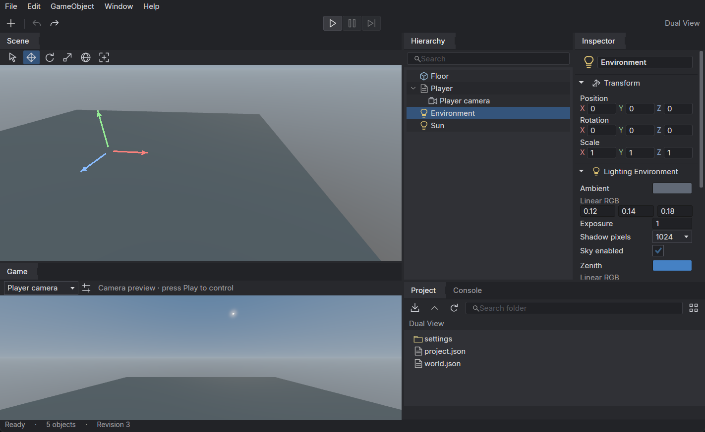

# Poima Engine

Poima is an experimental 3D game engine designed for humans and development agents. Its desktop editor and CLI are first-class interfaces to the same native core: both inspect, edit and run the same world through a documented API.

The core and player are C++20. The 3D renderer uses Vulkan. The Windows editor uses C#/Avalonia with native Vulkan Scene and Game viewports, and C# gameplay supports development-time reloads and a bounded native AOT game-bundle route. Headless deployments can run without the editor or its managed runtime.

**Status: early development, version 0.0.36.** Working authoring, simulation, rendering and packaging systems exist, but Poima is not a production-ready engine. APIs and file formats may change. Native animation crossfades support advancing clips, interruption, C# gameplay and guarded Inspector controls. Static mesh collision preserves geometric openings. Scene and Game are independent dockable panels over one simulation, with a Modified Tall workspace and editable procedural sky in new projects. See [implementation status and recorded evidence](docs/IMPLEMENTATION_STATUS.md) for tested configurations and limitations.



*Earlier desktop checkpoint: the editor shares world state with CLI clients. Scene and Game can be docked or floated independently; the editor remains an early implementation.*

## Why a headless core?

Poima's authoring operations live in the engine service, rather than depending on automation of editor widgets. Clients can discover schemas, query individual components, submit atomic edits, detect revision conflicts, retry acknowledged transactions and request rendered observations. The desktop editor and connected agents share the same authoritative session.

No particular AI provider is required. Codex, Claude or another client can use the CLI and newline-delimited JSON-RPC. Other frontends can use the native service or local transport. This architecture is implemented for the current built-in components; a complete extensible gameplay/component SDK remains future work.

## What works today

| Area | Current implementation |
| --- | --- |
| Authoring | Persistent entity hierarchy, typed component operations, atomic transactions, revision guards, durable retry receipts, bounded undo/redo and shared local sessions. |
| Rendering | Vulkan/NVRHI geometry, PBR materials, texture and normal maps, direct lights, shadow maps, procedural sky, frustum culling, 1×/4× MSAA, GPU skinning and image captures. |
| Simulation | Optional Jolt/EnTT runtime at 60 Hz, rigid bodies, capsule locomotion, static triangle mesh collision, raycasts with mesh triangle identities, moving kinematic objects, editable rigs and interruptible animation crossfades. |
| Input and player | Native continuous player, keyboard/mouse bindings, gamepad profiles and deterministic scripted input replay. |
| Assets | glTF/GLB import into editable hierarchies; cooked models, PNG/JPEG textures and WAV audio. Supported formats and limits are explicit. |
| Audio | Optional Steam Audio integration, direct-path obstruction/HRTF processing, persistent sound events and native-player device output. |
| Desktop | Independent dockable Scene and Game panels, saved Modified Tall layouts, hierarchy, typed Inspector fields and animation controls, Project browser, native navigation and transform gizmos; clocked Play with keyboard/mouse Game controls, C# launch configuration, typed live fields and compatible assembly reload. |
| Packaging | Project manifests and native game bundles with validated content, runtime files, compiled C# gameplay artifacts, integrity checks and read-only game launch. |

These are bounded implementations with subsystem-specific limits, not finished versions of every feature. For example, Game view supports keyboard/mouse control, while editor gamepad input and audio output remain unfinished; the separate native player supplies those paths. C# hot reload covers the documented gameplay module. Native AOT compiles that module for Linux/Windows, with a tested relocated Windows game bundle; arbitrary engine-code replacement, consoles and clean-machine production deployment remain unqualified.

[Static mesh collision](docs/MESH_COLLISION.md) uses explicit imported geometry; texture transparency does not create collision holes. Moving/deforming mesh colliders and separate movement/weapon-query channels remain unfinished. [Recorded collision evidence](docs/evidence/m2-mesh-collision.json) covers synthetic native, protocol and Inspector fixtures, not game-scale performance.

[Animation crossfades](docs/RUNTIME_ANIMATION.md) blend local poses over fixed ticks and expose their source, destination and weight. Interruptions preserve the current pose, without guaranteeing continuous velocity. The Inspector provides named authored clips and guarded live commands that advance a paused runtime by one tick. C# gameplay can inspect playback and queue the same native transitions. Blend layers, state machines, IK, root motion and retargeting remain unfinished. [Recorded animation evidence](docs/evidence/m2-animation-blending.json) covers native/protocol checks and GPU captures against independently authored reference poses; it does not establish character-production readiness or crowd performance.

[Editor C# iteration](docs/EDITOR_GAMEPLAY.md) loads a prebuilt game on Play and supports paused state edits and compatible reloads. Configuration and guarded runtime operations are shared with agents. Source compilation and persistent launch profiles remain separate work.

[Native C# gameplay](docs/NATIVE_GAMEPLAY.md) uses the same supported game source and native services as the CoreCLR development path. Native libraries stay loaded for the player process; changing the compiled library requires a restart. [Recorded evidence](docs/evidence/m2-native-gameplay.json) covers both operating systems, backend state comparisons and relocated Windows game replay.

The experimental [save-slot service](docs/RUNTIME.md#durable-save-slots) preserves supported physics, animation, sound and typed gameplay state with guarded writes, fresh-process loads and explicit corruption recovery. The CLI and [editor Save/Load window](docs/EDITOR_SAVES.md) share these operations. [Typed C# save/load requests](docs/GAMEPLAY_SAVES.md) run after committed simulation batches. General migrations and asynchronous saving remain unfinished.

Advanced GI, temporal upscaling/frame generation, comprehensive water and weather, multiplayer, Unity scene/prefab conversion, production VFX/UI frameworks and console backends are **roadmap work**. They are not included in the current feature claims. Poima is an independent implementation, not an id Tech 4 fork.

## Build the headless engine

The smallest build needs CMake 3.24+, Ninja, a C++20 compiler with C99 support, and Python 3.9+ for tests. It requires no GPU, display, .NET runtime or dependency downloads.

From a Linux or WSL checkout:

```sh
cmake --preset headless
cmake --build --preset headless
ctest --preset headless
./build/headless/poima capabilities
```

Create a new project and open its world service:

```sh
./build/headless/poima project create build/FirstProject --name "First Project"
./build/headless/poima world build/FirstProject/world.json
```

The destination project directory must not already exist. The world command accepts one JSON-RPC request per line; try:

```json
{"jsonrpc":"2.0","id":1,"method":"world.describe"}
{"jsonrpc":"2.0","id":2,"method":"world.inspect"}
{"jsonrpc":"2.0","id":3,"method":"session.close"}
```

Use the `runtime-headless` preset to add simulation; it downloads pinned Jolt and EnTT sources. Optional rendering, audio and managed gameplay have separate prerequisites. See [build instructions](docs/BUILD.md), [world protocol](docs/WORLD_SERVICE.md) and [project workflows](docs/PROJECTS.md).

## Build the Windows editor

The documented graphics build uses Linux x64/WSL to cross-compile a native Windows x64 executable. It requires a Vulkan-capable Windows driver for rendering. The editor adds a pinned .NET SDK and NuGet dependencies; its published application includes its .NET runtime.

With the native build prerequisites above, use Python 3.12+ for tool bootstrapping:

```sh
python3 scripts/bootstrap_tools.py
python3 scripts/bootstrap_tools.py --only dotnet
python3 scripts/build_desktop.py
```

Then open `launch-editor.cmd` from Windows. See the [desktop guide](docs/DESKTOP_EDITOR.md) for project selection, controls, shared agent connections and packaging details. The older [ImGui prototype](docs/EDITOR.md) remains a separate optional frontend.

Windows graphics/player/editor workflows and Linux headless authoring/simulation have recorded tests. Native Linux desktop rendering, Windows-hosted MSVC builds, clean-machine installers and console support are not currently qualified by those tests. GPU correctness captures on particular devices do not establish game-scale performance or broad hardware compatibility.

## Documentation

Start with the [Poima wiki](https://github.com/OvershockStudios/poimaengine/wiki) for guides and an overview. Detailed contracts and reproducible evidence remain versioned with the source below.

- **Start here:** [build](docs/BUILD.md), [projects and exported games](docs/PROJECTS.md), [desktop editor](docs/DESKTOP_EDITOR.md), [native player](docs/PLAYER.md).
- **Agent and tool integration:** [world API](docs/WORLD_SERVICE.md), [shared local sessions](docs/SHARED_SESSIONS.md), [runtime](docs/RUNTIME.md), [static mesh collision](docs/MESH_COLLISION.md), [C# gameplay](docs/MANAGED_GAMEPLAY.md).
- **Content:** [assets](docs/ASSETS.md), [materials](docs/MATERIAL_AUTHORING.md), [lighting](docs/LIGHTING.md), [shadows](docs/SHADOWS.md), [animation](docs/RUNTIME_ANIMATION.md), [audio](docs/AUDIO_EVENTS.md), [input](docs/INPUT_PROFILES.md), [gamepads](docs/GAMEPADS.md).
- **Engineering:** [implementation evidence](docs/IMPLEMENTATION_STATUS.md), [render diagnostics](docs/RENDER_DIAGNOSTICS.md), [development conventions](CONTRIBUTING.md).

Roadmap items describe intended systems. Use the current executable's `capabilities`, command schemas and `world.describe` to discover what a particular build exposes.

Poima's code is licensed under [Apache-2.0](LICENSE). Dependencies retain their own licenses; see [third-party notices](THIRD_PARTY_NOTICES.md) and the notices included with built packages.
