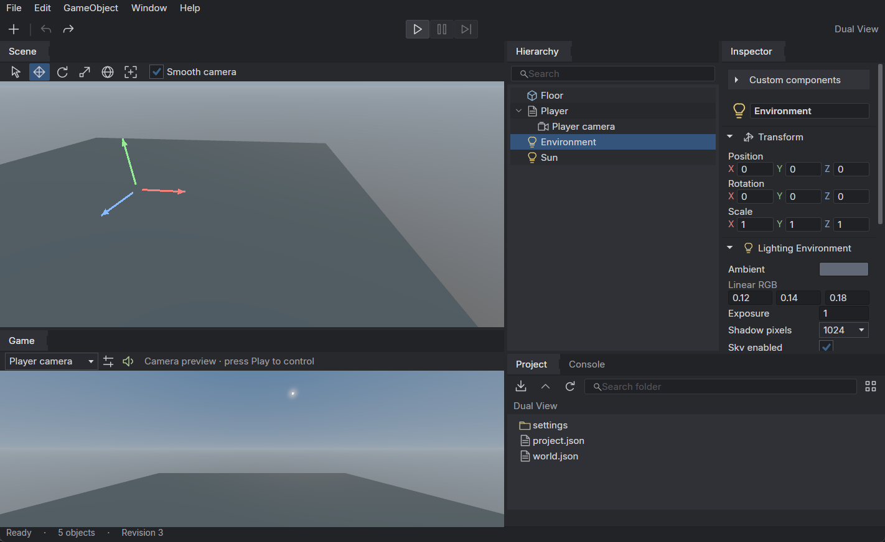
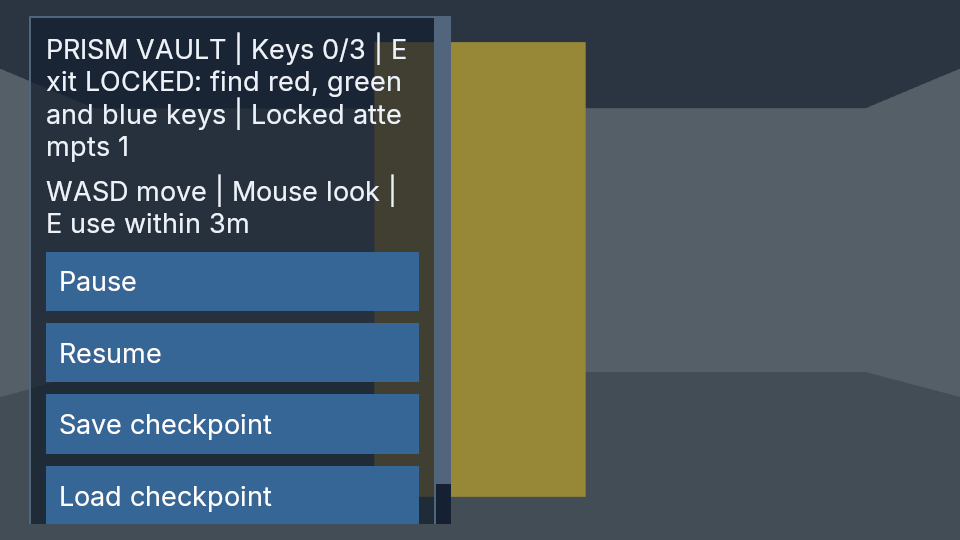
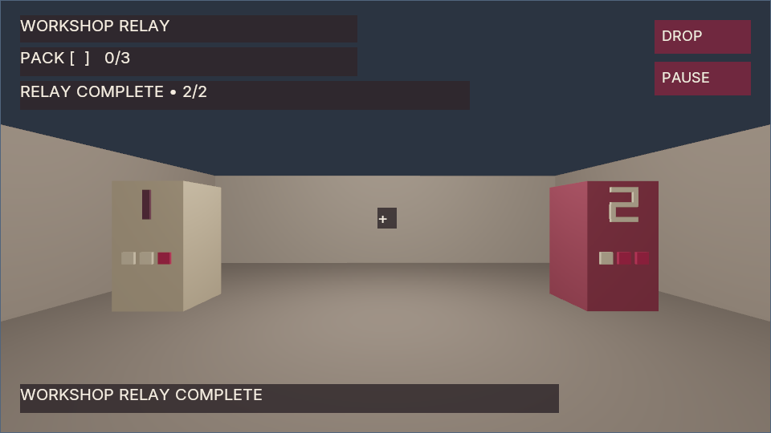

# Poima Engine

**An agent-native game engine, built for people and the agents they work with.**

Poima is an open-source 3D engine with a native **C++20** core, **Vulkan** graphics and **C#** gameplay. Its CLI and desktop editor share an authoritative engine service: an agent can inspect, edit, run and observe a world through structured commands, while you work in the editor.

[Get started](#get-started) · [Try a sample](examples/collection-game) · [Documentation](#documentation) · [Road to 1.0](docs/ROADMAP.md) · [Implementation status](docs/IMPLEMENTATION_STATUS.md) · [Changelog](CHANGELOG.md)



*Desktop editor with independent Scene and Game views.*

> **0.0.90.** See the [implementation status](docs/IMPLEMENTATION_STATUS.md) for tested workflows and known limits.

## Built for iteration

Poima makes engine operations directly available to tools. External agents such as Codex and Claude can use the CLI or newline-delimited JSON-RPC without opening an editor or relying on screen coordinates.

- **Discover and inspect.** Fetch available operations or a focused mutation schema, and inspect the current world before making changes. Find the entity/template fields using an asset through [reference queries](docs/ASSET_REFERENCES.md).
- **Edit together.** Humans and agents use shared sessions. Atomic transactions apply related edits together; revision guards reject stale changes, and retry receipts prevent duplicate application.
- **Run and observe.** Exercise gameplay with scripted input, [pause and capture a live native game](docs/LIVE_PLAYER.md) through a shared headless host, and inspect simulation state and profiling data.
- **Recover and repeat.** Bounded authoring undo/redo, runtime rollback and input replay support reproducible checks within their documented contracts.

The desktop editor is a visual client of the same engine, with a hierarchy, typed Inspector, Project browser, transform gizmos and separate Scene and Game panels. Gameplay uses C#, including compatible development reload and Native AOT bundle workflows.

Three recorded exercises put this workflow into practice: [Codex builds an escape room](docs/evidence/m2-agent-game.json), [Claude builds a wave-defense game](docs/evidence/fixtures/agent-defense/README.md), and [Codex builds Workshop Relay](docs/evidence/fixtures/agent-workshop/README.md) with a native inventory, recipes and styled UI. They compile C# gameplay and pass independent controller-input and save-continuation checks. The escape room also has a [rendered replay](docs/evidence/fixtures/agent-escape/README.md#rendered-checkpoints). These are small, bounded demonstrations, not a general success-rate or production-readiness claim.



*Three captured gameplay checkpoints, shown as a slideshow; not a live authoring session or real-time video.*



*Agent-authored Workshop Relay, captured through Vulkan after completion. Primitive geometry; this is a rendered checkpoint, not a live authoring video.*

The [authoring-core v1 contract](docs/AUTHORING_API_COMPATIBILITY.md) stabilizes nine selected world/entity methods and Transform edits, with separate request and response compatibility gates and native behavioral checks. The [Python automation client](docs/PYTHON_CLIENT.md) adds guarded editing and revision-pinned queries over the native service. The [gameplay, content and save profile](docs/ALPHA_GAMEPLAY_PROFILE.md) defines the wider compatibility boundary; broader API stability remains unfinished.

Joined [runtime observations](docs/RUNTIME_OBSERVATION.md) let tools inspect live poses and selected component fields together. A provider-free Workshop replay comparison uses 49% fewer native RPCs with identical checked gameplay and checkpoint state. [Reproduction and results](docs/RUNTIME_OBSERVATION.md#reproduce-the-replay-comparison).

Read the [Codex/Claude setup guide](docs/AGENT_CLIENTS.md), [world API](docs/WORLD_SERVICE.md), [shared-session guide](docs/SHARED_SESSIONS.md) and [C# gameplay guide](docs/MANAGED_GAMEPLAY.md).

## What works today

| Area | Implemented foundations |
| --- | --- |
| Graphics | Vulkan PBR, HDR composition, clustered direct lights and shadows, procedural sky, MSAA, GPU skinning and render inspection. Optional [deferred opaque lighting](docs/DEFERRED_RENDERING.md) and experimental [FSR reconstruction](docs/RECONSTRUCTION.md). |
| Gameplay | Fixed-step Jolt physics, player and [compiled NPC character controls](docs/CHARACTER_INPUT.md), [static NPC pathfinding](docs/NAVIGATION.md), static triangle-mesh collision, raycasts, [complete hierarchy instances](docs/RUNTIME_INSTANCES.md) and [crossfades, inertial transitions and masked animation layers](docs/RUNTIME_ANIMATION.md). |
| Execution | Shared [native jobs](docs/JOBS.md) for parallel animation sampling and procedural material baking, separate frame/background budgets, cancellation and actual worker-thread profiling. Physics and C# callbacks remain on the owner thread. |
| C# and persistence | Native-owned custom components, generated accessors, compatible reload, Native AOT bundles, durable save slots and corruption recovery. [Opt-in C# inertial transitions and masked layers](docs/MANAGED_GAMEPLAY.md#control-masked-layers-from-c) pass Windows/Linux CoreCLR and Native AOT fixtures while preserving older animation calls. Bounded collections and [explicit hierarchy/collection save upgrades](docs/SAVE_UPGRADES.md) preserve retained fields, instance identities and allocator history; collection resizing requires an approved plan and rejects overflow. |
| Exported agent sessions | [Serve a verified native game](docs/GAME_SERVICE.md) through the existing CLI/MCP runtime, UI, settings, save and capture operations. Bundle content stays read-only; no editor is required. |
| Player systems | Guarded [live and portable player preferences](docs/PLAYER_SETTINGS.md) for FOV, pointer controls, UI scale, output gain and next-launch graphics; keyboard, mouse and gamepad profiles; [compiled settings menus](docs/COMPILED_PLAYER_SETTINGS.md) with a [tested exported-player workflow](docs/EXPORTED_PLAYER_SETTINGS.md); typed [HUD/menu layout and styling](docs/GAME_UI.md#authored-layout-and-styling), native UI controls and C# callbacks; optional Vulkan UI presentation and Steam Audio integration. |
| Content and tools | glTF/GLB and bounded [FBX model and separate-clip import](docs/FBX_IMPORT.md), [guarded source inspection and explicit retargeting](docs/ANIMATION_RETARGETING.md), PNG/JPEG and WAV import; immutable [asset records and exported credits](docs/ASSET_PROVENANCE.md); native [procedural brick/plaster materials](docs/PROCEDURAL_MATERIALS.md); optional [navigation baking, world binding and compiled queries](docs/NAVIGATION.md); project manifests, validated native bundles, CPU profiling, GPU duration samples and trace export. |

These are bounded implementations, not production or game-scale performance claims. Windows graphics/editor workflows and Linux headless workflows have recorded qualification. Browser and console backends, advanced 2D, multiplayer, comprehensive water/weather, GI and production VFX tooling remain future work. Desktop layer controls, IK, automatic anatomical/contact retargeting and general character-exporter compatibility are unfinished.

Use `poima capabilities` and `world.describe` to discover your build's interfaces. The [status document](docs/IMPLEMENTATION_STATUS.md) records feature-specific limits, platform coverage and evidence.

## Get started

### Headless core

From a Linux or WSL checkout, with CMake 3.24+, Ninja, a C++20/C99 toolchain and Python 3.9+:

```sh
cmake --preset headless
cmake --build --preset headless
ctest --preset headless
./build/headless/poima capabilities
```

This authoring build needs no GPU, display, .NET runtime or dependency downloads. Create a project in a new directory and open its world service:

```sh
./build/headless/poima project create build/FirstProject --name "First Project"
./build/headless/poima world build/FirstProject/world.json
```

Send one JSON-RPC request per line:

```json
{"jsonrpc":"2.0","id":1,"method":"world.describe","params":{"view":"catalog"}}
{"jsonrpc":"2.0","id":2,"method":"world.inspect"}
{"jsonrpc":"2.0","id":3,"method":"session.close"}
```

The `runtime-headless` preset adds simulation and downloads pinned dependencies. Rendering, managed gameplay and audio require additional configuration; follow the [build guide](docs/BUILD.md).

### Desktop editor and sample game

Follow the [Windows editor build and launch guide](docs/DESKTOP_EDITOR.md#build-and-launch). The documented path builds from Linux/WSL and uses Windows Vulkan drivers. The published editor includes its .NET runtime.

[Collection Room](examples/collection-game) is a small first-person C# game with movement, collectible interactions, native UI and checkpoint saves. Its headless verification runs actual gameplay and checks save continuation in a fresh process. It includes CoreCLR and Native AOT instructions.

[Patrol Room](examples/managed/PatrolGame) demonstrates compiled NPC decisions: a guard patrols, investigates noise, pursues a visible player and loses sight behind solid cover. Native-input checks exercise escape, capture, reload and checkpoint continuation. It uses an authored route and direct steering; arbitrary obstacle pathfinding remains separate work.

[Locomotion Yard](examples/locomotion-yard) connects an original licensed FBX character and separate idle/run clips to native capsule movement, compiled navigation and checkpoints. Playback rate follows committed controller movement. Its tested playbook includes Windows Native AOT export and relocated playback.

[Relay Yard](examples/relay-yard) combines native first-person pickups, an imported animated courier, navigation, menus, live settings, licensed sound cues and checkpoints into a complete small game. Its playbook covers removing the owned source copy, restoring progress in a fresh exported-game process and completing the objective. [Game evidence](docs/evidence/m2-relay-yard.json), [audio evidence](docs/evidence/m2-relay-yard-audio.json). A [retained-game upgrade](examples/relay-yard/UPGRADING.md) preserves progress across an explicitly approved C# state change and verifies completion before writing and reopening the target save.

Recorded qualification covers Windows graphics/editor workflows and Linux headless workflows. Linux desktop rendering, clean-machine distribution and consoles remain unqualified; physical input testing is separate from scripted and virtual-device checks.

## Documentation

- **Build and run:** [builds](docs/BUILD.md), [projects and exports](docs/PROJECTS.md), [desktop editor](docs/DESKTOP_EDITOR.md), [native player](docs/PLAYER.md).
- **Program and automate:** [world service](docs/WORLD_SERVICE.md), [Python client](docs/PYTHON_CLIENT.md), [runtime](docs/RUNTIME.md), [runtime instances](docs/RUNTIME_INSTANCES.md), [C# gameplay](docs/MANAGED_GAMEPLAY.md), [native gameplay](docs/NATIVE_GAMEPLAY.md), [custom components](docs/CUSTOM_COMPONENTS.md).
- **Create content:** [assets](docs/ASSETS.md), [asset records](docs/ASSET_PROVENANCE.md), [materials](docs/MATERIAL_AUTHORING.md), [procedural materials](docs/PROCEDURAL_MATERIALS.md), [animation](docs/RUNTIME_ANIMATION.md), [game UI](docs/GAME_UI.md), [audio](docs/AUDIO_EVENTS.md), [input](docs/INPUT_PROFILES.md), [player settings](docs/PLAYER_SETTINGS.md).
- **Inspect behavior:** [profiler](docs/PROFILER.md), [native jobs](docs/JOBS.md), [save upgrades](docs/SAVE_UPGRADES.md), [implementation status and evidence](docs/IMPLEMENTATION_STATUS.md).
- **Follow a task playbook:** [task index](docs/PLAYBOOKS.md), [guarded scene edits and recovery](examples/guarded-authoring), [build a compiled collection game](examples/collection-game), [import, animate and export a character game](examples/locomotion-yard).

The [wiki](https://github.com/OvershockStudios/poimaengine/wiki) provides another entry point. Detailed contracts and evidence are versioned with the source. The [documentation standard](docs/DOCUMENTATION.md) defines the manual, API reference, tested task playbooks and agent skills required as capabilities mature. The [coverage inventory](docs/DOCUMENTATION_COVERAGE.md) maps current workflows and identifies missing reference and tutorials.

## Credits and license

**Creator, architect and project owner:** Divesh Gupta ([Legendile7](https://github.com/Legendile7)), publishing as Overshock Studios.

**AI implementation:** GPT-6-Astra, under Divesh Gupta's direction.

Poima is licensed under [Apache-2.0](LICENSE). Dependencies retain their own licenses; see [third-party notices](THIRD_PARTY_NOTICES.md). The Poima name is covered separately by the [branding notice](TRADEMARKS.md).
