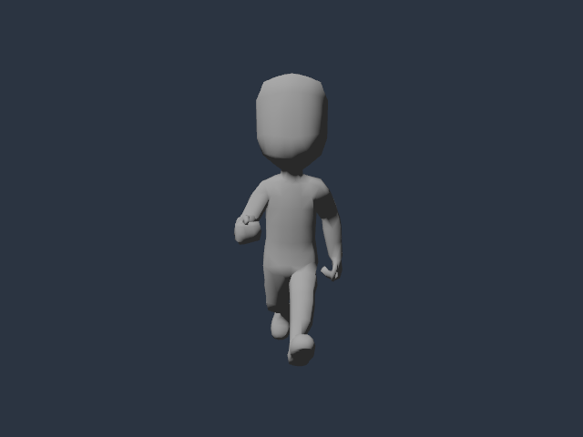

# Retarget separate animation clips

`reference-rotation-v1` transfers animation orientations between rigs with
matching named ancestry while using the target's chosen positions and scales.
It supports differing proportions, reference poses and positive nonuniform
scale. The target model's imported defaults, geometry and inverse binds remain
unchanged; the resulting clips express the declared retarget policy.

Choose the operation that fits the source:

| Operation | Required relationship | Motion policy |
| --- | --- | --- |
| [Exact composition](FBX_IMPORT.md#compose-separate-clips) | Matching named ancestry and local imported rest frames. | Append the original curves. |
| [Reference-frame conversion](ANIMATION_FRAME_TRANSFER.md) | Matching named ancestry, coincident reference joint origins and uniform mapped scales. | Re-express supported motion in different bone frames. |
| `reference-rotation-v1` | Matching named ancestry and explicit reference poses. | Transfer quaternion-chain orientations; keep target-reference positions/scales or explicitly transfer selected position deltas. |

Each donor may use `frame_transfer` or `retarget`, never both. None of these
operations automatically maps anatomical bone names or repairs a mismatched
hierarchy. Retargeting here does not promise identical source affine motion,
ground contact, foot placement or body shape.



*Original Kenney Animated Characters Protagonists body and Run take, rendered
through Poima after explicit retargeting. CC0-1.0; lossless BMP-to-PNG
conversion. The untextured base and source motion are a pipeline check.*

## Inspect the original sources

Use `asset.source.inspect` before choosing takes or source node indices. It
parses the original glTF, GLB or FBX without publishing a cooked package or
changing the world. Geometryless animation donors can be inspected directly.
Paths resolve relative to the open world document, as with `asset.import`.

Inspect the base and donor separately:

```json
{"jsonrpc":"2.0","id":1,"method":"asset.source.inspect","params":{"source":"characters/body.fbx"}}
{"jsonrpc":"2.0","id":2,"method":"asset.source.inspect","params":{"source":"characters/motions.fbx","section":"animations","offset":0,"limit":64}}
```

Both responses contain `published: false` and `model_sha256`. Keep the base's
fingerprint for `expected_target_model_sha256`, and the donor's fingerprint for
`expected_source_model_sha256`. These identify normalized **original parsed
model content**, including the original takes; they are not raw source-file
hashes or the eventual cooked asset identity.

`section` is `summary` (default), `nodes`, `skins` or `animations`. Pages contain
at most 64 items and return `next_offset` or null. Node rows provide original
indices, names, parents and local transforms. Animation rows provide original
take indices, names, durations and channel counts. Skin rows provide skeleton
indices and joint counts.

Use the first response's `model_sha256` as `expected_model_sha256` on subsequent
pages or pose observations. Replace the placeholder below with that actual
64-character lowercase hexadecimal value:

```json
{
  "jsonrpc": "2.0",
  "id": 3,
  "method": "asset.source.inspect",
  "params": {
    "source": "characters/motions.fbx",
    "section": "nodes",
    "offset": 0,
    "limit": 64,
    "expected_model_sha256": "<donor model_sha256>",
    "pose": {"kind": "sample", "clip": 0, "time": 0}
  }
}
```

With `pose`, node rows include sampled local transforms and global `world`
matrices. Pose sampling requires the `nodes` section. `{"kind":"rest"}` uses
imported defaults; `{"kind":"sample","clip":0,"time":0}` uses an explicitly
selected original take, with defaults for properties absent from its channels.
Take indices are 0–255. Time must be finite, within 0–3600 seconds and within
that take's actual duration. Reference observation neither loops nor clamps an
out-of-range time. Within a take's duration, times before its first key hold that
key through the ordinary sampler. A take called “Reference” or “Targeting Pose” still needs
inspection; its name does not establish bind-pose compatibility.

The inspector reads and validates the source on each call. It reports importer
identity, retained data size and diagnostics, retaining at most 64 bounded
diagnostic records with complete count/truncation metadata. It does not bypass
unsupported geometry, materials or missing external dependencies. This method
is outside the frozen authoring-core v1 contract; discover its current schema
through `world.describe`. For FBX, optional `fbx_normal_map` is `opengl` (the
default) or `directx`; use the same convention during inspection and import so
their fingerprints describe the same normalized model.

## Import a clip with an explicit policy

Send the following as `asset.import` parameters. Substitute actual paths,
fingerprints and original take indices obtained above. This example deliberately
chooses original take 0 as a reference and take 1 as motion; those choices are
not inferred by the engine.

```json
{
  "source": "characters/body.fbx",
  "animations": [{
    "source": "characters/motions.fbx",
    "clip": 1,
    "name": "Walk",
    "retarget": {
      "policy": "reference-rotation-v1",
      "expected_source_model_sha256": "<donor model_sha256>",
      "expected_target_model_sha256": "<base model_sha256>",
      "source_pose": {"kind": "sample", "clip": 0, "time": 0},
      "target_pose": {"kind": "rest"},
      "positions": {"kind": "target_reference"},
      "scales": "target_reference"
    }
  }]
}
```

Both original-model fingerprint guards and both reference selectors are
required. They are checked against the original base and unfiltered donor
before selected-take filtering or renaming. Source node indices and reference
take indices therefore refer to the inspected original source, not the output
clip order or instantiated entity IDs. Every donor uses the original base as
its target reference, including when several donors are appended together.

`target_pose` may also select an original base take. Its sampled reference can
differ from the base's imported defaults or skin bind pose. The policy does
not rewrite those defaults or inverse binds. Output clip names must remain
distinct, following the [separate-clip composition rules](FBX_IMPORT.md#compose-separate-clips).

## Choose positions and scales

`scales` must explicitly be `"target_reference"`. All mapped node scales stay
at the selected target-reference values throughout each clip. Source scale
animation is discarded. Positive nonuniform target-reference scale is allowed;
orientation transfer is defined on quaternion chains rather than extracting
rotations from scaled or sheared global matrices.

For `positions: {"kind":"target_reference"}`, every mapped local position
stays at its target-reference value. This policy accepts no `nodes` or `scale`
fields. Source translation tracks are discarded.

To preserve selected local position changes, replace `positions` with:

```json
"positions": {
  "kind": "reference_delta",
  "nodes": [2, 5],
  "scale": 1.0
}
```

Choose these indices from the original donor's inspected node rows. They must
be 1–64 unique existing **source-local** indices within the mapped skeleton or
selected animated ancestry. Index 0 is valid. List them in ascending order for
readability; request order does not change the selection, and diagnostics
record the sorted set. `scale` is a finite scalar in `(0, 100]` applied only to
these translation deltas. It does not scale the body or source animation time.

For a selected node, the output local position is the target reference position
plus the rotated, scaled difference between its sampled source position and
its source reference position. A nonroot delta is rotated through the parent
frame correction; a root delta uses the declared alignment rotation. Other
mapped nodes retain their target-reference positions. An unanimated selected
property still uses its original source default, which may differ from the
explicit source reference.

Optional `alignment_rotation` is one normalized XYZW quaternion mapping donor
orientation space toward the target, defaulting to `[0,0,0,1]`. Components must
be finite in `[-1,1]`, with squared-length residual at most `1e-6`. There is no
alignment-position or inferred height-scale parameter in this policy.

## Orientation and curve behavior

Let `Qs_ref(i)` and `Qt_ref(i)` be the products of normalized local reference
quaternions through each mapped node's ancestors. These orientation chains
ignore affine scales. With alignment quaternion `H`, the reference correction
is `C(i) = inverse(H * Qs_ref(i)) * Qt_ref(i)`. The transferred orientation
chain is `H * Qs(i,t) * C(i)`, expressed as local rotations using both parent
and child corrections. Animated nonjoint ancestors participate too.

Original rotation key times, interpolation and clip duration are retained.
Raw quaternion values and cubic tangents receive the same linear left/right
map; neither is normalized during curve conversion. Evaluated orientations
normalize through the ordinary animation sampler. Selected translation curves
retain interpolation, with reference offsets applied only to values and the
linear coordinate change applied to cubic tangents. Float storage introduces
ordinary rounding; this is not a byte-identity promise for converted clips.

Sparse clips can need constant channels for transformed original source-default
rotations or target-reference positions/scales. Source defaults remain distinct
from the explicit source reference. Discarded-only clips retain their original
duration through a constant target-reference scale endpoint when necessary.
The existing 8,192-channel, 1,000,000-key and retained-data budgets still apply
to all resulting clips, including synthesized constants.

## Observe, recover and use the result

Import diagnostics identify the policy, original references/fingerprints,
alignment, sorted translation selection, node mappings, retained/synthesized
channels and discarded translation/scale channel/key counts. Inspect the cooked
result through [`asset.inspect` and animation sampling](ANIMATION_ASSETS.md).
Compare the chosen references, key and between-key poses, visible skin
deformation and transitions. The [native oracle](../tests/animation_rotation_retarget.cpp)
and [protocol verifier](../tests/animation_rotation_retarget.py) define the
bounded verification workflows; qualification results belong in the
implementation status and evidence records.

Malformed policy parameters return `-32602`. Stale original-model fingerprints,
unsupported topology, invalid original reference selections and conversion or
budget failures return `-32050` with a bounded diagnostic. After a fingerprint
mismatch, inspect the current source again and deliberately reselect indices
and references. Keep the original guards until that review is complete. A
rejected inspection publishes nothing; a rejected import leaves the authored
world, history and existing cooked packages unchanged. A successful import
publishes an immutable asset without changing the authored revision.

Instantiate the result as a separate guarded edit, then use the
[runtime animation controls](RUNTIME_ANIMATION.md). Humans and agents use the
same source observations and explicit import policy. Native engine callers
can supply `ModelPose` references to `transfer_animation_rotations`; that
internal helper operates on already supplied models/poses and does not validate
file-layer fingerprints against a filtered donor. The authoring API provides
the original-source fingerprint guards.

Root translation changes the visual rig only when selected. Import does not
extract root motion, move a controller, choose locomotion speed, repair a loop
seam or add foot/contact IK. Ground placement, stride matching, planted feet,
collision alignment and acceptable animation quality require observation and
separate game authoring.

## Run the contract checks

These checks are qualified for 0.0.74 on Linux runtime, native Windows runtime
and simulation-disabled Linux authoring. Run from the repository root with
Python 3.10+ and a native authoring build.
The native target and protocol verifier use original analytic fixtures and
do not download character assets or require a renderer or .NET installation.

```sh
cmake --preset headless
cmake --build --preset headless --target poima poima-animation-rotation-retarget-test
build/headless/poima-animation-rotation-retarget-test
python3 tests/animation_rotation_retarget.py \
  --binary build/headless/poima --output build/rotation-retarget-example
```

The output directory must be new. The native executable reports eight passed
check groups. The protocol report is `evidence.json`; check its `passed` result,
source-hash preservation and owned-process exits. With the original source
directory supplied, all six tests run; the recorded results are in the
[qualification evidence](evidence/m2-animation-rotation-retarget.json).
Without `--source-directory`, the original-character case records one explicit
skip. To include it, supply an unchanged [Kenney Animated Characters
Protagonists](https://kenney.nl/assets/animated-characters-protagonists) 1.1
directory containing `License.txt`, `Model/characterMedium.fbx`
and `Animations/{idle,run,jump}.fbx`:

```sh
python3 tests/animation_rotation_retarget.py \
  --binary build/headless/poima --source-directory path/to/kenney \
  --output build/rotation-retarget-character-example
```

For the Windows Vulkan consumer, use a renderer/simulation build and a supported
GPU. From WSL:

```sh
python3 tests/animation_rotation_retarget_capture.py \
  --binary build/windows-runtime/poima.exe --windows-interop \
  --source-directory path/to/kenney --output build/retarget-capture-example \
  --gpu 0 --samples 4 --timeout 1800
```

This destination must also be new. The capture verifier checks pinned original
base, Run and Idle files and their CC0 license, retaining caller originals
unchanged. It removes only its owned source copies before reopening cooked
content. Inspect the retained images alongside `evidence.json`: its oracle
uses normalized original source observations and independent quaternion-chain,
forward-kinematics and skin calculations, not an independent FBX parser.
Hardware readback does not establish physical-input, editor, contact/loop,
compiled locomotion or performance qualification.
