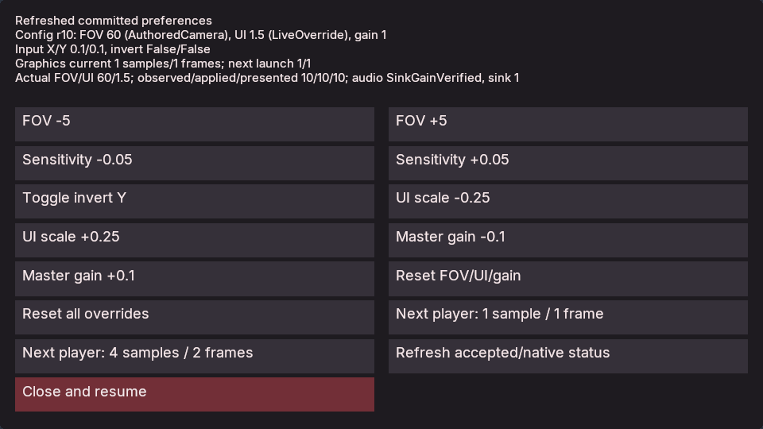

# Compiled player settings and native menu

Use the C# gameplay SDK to read the attached native player's preferences and
stage a guarded change from a real Tick or UI Control callback. A stateless
compiled settings menu can tune FOV, relative mouse interpretation, UI scale and
master gain, reset sparse overrides, and display requested next-launch graphics.
The native player remains the sole configuration and application authority.

The **0.0.81** fixture passes headless unavailable-owner checks with Linux
CoreCLR and Native AOT, and attached Windows checks with both backends on both
laptop GPUs. It exercises native Control/Tick callbacks, rollback, save/load
replacement and independent rendered FOV/UI checks. This is a bounded fixture;
physical input and source-free exported menu playback are separate checks.
See [recorded qualification](evidence/m2-compiled-player-settings.json).

Follow [the documentation standard](DOCUMENTATION.md) for capability and
qualification boundaries and [the task playbooks](PLAYBOOKS.md) for related
workflows. The host-selected profile and external live channel are described in
[Player settings](PLAYER_SETTINGS.md); UI authoring is in [Game UI](GAME_UI.md).
This guide covers the compiled callback path and its relationship to those
existing authorities.



*Windows Native AOT fixture at UI scale 1.5. Controls and status use the native
UI renderer; the primary Close action uses the engine's wine color.*

## Prerequisites and compatibility

Use a matching SDK/engine cohort with simulation and the chosen gameplay backend:
`POIMA_ENABLE_SIMULATION=ON`, and either
`POIMA_ENABLE_MANAGED_GAMEPLAY=ON` for CoreCLR development or
`POIMA_ENABLE_NATIVE_GAMEPLAY=ON` for actual NativeAOT gameplay. A visible native
menu additionally needs `POIMA_ENABLE_GAME_UI=ON`, the Windows Vulkan player and
its existing display/render prerequisites. Actual sink-gain observation requires
enabled native audio. See [Build](BUILD.md), [Managed gameplay](MANAGED_GAMEPLAY.md)
and [Native gameplay](NATIVE_GAMEPLAY.md) for backend setup.

Declare `IPlayerPreferencesGame` on the game class. This independently requires:

| Contract | Required value |
| --- | --- |
| Gameplay call | Version 1, 80 bytes |
| Services epoch | 7 |
| Minimum readable services prefix | 256 bytes |
| Named feature | `player_preferences_v1`, together with `baseline_v7` |

The marker grants only the three preference callbacks. It does not grant
animation, character input, navigation or hierarchical-instance services whose
slots precede them. Declare each additional marker when using its API. Matched
bridge/native-entry code validates named host availability before constructing
the game, and validates the required callbacks on each Tick/Control invocation.
`Initialize` retains its existing no-services contract.

The original 176-byte `NativeServices` prefix and old marker requirements are
unchanged. Generated requirements and NativeAOT descriptors use 256 bytes for a
preferences-marked game and retain all separately declared feature names.
Package/export admission uses those same names and minimum extent; an installed
runtime must advertise them. A large byte count alone cannot satisfy a missing
feature name. Larger offered same-epoch tables can satisfy the known required
prefix. SDK/bridge mixing and retained-binary compatibility require their own
qualification; recompiling old source is not retained-binary evidence.

Host capability is separate from an attached owner. A game can load before a
player exists. A headless Tick can call the API and receive unavailable results.
Binding covers shared `player.start`, blocking `runtime.play` and its exported
player route without requiring a writable authoring document. The source wiring
of these routes does not establish an executed export or graphics result.

## Public C# reference

Both `GameContext` and `ControlContext` expose these methods:

```csharp
PlayerPreferenceSnapshot GetPlayerPreferences();
PlayerPreferenceStageResult TryStagePlayerPreferences(PlayerPreferencePatch patch);
PlayerPreferenceOperationResult GetPlayerPreferenceResult(PlayerPreferenceTicket ticket);
```

Calls are synchronous and legal during Tick or Control. They copy bounded typed
values and read cached native observations; they do not poll SDL, invoke a
renderer, access settings files or call JSON-RPC from inside gameplay. No callback
pointer or supplied managed storage is retained.

`GetPlayerPreferences` returns:

| Member | Meaning |
| --- | --- |
| `Available`, `Replay` | Whether a current owner is attached, and whether it is read-only replay |
| `Owner` | Opaque `PlayerPreferenceOwner(ulong High, ulong Low)` for this player lifetime |
| `Revision` | Nullable committed configuration revision; absent when unavailable |
| `Overrides` | Sparse requested-key presence as `PlayerPreferenceFields` flags |
| `Values` | Resolved values, optional FOV/UI when inheritance has not yet been observed, and frozen current graphics |
| `Sources` | One `PlayerPreferenceSource` for each of the nine fields |
| `NextSamples`, `NextFramesInFlight` | Requested next-launch graphics configuration |
| `Observation` | Cached effective FOV/UI, requested gain, sink gain, audio outcome and observed/applied/presented revisions |

`PlayerPreferenceValues` contains `double? VerticalFov`, `double SensitivityX`,
`double SensitivityY`, `bool InvertX`, `bool InvertY`, `double? UiScale`,
`uint Samples`, `uint FramesInFlight` and `double MasterGain`.
`PlayerPreferenceChanges` uses nullable versions of all nine members, each
defaulting to `null`. Omission leaves the key untouched; reset removes it from
the sparse requested values and restores the original launch inheritance.

Construct a patch as:

```csharp
new PlayerPreferencePatch(snapshot.Owner, snapshot.Revision!.Value,
    new PlayerPreferenceChanges(VerticalFov: 75, InvertY: true),
    Reset: PlayerPreferenceFields.UiScale);
```

The owner and revision must come from a current available snapshot. `Set` and
`Reset` must be disjoint. An empty or same-value valid patch is accepted as an
operation and advances configuration revision; it is not a free read. The SDK checks nonzero
owner, safe revisions, known flags, finite numbers and exact bounds before
entering the native callback. The native owner prepares the complete candidate
through the same `PlayerPreferences::prepare` authority used by external live
settings, including next-player render dependencies.

### Fixed registry and flag values

There are no arbitrary string keys across the gameplay ABI.

| C# field / flag | Bit | Native registry ID | Configured type and bounds |
| --- | --- | --- | --- |
| `VerticalFov` | 1 | `camera.vertical_fov` | Finite double, 5–150 vertical degrees |
| `SensitivityX` | 2 | `input.sensitivity_x` | Finite double, 0–10 degrees per relative mouse unit |
| `SensitivityY` | 4 | `input.sensitivity_y` | Finite double, 0–10 degrees per relative mouse unit |
| `InvertX` | 8 | `input.invert_x` | Boolean |
| `InvertY` | 16 | `input.invert_y` | Boolean |
| `UiScale` | 32 | `ui.scale` | Finite double, .25–8 physical pixels per logical UI pixel |
| `Samples` | 64 | `graphics.samples` | Integer 1 or 4 |
| `FramesInFlight` | 128 | `graphics.frames_in_flight` | Integer 1 or 2 |
| `MasterGain` | 256 | `audio.master_gain` | Finite double, 0–1 linear output gain |

`None=0`, `All=511`. The native Boolean representation is exactly 0 or 1; unused
patch slots, unknown mask bits and reserved fields must be zero. Native wire
encoding errors fail the service call; the SDK surfaces errors as exceptions.
Expected owner/revision/replay/busy conflicts use the typed results below.

`PlayerPreferenceSource` values are `None=0`, `AuthoredCamera=1`, `InputProfile=2`,
`WindowDensity=3`, `EngineDefault=4`, `SettingsProfile=5`, `SessionOverride=6`,
`ExplicitOption=7` and `LiveOverride=8`. Source and sparse presence tell whether a
resolved number comes from inheritance or requested intent. An inherited number
does not mean that gameplay created an override.

### Configuration versus native observations

Absent FOV inherits the selected camera; absent UI scale inherits actual display
density. They stay nullable until the owner has a relevant observation. Registry
fallback metadata of 60 degrees or scale 1 does not prove a particular camera or
window uses that value. The sample uses those numbers only as explicit starting
points for a user-requested increment when no observation is available.

Resolved inherited values can use the cached actual observation. Immediately
after reset, that cache may still describe the preceding applied override until
the outer player consumes the new configuration. Read `Overrides`, `Sources`
and observation revisions together. Inherited/observed UI density may be any
positive finite value, including values outside .25–8; those bounds apply to a
configured UI override.

`PlayerPreferenceObservation` contains nullable `ObservedRevision`,
`AppliedRevision`, `PresentedRevision`, `EffectiveVerticalFov`,
`EffectiveUiScale` and `SinkGain`, plus `RequestedMasterGain` and `AudioOutcome`.
Null means unavailable; it must not be displayed as revision zero or verified
gain zero. `PlayerPreferenceAudioOutcome` is `Disabled=0`, `NotInitialized=1`,
`SinkGainVerified=2`, `ApplyFailed=3`, `InitializationFailed=4`.

FOV is a presentation override and does not rewrite a Camera component. Mouse
tuning changes interpretation of future relative mouse events; previously
queued semantic input remains intact. UI scale changes native layout and input
mapping. Master gain applies at the native SDL output sink without rewriting
emitters, propagation or offline PCM. Numeric sink readback does not establish
physical audibility. Current `Values.Samples` and `Values.FramesInFlight` remain
frozen for the existing window; next-launch intent is exposed separately.

### Native ABI reference

`PoimaGamePlayerPreferenceServicesV1` preserves the complete 232-byte instance
prefix and appends only these callbacks on the supported 64-bit targets:

| Callback | Offset | Input/output |
| --- | --- | --- |
| `preference_snapshot` | 232 | `PoimaGamePreferenceSnapshotV1` output, 216 bytes |
| `preference_patch` | 240 | `PoimaGamePreferencePatchV1` input, 104 bytes; `PoimaGamePreferenceEnqueueV1` output, 40 bytes |
| `preference_result` | 248 | `PoimaGamePreferenceTicket` input, 24 bytes; `PoimaGamePreferenceResultV1` output, 56 bytes |

The full allocation is 256 bytes. `PoimaGamePreferenceValuesV1` is 56 bytes;
the owner uses the 16-byte `PoimaEntityId` wire shape as opaque epoch words.
That wire shape does not make the owner a gameplay entity. The native ticket is
three 64-bit words. Each versioned request/output starts with `version=1` and
the exact known byte size; callers initialize output headers and zero reserved
fields before invoking. Snapshot availability, optional value/observation masks,
source tags and fixed numeric slots encode the corresponding C# properties.
Successful unavailable snapshots have only the version/size header populated.

The SDK asserts its layout and validates returned sizes, tags, masks, optional
payloads, safe revisions and bounded numeric values. Baseline table size remains
176; the preferences implementation reads only its own three declared tail
slots. For exact native members and C callback signatures, use
[gameplay_abi.h](../include/poima/gameplay_abi.h).

## Staging, acceptance and recovery

`PlayerPreferenceStageResult` contains nullable `Ticket`, `Rejection` and the
convenience property `Staged`. `Staged` means a prepared operation was reserved;
configuration, native application and presentation have not been claimed.

A `PlayerPreferenceTicket(ulong High, ulong Low, ulong Sequence)` combines the
owner epoch with a positive bounded sequence. Owner words are opaque bit
patterns; revisions/sequences used by the SDK are at most 9007199254740991.
Tickets are process-local operation identities, not entity handles, save epochs
or durable settings receipts. If retaining them in existing `TState`, use
separate `long` words with unchecked casts for owner bits and a positive `long`
sequence, as the fixture does. The SDK record itself is not an added supported
saved state-field kind.

| `PlayerPreferenceRejection` | Value | Recovery |
| --- | --- | --- |
| `None` | 0 | Staged; query after the successful native boundary |
| `Unavailable` | 1 | Attach a player or report unavailable; create no synthetic success |
| `StaleOwner` | 2 | Read the new owner and require a deliberate fresh action |
| `StaleRevision` | 3 | Refresh current values; reconsider the intended change before retry |
| `Replay` | 4 | Show read-only status; replay preserves recorded semantic input |
| `Busy` | 5 | One patch is already staged in this Control/step boundary; defer |
| `Invalid` | 6 | Correct the complete candidate, including graphics dependencies |
| `Capacity` | 7 | Owner mutation counters are exhausted; reads remain available |
| `UnknownTicket` | 8 | Query-only unknown/evicted ticket; do not rerun an operation to recover it |

Typed rejection does not discard an earlier valid stage or consume a ticket.
Local encoding/bounds violations can throw before native admission. Native
preparation rejects an invalid complete candidate as `Invalid`; native ABI
misuse can fail the callback instead. Do not automatically replace a stale guard
and silently overwrite an external client's change.

`GetPlayerPreferenceResult` returns `PlayerPreferenceOperationResult` with
`Ticket`, `State`, `Rejection`, nullable `AcceptedRevision` and `ErrorCode`.
`PlayerPreferenceResultState` is `Unknown=0`, `Staged=1`, `Accepted=2`.
Accepted configuration revisions are retained immutably in a bounded 32-result
ledger. The current source reports no separate operation error payload;
`ErrorCode` is zero for valid results. Native application outcomes are read from
`Observation`, rather than rewriting accepted intent into a rejected operation.

A same-callback ticket query can report `Staged`; later queries report `Accepted`
only after the successful host boundary. Unknown/evicted tickets return
`UnknownTicket`, a different active owner returns `StaleOwner`, and a detached
Runtime returns `Unavailable`. Querying never restages or reapplies a patch.
Native application may fail after configuration acceptance; retain the accepted
revision and inspect the host's application/terminal player report.

### Native phase and lifetime

The player owns one attachment to the exact shared native preference pointer.
Runtime callbacks use an owner-scoped weak binding; they do not own a renderer,
World pointer or asynchronous task. The binding is installed before initial
player polling. Stop/detach clears availability. A fresh player gets a new epoch.
Compatible CoreCLR reload retains the player owner; NativeAOT libraries retain
their existing process-pinned replacement policy.

Only one preference patch can be staged per accepted Control or complete
`Runtime::step` batch. Every later callback in the same batch still reads the
original committed snapshot. A second valid stage reports Busy. A subsequent
failure rolls back the whole batch, including earlier successful Tick work,
queued UI/control/save changes, gameplay state and native physics checkpoints.
It discards the prepared preference effect without publishing or consuming its
ticket. A later accepted patch uses the next unconsumed sequence.

At a successful boundary, native entity/gameplay/UI/physics validation completes
before the host publishes the prepared effect. It flushes the original Runtime's
effect before servicing queued save/load that might replace that Runtime. The
replacement binds to the same still-live player attachment. Configuration and
live-control authority advance once, making existing external guards stale.
The native window consumes the new snapshot at its outer synchronization/input
boundary, outside the gameplay callback. No callback recursively polls or
synchronizes the renderer.

The source also consumes preferences before a subsequent native input event or
catch-up advance can use stale presentation/input state. The separate runner
does not establish event-batch or physical-input qualification merely by calling
logical `runtime.ui.activate`. See its explicit limitations below.

## Task: author and use the compiled menu

The concrete consumer is
[ManagedPlayerPreferencesGame](../tests/managed_player_preferences_gameplay/PlayerPreferencesMenuGame.cs),
a stateless `Game<PlayerPreferencesMenuState>` implementing the actual marker.
The native scene is authored by
[the runner](../tests/player_preferences_gameplay_contract.py); gameplay edits
the existing native controls through `SetUi`, `SetModal`, `RequestPause` and
`RequestResume`. It does not manufacture fields to pretend a menu action ran.

The native ID table below uses **decimal low-word shorthand**. For example,
opener 699 is `new UiId(0, 699)` in C# or
`000000000000000000000000000002bb` in the native UI protocol. All controls have
stable nonzero IDs separate from scene entities.

| Native control | ID | Actual Control action |
| --- | --- | --- |
| Settings opener | 699 | `pref.open` |
| Hidden modal panel / status label | 700 / 701 | No action |
| FOV −/+ | 710 / 711 | `pref.fov.minus` / `pref.fov.plus` |
| Mouse X/Y sensitivity −/+ | 712 / 713 | `pref.sensitivity.minus` / `pref.sensitivity.plus` |
| Invert Y | 714 | `pref.invert` |
| UI scale −/+ | 715 / 716 | `pref.ui.minus` / `pref.ui.plus` |
| Master gain −/+ | 717 / 718 | `pref.gain.minus` / `pref.gain.plus` |
| Reset FOV/UI/gain / reset all | 719 / 720 | `pref.reset` / `pref.reset.all` |
| Next player graphics 1/1 or 4/2 | 721 / 722 | `pref.graphics.low` / `pref.graphics.high` |
| Refresh / close and resume | 723 / 724 | `pref.refresh` / `pref.close` |

The proof panel/status/button 500/501/502 remains separate; button 502 dispatches
`live`, a combined FOV +5, UI +.25 and gain −.1 patch. Diagnostic controls 601+
exercise rollback, guards and saves offscreen. They are distinct from the usable
menu's tuning rows. Panels 730–737 arrange paired native tuning buttons using
explicit percentage positions and padding, without inherited legacy margins.

1. Author panel 700 hidden, label 701 and its buttons, plus visible opener 699,
   before `runtime.start`. The runner's `author` function supplies the complete
   native definitions and preserves the independent proof UI.
2. Load the exact compiled consumer through `runtime.gameplay.load` or
   `runtime.gameplay.load_native`, then attach a native player. Admission before
   launch does not imply that a snapshot is available yet.
3. Activate the visible opener. Its genuine Control callback shows panel 700,
   makes it modal, refreshes current native status and requests pause. A paused
   player receives Control callbacks without requiring simulation Tick.
4. Activate a tuning button. Read the staged/rejected status. Refresh to inspect
   the committed configuration and current application revisions; the fixture's
   diagnostic state separately records the queried ticket's immutable accepted
   revision. Reopening also
   refreshes. A paused label does not continuously animate without another
   callback.
5. Inspect sources and sparse presence when resetting. Inspect current versus
   next-launch graphics when changing presets. Close clears modal eligibility,
   hides the panel and requests resume.

The menu uses bounded increments with native validation: FOV 5 degrees,
sensitivity .05 on both mouse axes, UI .25 and gain .1. Bounds clamp the explicit
intent; native whole-candidate render rules can still reject graphics presets.
The status reports fresh input values, provenance, frozen graphics and actual
application observations. Only panels, labels and buttons are supplied. Sliders,
text fields, scrolling, dropdowns, automatic persistence and a visual menu
authoring tool are not part of this fixture.

### Minimal callback pattern

This example assumes native status label 701 and button actions have already
been authored. Mutable ticket storage belongs in `TState`, not instance fields.

```csharp
using System.Runtime.InteropServices;
using Poima;

[StructLayout(LayoutKind.Sequential)]
public struct SettingsState
{
    public long TicketHigh, TicketLow, TicketSequence;
}

[GameModule("example.compiled-settings")]
public sealed class SettingsGame : Game<SettingsState>, IPlayerPreferencesGame
{
    static readonly UiId Status = new(0, 701);
    public override void Initialize(ref SettingsState state) => state = default;
    public override void Tick(ref SettingsState state, GameContext context) { }
    public override void Control(ref SettingsState state, ControlContext context)
    {
        var snapshot = context.GetPlayerPreferences();
        if (!snapshot.Available)
        {
            context.SetUi(Status, text: "Preferences unavailable; attach a player.");
            return;
        }

        string status = $"Committed configuration r{snapshot.Revision}";
        if (state.TicketSequence > 0)
        {
            var ticket = new PlayerPreferenceTicket(
                unchecked((ulong)state.TicketHigh),
                unchecked((ulong)state.TicketLow), (ulong)state.TicketSequence);
            var result = context.GetPlayerPreferenceResult(ticket);
            status += $"; {result.State}, accepted {result.AcceptedRevision}";
        }
        if (context.Action == "pref.ui.plus")
        {
            double current = snapshot.Values.UiScale ??
                snapshot.Observation.EffectiveUiScale ?? 1;
            var stage = context.TryStagePlayerPreferences(new(
                snapshot.Owner, snapshot.Revision!.Value,
                new(UiScale: Math.Clamp(current + .25, .25, 8))));
            status = stage.Staged ? "Staged; refresh to inspect acceptance" :
                $"Rejected: {stage.Rejection}; refresh before retry";
            if (stage.Ticket is { } ticket)
            {
                state.TicketHigh = unchecked((long)ticket.High);
                state.TicketLow = unchecked((long)ticket.Low);
                state.TicketSequence = checked((long)ticket.Sequence);
            }
        }
        context.SetUi(Status, text: status);
    }
}
```

There is no revision guess after staging. The complete native boundary must
succeed, then a subsequent callback reads the retained result and cached
application state. The full fixture also asserts that committed reads stay
unchanged inside the staging callback.

## Gameplay saves and profile persistence

Preferences, their owner attachment and the 32-result ledger live outside saved
gameplay state. A same-owner load or compatible reload retains that authority;
loading an old game save must not republish recorded FOV/gain/menu observations.
A saved ticket is only diagnostic: it can query a retained same-owner result,
or become unavailable, stale-owner or unknown after a lifetime change.

The fixture uses `RequestSave`/`RequestLoad` through the existing gameplay-save
service, with slot `player-preferences`, expected save generation 0 and load
generation 1. `pref.stage.save` and `pref.stage.load` deliberately request both
effects in the same callback so qualification can check publication before
storage or Runtime replacement. These offscreen probes are not profile-save
buttons. A game-save operation does not write a settings profile.

Host-selected profile persistence remains a separate explicit
`settings.transact` workflow. Compiled settings do not select a path or perform
automatic file writes. Consult [Gameplay saves](GAMEPLAY_SAVES.md) for storage
configuration and [Player settings](PLAYER_SETTINGS.md) for deliberate profile
write/conflict recovery. Reset removes sparse overrides; it does not rewrite
authored cameras, input profiles or a previously stored profile file.

## Reproduce the source workflow

Use these commands against matching built inputs. The recorded cohort builds
this source and runs the verifier with .NET 10/C# 14, explicit platform paths
and separate output directories. `bin`/`obj` directories are reusable development intermediates. Runner
and NativeAOT output directories below must be **new**.

From the repository root, build the CoreCLR closure:

```sh
dotnet build managed/Poima.ManagedBridge/Poima.ManagedBridge.csproj -c Release
dotnet build tests/managed_player_preferences_gameplay/Poima.PlayerPreferencesMenuGame.csproj -c Release
```

Write an input configuration JSON, replacing paths with real matching-platform
files. Paths can be absolute or relative to the configuration file. Keep the
matching `Poima.Gameplay.dll` beside both the bridge and game assemblies; retain
the bridge runtime configuration/dependencies produced by its build.

```json
{
  "hostfxr": "/path/to/hostfxr-library",
  "bridge": "/path/to/Poima.ManagedBridge.dll",
  "assembly": "/path/to/Poima.PlayerPreferencesMenuGame.dll",
  "type": "Poima.Tests.ManagedPlayerPreferencesGame"
}
```

Run the unattached headless callback checks with a simulation/CoreCLR engine:

```sh
python3 tests/player_preferences_gameplay_contract.py \
  --binary /path/to/poima --config /path/to/coreclr-settings.json \
  --output build/compiled-settings-headless-new
```

That path supplies no attached player and qualifies only unavailable callbacks
and bounded native rollback if it passes. For actual Windows native menu,
configuration acceptance, application and capture checks:

```sh
python3 tests/player_preferences_gameplay_contract.py \
  --binary /path/to/poima.exe --config /path/to/windows-coreclr-settings.json \
  --capture --gpu 0 --output build/compiled-settings-window-new
```

Add `--windows-interop` when launching Windows executables from WSL. Add `--audio`
only with `--capture` and enabled native audio to check numeric SDL sink gain.
GPU index selects a real available device. The runner owns temporary fixture
hosts/windows and shuts them down; it is an automated example/qualification
workflow, not a persistent interactive editor session.

To supply an actual NativeAOT consumer instead, publish on the matching x64
Linux or Windows host with its .NET SDK/native linker prerequisites:

```sh
python3 scripts/publish_native_gameplay.py \
  --project tests/managed_player_preferences_gameplay/Poima.PlayerPreferencesMenuGame.csproj \
  --type Poima.Tests.ManagedPlayerPreferencesGame \
  --rid linux-x64 --output build/compiled-settings-native-new
```

Use `--rid win-x64` on Windows. Cross-OS NativeAOT publishing is not supported.
The artifact output contains the genuine native library, descriptor and retained
notices; generated source and IL intermediates are outside it. Check descriptor
`minimum_services_bytes:256` and `player_preferences_v1` before execution. Use
this alternative input configuration with the same runner commands:

```json
{"descriptor":"/path/to/native-gameplay.json"}
```

NativeAOT configuration needs no CoreCLR `assembly`, `bridge` or `hostfxr`.
It requires an engine with the native gameplay backend; its library stays pinned
until process exit. Compatible development reload checks apply to CoreCLR, not
replacement of a loaded NativeAOT image. See [Native gameplay](NATIVE_GAMEPLAY.md)
and [Projects/export](PROJECTS.md) for installed-runtime and packaged content
prerequisites. A published artifact or a test host is not a source-free exported
game, and these commands do not establish that separate export proof.

## Checkpoints, failures and qualification limits

If a runner cohort passes, retain its `evidence.json`, source/compiled hashes,
recorded RPC outcomes and captures. The menu capture is named
`compiled-settings-menu.bmp`. Its assertions are intended to check real native
UI activation, staging versus acceptance, external stale guards, one patch per
step, failed Control and Tick/entity-validation rollback, restoration of earlier
completed falling-body physics, save/load replacement, owner lifetimes and
frozen versus next-launch graphics. Review the actual recorded checks before
claiming a specific outcome.

The independent
[managed ABI probes](../tests/managed_service_abi/PlayerPreferencesExtension.cs)
check strict managed wire decoding and short protected service allocations;
[publisher requirements tests](../tests/native_gameplay_publish_requirements.py)
cover every existing named feature combination and prefix mismatch. Native
POD/preparation assertions are in
[gameplay_player_preferences_native.cpp](../tests/gameplay_player_preferences_native.cpp).
Mocks, native pure preparation and headless absent-owner execution each cover
different parts of the contract; none alone proves native presentation.

When no owner is attached, display unavailable rather than treating fallback
values as applied. When marked-game loading fails, compare both the name and
byte extent in the actual host/runtime contract. On stale owner/revision, refresh
and preserve the external client's intent until the next deliberate action.
On Busy, defer the second patch to another native boundary. On graphics Invalid,
inspect the launch render dependencies. On absent presentation revisions or an
audio failure outcome, keep accepted configuration distinct from device success.
An exact external Control request retry returns its retained native receipt
without invoking C# or publishing preferences again; a ticket query does not
replace that external request-recovery mechanism.

The source runner explicitly does not qualify physical input, audibility,
same-event-batch ordering, injected Jolt errors, source-free export, clean-machine
deployment, imported art or production performance. Rollback after a later
compiled callback restores earlier completed physics; that is different from an
injected native physics failure. UI labels and logical activation do not prove
mouse hit testing or controller feel. Qualification for Linux/Windows CoreCLR,
genuine NativeAOT, native presentation and exported playback must be recorded
separately against their actual artifacts.

Authoritative reference sources are
[the public SDK](../managed/Poima.Gameplay/PlayerPreferences.cs),
[the native ABI](../include/poima/gameplay_abi.h),
[the native preference owner](../include/poima/gameplay_player_preferences.hpp)
and [native callback staging](../src/runtime_player_preferences.inc).
For the menu's actual state fields, modes and action mapping, use its
[fixture guide](../tests/managed_player_preferences_gameplay/README.md).
