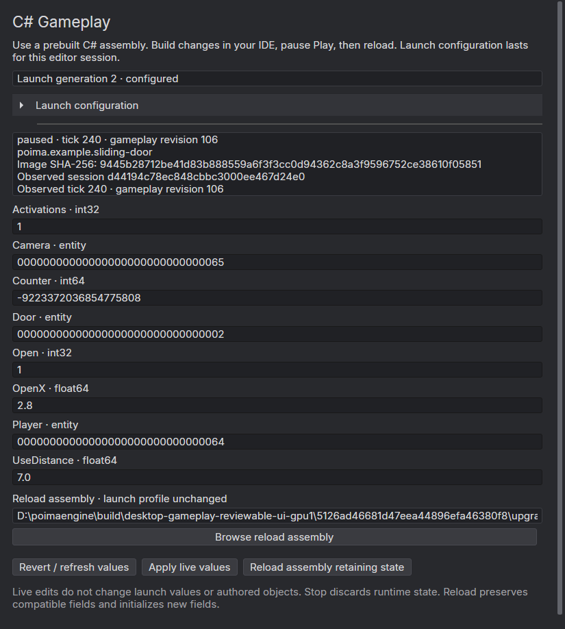

# C# gameplay in the editor

The desktop editor can load the same C# `Game<TState>` used by the native player. A session launch profile loads the module before the first Play tick. While paused, the C# Gameplay window exposes typed values and compatible assembly reloads through the existing native world service.

This is a prebuilt-assembly workflow. Compile with your IDE or `dotnet build`, then load or reload the resulting DLL. Automatic source watching, background compilation, persistent launch profiles and per-entity script components are not implemented. The launch profile lasts for this editor session; it does not change the authored scene or a shipped game's manifest.

## Configure and play

1. Build a C# project referencing `Poima.Gameplay`. The [sliding-door example](../examples/managed/DoorGame/DoorGame.cs) and [managed gameplay guide](MANAGED_GAMEPLAY.md) describe the current SDK and supported state types.
2. Open **Window → C# Gameplay**. Choose the game assembly and enter its fully qualified game type, such as `Poima.Examples.DoorGame`.
3. Leave the runtime and bridge paths at the packaged defaults unless you intentionally use another compatible development environment. The editor package includes `hostfxr.dll` and `gameplay/Poima.ManagedBridge.dll` with its SDK and metadata.
4. Configure the profile while stopped, then press Play. Optional initial values override initialized game fields. They are validated against the loaded module's schema at startup.

Selecting or configuring an assembly does not execute it. Play and reload execute trusted game code inside the editor process; this is not isolation from faulty or untrusted code. The first selected hostfxr and bridge remain process-lived. Restart the editor to select a different runtime or bridge after loading gameplay.

If module initialization or initial values fail, Play stops the newly created runtime, retains the launch configuration and reports the error. The authored world is unchanged. Repair the configuration or assembly and press Play again. Stop discards live simulation values; the next Play starts with the configured initial values.

## Inspect, edit and reload

The live section identifies the observed runtime session, tick, gameplay revision, module identity and assembly hash. Fields are generated from the module's registered state schema: integers, floating-point values and entity IDs. Integer text preserves 64-bit precision.

Pause to edit values. Apply sends a typed patch guarded by the original session, tick and gameplay revision. If an agent changes state after you observed it, a stale Apply is rejected. Refresh explicitly replaces the draft with the current state. Invalid text and conflicted drafts remain available to correct or discard; they are not silently overwritten by polling.

After compiling, reload the assembly while paused. A separate reload path allows testing another prebuilt assembly without changing the launch profile. Compatible fields retain their values, newly added fields receive initialization defaults and incompatible changes fail while preserving the current module and state. The existing [reload contract](MANAGED_GAMEPLAY.md) defines compatibility and restrictions. Reload uses no initial-value overrides, so it does not reset edited live values to launch values.

This workflow does not reload arbitrary managed runtime services, native libraries or the editor itself. Native AOT game artifacts use a different, process-lived [distribution route](NATIVE_GAMEPLAY.md).

## Agent operations

The native desktop service owns configuration. Both the window and external clients use these operations:

```json
{
  "jsonrpc": "2.0",
  "id": 1,
  "method": "desktop.gameplay.configure",
  "params": {
    "request_id": "<fresh 32-character lowercase hexadecimal ID>",
    "expected_generation": 0,
    "profile": {
      "hostfxr": "<hostfxr path>",
      "bridge": "<Poima.ManagedBridge.dll path>",
      "assembly": "<game DLL path>",
      "type": "Poima.Examples.DoorGame",
      "values": {}
    }
  }
}
```

`desktop.gameplay.inspect` returns the current configuration generation, resolved profile and compact runtime metadata. Paths resolve relative to the world document and must name existing regular files. A null profile clears configuration while stopped. Every accepted configure increments the generation, including an identical replacement. The latest 32 normalized exact request receipts support retries; changed payloads under a retained request ID reject. Configuration and receipts end when the desktop host closes.

When a profile is configured, `desktop.play.start` requires its observed `expected_gameplay_generation` alongside the existing authored revision and fresh runtime session ID. An active start retry neither reloads nor resumes the runtime. A failed startup consumes its runtime session ID; retry with a fresh one. Direct `runtime.start` continues to create a paused simulation without automatic desktop profile loading.

`desktop.inspect` and owner polling expose compact configuration/runtime counters, not every gameplay field. Obtain schema and values explicitly through `runtime.gameplay.inspect` with `include_schema: true`. Paused `runtime.gameplay.edit` and `runtime.gameplay.load` retain the existing session/tick/revision guards and receipts. Automatic playback rejects manual gameplay mutation, including Native AOT loading.

Profiles are bounded to 64 KiB, 128 initial fields, 64-byte field names, 4096-byte paths and a 512-byte game type. Configuration checks syntax and files; it cannot establish that a selected DLL contains a compatible game or that its code will initialize successfully.

## Recorded qualification

The [0.0.36 evidence](evidence/m2-editor-gameplay.json) records eight native Windows groups/193 RPCs, 192 focused editor actions with 100 compatible reloads and no retired contexts left alive, the 232-action editor regression, and 33 runtime/28 authoring-only Linux suites. The actual self-contained editor uses its packaged runtime and bridge. Earlier setup failures and the corrected visual-parent ownership defect are retained in that record.



*An Avalonia render of the attached window's own visual content at 125% scale. The dark fields, current/observed counters and exact 64-bit value were inspected. This is not an OS screenshot; Windows was locked. Desktop composition, native window chrome, physical input and broad DPI/accessibility behavior remain separate qualification work.*

The qualification script's `render_gameplay` operation writes a bounded PNG from the actual measured Gameplay visual, while `scroll_gameplay` changes its existing scroll offset. These require an explicit qualification script and do not capture other applications, the display or native Scene/Game HWNDs. The [configuration view](evidence/m2-editor-gameplay-configuration.png) and [scrolled controls](evidence/m2-editor-gameplay-controls.png) are recorded separately from native Vulkan captures.
