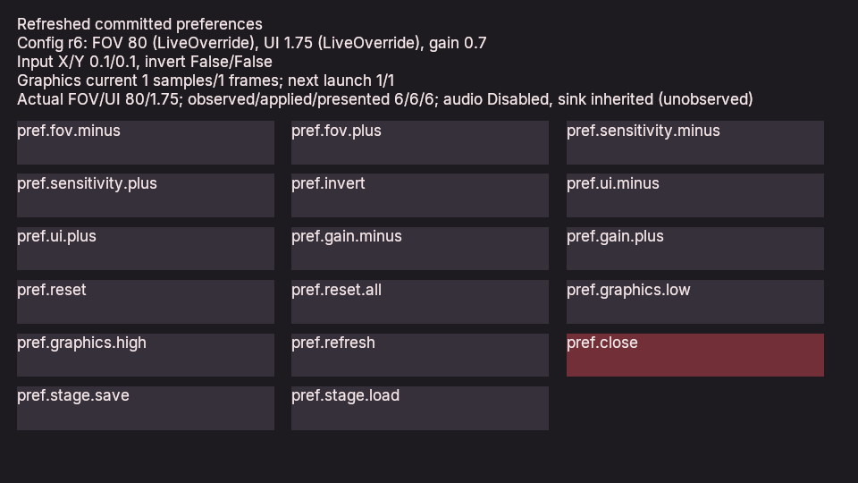

# Test settings and checkpoints in an exported player

This task tests a compiled settings menu inside the actual exported Windows
player. It complements the [compiled settings guide](COMPILED_PLAYER_SETTINGS.md):
the executable runs a relocated, immutable game bundle, while preferences and
checkpoints remain owned by the running player and external save storage.

Use this task when changing the shipping path, native UI input routing, player
preference binding or save/load replacement. A separate headless runtime test
cannot establish that these mechanisms work together in the exported window.

## Prerequisites

- A matching Windows engine and installed runtime, with simulation, Vulkan
  rendering, native game UI and Native AOT gameplay enabled.
- The genuine published native artifact for
  `Poima.Tests.ManagedPlayerPreferencesGame`. Its descriptor requires
  `baseline_v7` and `player_preferences_v1`, services epoch 7 and at least
  256 service bytes. Building this fixture requires the matching .NET SDK
  and native AOT toolchain; running its exported game does not use CoreCLR.
- Native Windows Python, an accessible Windows desktop, and a suitable Vulkan
  device. The verifier creates its own game window and sends messages only
  to that process's window. It does not move the global cursor or qualify
  physical mouse, keyboard or controller behavior.
- A new output directory. The supplied runtime and published artifact are
  inputs and must remain unchanged.

The recorded integration uses Poima 0.0.82 with the retained genuine 0.0.81
settings consumer. Its separately negotiated service requirements remain
compatible; the engine/runtime exact-version requirement still applies.

See [native gameplay publication](NATIVE_GAMEPLAY.md) for compiling and
publishing a game, and [project export](PROJECTS.md) for installing the runtime.
An engine executable and runtime must have matching exact engine versions;
gameplay admission separately checks the declared ABI prefix and feature names.

## Run the workflow

To create the input artifact on Windows, with the native AOT compiler/linker
environment configured:

```powershell
python scripts/publish_native_gameplay.py `
  --project tests/managed_player_preferences_gameplay/Poima.PlayerPreferencesMenuGame.csproj `
  --type Poima.Tests.ManagedPlayerPreferencesGame `
  --rid win-x64 --output build/published-settings

cmake --install build/windows-runtime --strip --prefix build/runtime-windows
```

Both destinations should be new. Publication is a build step; the integration
verifier below builds nothing and accesses no network. A previously published
compatible fixture can be supplied directly, as in the recorded integration.

Use the configured toolchain's stripped installation for distribution. Debug
symbols remain in the development build. A debug-symbol executable can exceed
the exporter's per-file size budget; increasing that budget does not remove the
unnecessary shipping data. Stripping retains the executable's runtime behavior
and exported native entry points, which this workflow then verifies.

From the repository root, using Windows paths and native Windows Python:

```powershell
python tests/player_preferences_gameplay_bundle.py `
  --binary build/windows-runtime/poima.exe `
  --runtime build/runtime-windows `
  --artifact build/published-settings/native-gameplay.json `
  --output build/exported-settings-check `
  --gpu 1
```

Select the GPU index reported by your installed engine; `1` is an example,
not a portable NVIDIA selection. Do not reuse a previous output directory.
Do not run with Python optimization enabled. The task expects the actual
settings fixture artifact, not an arbitrary game module.

The verifier authors a valid controller and direct-child camera, assembles
native menu definitions around the compiled fixture, inspects the project,
exports it, and verifies the copied runtime and native artifact inventory.
It relocates the game into a new directory alongside the checkout on the same
drive, and removes only its own source project. Launches use an unrelated working directory and a system-only PATH.

Menu interaction enters through the exported player's native window event
route and UI hit testing. It does not invoke `runtime.ui.activate` against a
second service, change compiled fields externally, or rewrite the bundle.
Recorded input replay remains a separate observation-only mode; it rejects
preference mutations and cannot replace this interactive check.

The verifier checks visible pixels in bounded rectangles clipped to its owned
client before the first interaction, after opening the modal and after restore.
It checks foreground ownership and practical occlusion guards, synchronizes the
GDI readback and compares visible RGB bytes. Only observation hashes and sampled colors are retained.
Windows focus activation can briefly join the foreground input queue, with
mandatory detachment; all injected key/pointer messages target the owned window.

SDL can consume a first focus click. The opener can retry only until the modal is
visibly present: its original point then lies under the modal's inert header.
Value-changing actions are not retried. Post-load input also has two seconds of
explicit spacing; that delay is not a redraw observation. Changed header pixels
are an additional guard, while exact final callback/save state establishes the
semantic result.

## Inspect completion

Read the output's `evidence.json` and the retained game reports and capture.
Passing evidence must establish the actual native backend, source-independent
launch, successful native window interaction, authoritative settings outcomes,
checkpoint continuation and unchanged complete bundle inventory. A launched
window or successful export alone is insufficient.

The [recorded 0.0.82 integration](evidence/m2-exported-player-settings.json)
preserves failed-attempt summaries alongside passing cohorts and source pins.



The inspected image is the final Vulkan renderer readback from the native
settings/checkpoint fixture. The status reports current configuration and
native application/presentation after restore.

Preference changes have three distinct checkpoints:

1. The compiled Control callback stages an intent under its current owner and
   revision. Reads inside that callback still see committed configuration.
2. Successful completion of the native boundary publishes the patch and its
   acceptance ticket. A failed boundary publishes neither.
3. Native input, presentation and optional audio consume accepted intent.
   Reported application and presentation revisions describe that consumption;
   they are separate from acceptance.

Inspect FOV/UI/gain values and their observations in the final live-settings
report. A gain value with audio disabled establishes configuration only.
Numeric sink-gain readback is a separate check from listening to output.

Save/load must replace the Runtime through its normal owner boundary while
retaining the current player preference owner. Gameplay state and saved UI
state can return to their checkpoint; preferences do not enter that snapshot.
A fresh player has a new preference owner. Saved diagnostic ticket words do
not reconstruct the former authority or receipt ledger.

The Vulkan capture is a renderer readback. Inspect it alongside semantic
state; it is not an OS desktop screenshot or a physical-input measurement.
The small fixture does not establish game-scale performance or a complete
production game.

## Recover from a failed run

Keep the failed output and logs. Resolve the reported problem, then run again
with a new output path so the failure remains reviewable.

| Failure | Inspect and recover |
| --- | --- |
| Runtime/version mismatch | Install the matching engine into a fresh runtime prefix. Do not mix an old executable with a new `runtime.json`. |
| Gameplay admission failure | Check the actual descriptor, payload hashes, feature names and minimum service extent. Rebuild intentionally if the supplied artifact requires an unavailable feature. |
| Desktop or owned-window unavailable | Unlock Windows and rerun. Missing native interaction must fail the check rather than count as a passing headless substitute. |
| UI activation absent | Compare authored placement, current client dimensions and the recorded messages. Eligibility in a logical UI inspection alone does not prove hit-testable placement. |
| Staged patch not accepted | Inspect callback failure, owner/revision conflicts and typed rejection. Refresh committed state before forming a deliberate new patch. |
| Save request did not complete | Distinguish the request acknowledgement from its later terminal result. Check external storage, generation and save status before claiming success. |
| Bundle inventory changed | Treat the immutable-content check as a failure. Keep reports, captures and saves outside the bundle. |

This playbook is a shipping integration check, not a claim that the Alpha
release gates are complete. The [Alpha roadmap](ALPHA_ROADMAP.md) also requires
complete playable workflows, broader content qualification, physical controls,
representative measurements and installation/reliability checks.
