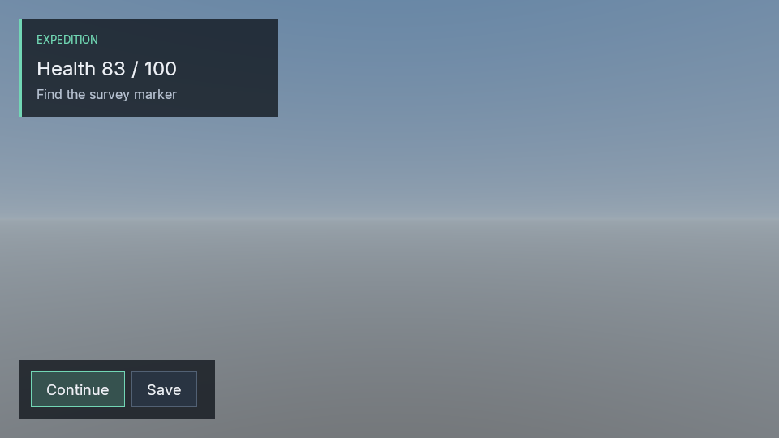

# Native game UI foundation

Poima's native UI work starts with retained document layout and shared Vulkan composition. This is a presentation foundation, not yet an integrated gameplay HUD or menu system. Compiled C# bindings, authored UI assets, service commands, live player/desktop input routing and paused control transactions remain unfinished.

The optional `POIMA_ENABLE_GAME_UI` build uses pinned RmlUi 6.3 and FreeType. It does not enable Lua, browser code or third-party scripting. The default headless engine build retains no UI dependency. Existing Inter font files are redistributed under their retained OFL license; see [third-party notices](../THIRD_PARTY_NOTICES.md).

## Presentation boundary

The native document adapter lays out in-memory RML and produces an owned, immutable `UiFrame`. It exposes registered label/button identities separately from rendered pixels. It returns semantic action identifiers to its caller; the document does not execute gameplay, write saves or advance simulation.

Geometry, textures, transforms and scissor rectangles cross the renderer boundary as native data. The common renderer composes UI after resolving scene MSAA and before capture. Legacy ImGui presentation uses the resolved scene texture, so game UI does not cover editor chrome. The first composition path requires an sRGB attachment and explicitly rejects unsupported UNORM composition.

RML/RCSS is RmlUi's layout format, not browser HTML/CSS. For a fixed container that must clip absolutely positioned children, use `overflow: hidden; clip: always;`. The adapter uses the library's clipping and hit testing. Semantic activation currently searches a bounded grid for an actionable point; very thin, partly occluded or transformed controls can report `hittable=false` despite having a small clickable region. This restriction must be resolved before claiming general control parity.

Input colors and textures use premultiplied sRGB bytes. Conversion to linear premultiplied values happens before texture filtering and framebuffer blending. Text uses rasterized glyph coverage. This does not establish production text accessibility, bidirectional/complex-script shaping, localization or geometric edge quality for every transform.

## Building

For native layout checks without a graphics dependency:

```sh
cmake -S . -B build/game-ui -G Ninja \
  -DPOIMA_ENABLE_VULKAN_PROBE=OFF \
  -DPOIMA_BUILD_MODULE_LAB=OFF \
  -DPOIMA_ENABLE_GAME_UI=ON
cmake --build build/game-ui --target poima-ui-document-test poima-ui-frame-test -j2
ctest --test-dir build/game-ui -R '^ui_(document|frame)_native$' --output-on-failure
```

Dependency downloads are verified by SHA-256. Renderer checks additionally require the existing Vulkan build dependencies and an accessible graphics device. Layout tests alone do not qualify rendering.

[The presentation example](../examples/ui/hud.rml) contains status text and two buttons. Its action names are illustrative: loading this document does not implement Continue or Save behavior. The host must bind returned actions to its own authoritative command path.

## Native API

[UiDocument](../include/poima/ui_document.hpp) accepts document text, owned font bytes and an explicit list of registered labels/buttons. Font families are shared within the library lifetime; case aliases must resolve to identical font bytes. Resource references cannot read disk or fetch URLs. Inline scripts, data-binding expressions, external images/stylesheets and unimplemented rendering effects are rejected.

```cpp
poima::UiDocumentSource source;
source.rml = document_text;
source.fonts.push_back({"Poima UI", font_bytes});
source.elements = {
    {"health", poima::UiElementKind::label, {}},
    {"continue", poima::UiElementKind::button, "continue"},
};
poima::UiDocument ui(std::move(source));
ui.set_text("health", "Health 83 / 100"); // Literal text, never markup.
scene.ui = ui.frame(960, 540, 1.0f, presentation_seconds);
auto controls = ui.inspect();
auto requested_action = ui.activate("continue");
```

`frame` takes physical pixel dimensions, density scale and nondecreasing presentation time. Published frames remain valid after document destruction. `set_visible` and `set_enabled` affect action validation; `pointer_activate`, `activate`, `focus_next` and `activate_focused` return presentation results without executing game code. Platform event wiring remains the caller's responsibility. A registered element cannot contain another registered element, because replacing its text would invalidate the descendant binding.

Current bounds include a 1 MiB RML document, 4,096 parsed nodes, 256 registered elements, 16 fonts per source and 16 KiB replacement text. [Draw-packet validation](../include/poima/ui.hpp) bounds extent, vertices, indices, draws and texture storage. Limit failures report errors instead of publishing invalid packets. These bounds are guardrails, not a measured production workload budget.

## Current limits

The presentation API is experimental. It has no C# bindings, world-service authoring commands, gameplay transactions or portable UI save state. Its returned action strings do not pause/resume a game or request storage operations. Controller navigation integration, inventory controls, text input, comprehensive accessibility and the UI editor remain unfinished.

## Recorded checks

[Qualification evidence](evidence/m2-native-game-ui.json) covers native layout/packet tests on Windows and Linux, the default headless build, and explicit Windows Vulkan captures on the laptop's AMD and NVIDIA GPUs. Numeric readback checks cover alpha composition, textures, transforms and clipping at 1× and 4× scene MSAA. The example also passes layout/action checks at 100% and 150% scale.

These checks do not qualify a live player/editor UI workflow, physical input, console support, a deployment package or production performance.



*Actual Vulkan capture of the presentation fixture. Text and focus are set through the native document API; the buttons are not connected to gameplay or storage.*
