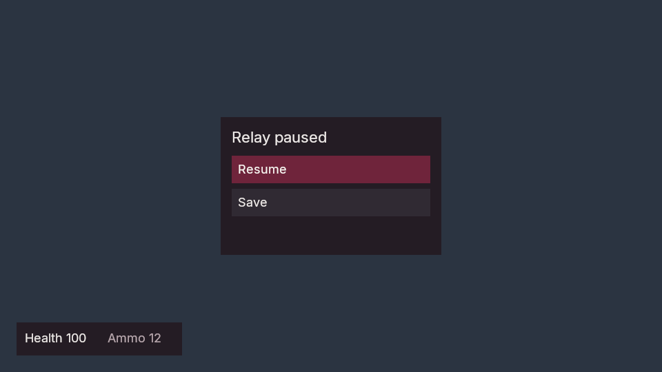
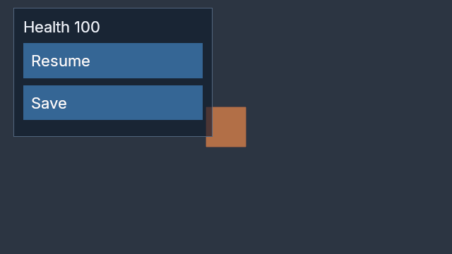

# Native game UI foundation

Poima owns logical controls in the world/runtime and uses native retained layout for Vulkan presentation. Typed authored layouts, optional styles and compiled C# control callbacks connect this state to native presentation. Bounded native, agent-service, desktop-owner and Vulkan capture checks are recorded below. The live input routing scope and qualification limits are recorded below.

Typed authored layout and styling are available in 0.0.50 development. Agents can
place HUDs and menus, choose a palette and inspect virtual-viewport bounds through
the native service. The blue skin remains the compatibility fallback when metadata
is absent. Theme assets, reusable style inheritance, images, text inputs, inventory
widgets, animations and a visual UI authoring tool remain future work.

The optional `POIMA_ENABLE_GAME_UI` build uses pinned RmlUi 6.3 and FreeType. It does not enable Lua, browser code or third-party scripting. The logical model is available in the default headless engine; it has no RmlUi, font or graphics dependency. Existing Inter font files are redistributed under their retained OFL license; see [third-party notices](../THIRD_PARTY_NOTICES.md).

## Authoritative controls

Authored world format 4 adds a separate `ui` hierarchy. Panels, labels and buttons have nonzero 32-character lowercase hexadecimal IDs, independent of world entities. Controls do not require transforms or physics objects. Definitions are frozen at runtime start and participate in packaged content identity.

Use `world.transact` with `ui.element.set` or `ui.element.remove`. A set operation supplies the complete element:

```json
{
  "op": "ui.element.set",
  "id": "10000000000000000000000000000001",
  "element": {
    "parent": null,
    "name": "Health",
    "kind": "label",
    "text": "Health 100",
    "action": null,
    "visible": true,
    "enabled": true
  }
}
```

Parents must be panels. Panel text is empty. Buttons require an action token of 1–128 ASCII letters, digits, underscores, dots or hyphens; other kinds require `action:null`. Tokens identify compiled handlers: naming a button Save alone does not write a checkpoint. The game must implement its `Control` callback and request storage explicitly. Final-state validation permits a child before its parent within the same transaction. Removing a parent requires removing or reparenting its children in that transaction. Retired IDs cannot be reused outside known undo/redo history.

Development discovery now encodes these kind constraints as explicit panel,
label and button `oneOf` variants in both the `ui` section and `ui.element.set`
mutation schema. This corrects a discovery gap exposed by a real agent's rejected
panel-text edit; native validation is unchanged. The focused discovery/authoring
regression passes against the rebuilt Windows and Linux world hosts; the typed
UI fixture also checks focused mutation discovery against the complete schema.

`world.ui.get` and `world.ui.list` inspect authored definitions. Pagination uses `revision`, `after` and `limit`. `runtime.ui.inspect` accepts `session_id`, `tick`, optional `ui_revision`, `after` and `limit`. Continuation pages require `ui_revision`. It returns frozen metadata alongside live text, local and inherited visibility/enabled state, modal membership eligibility and the next cursor. Inspection does not search for pixels or require a window.

`runtime.ui.edit` commits all supplied patches at the current simulation tick:

```json
{
  "session_id": "20000000000000000000000000000001",
  "request_id": "30000000000000000000000000000001",
  "expected_tick": 0,
  "expected_ui_revision": 0,
  "edits": [
    {"id": "10000000000000000000000000000001", "text": "Health 83"}
  ]
}
```

Each patch needs an ID and at least one of `text`, `visible` or `enabled`. Duplicate IDs are rejected. Optional `modal` selects an effectively visible panel; explicit `null` clears it, and omission preserves it. A modal-only edit can use an empty `edits` array. Hiding the active modal requires clearing or replacing it in the same transaction. Buttons are logically eligible only when they and their ancestors are visible/enabled and they lie inside the active modal, if any. Eligibility does not execute an action or promise a physically clickable layout region.

An accepted edit advances `ui_revision` once, including a same-value edit; it leaves simulation tick, physics and authored defaults unchanged. Invalid edits publish nothing. Identical retries return the original result within the shared 32-receipt runtime window, even after later UI/tick changes. A new runtime session invalidates old edit requests. Desktop-hosted edits require paused Play. The API is serialized by the native owner; it is not a concurrent direct-memory interface.

Definitions allow 256 controls, hierarchy depth 32, 128 UTF-8 bytes per name, 16 KiB per text and 1 MiB total text. Text is literal UTF-8 without NUL. These are bounded contract limits, not performance claims. The [native model API](../include/poima/ui_model.hpp) validates sorted complete definitions and owns mutable values. It is available without simulation; a live `Runtime` additionally requires the simulation build.

UI-bearing runtimes now write snapshot version 5, preserving complete logical state, modal, UI revision and `control_sequence` against trusted frozen definitions. Version 4 remains readable with control sequence zero; UI-free snapshots retain versions 1–3. No focus, atlas or pixel data is serialized. External `save.write` and replacement `save.load` require `expected_ui_revision` and `expected_control_sequence` when the active world contains UI. The Save/Load editor model retains the observed guards across retries and detects same-tick control activity even when no UI value changes. Stopped restore accepts absent or null guards.

## Authored layout and styling

Each `ui.element.set.element` retains its seven required logical fields and may
add nonempty `layout` and `style` objects. They are frozen with the runtime's
trusted authored definition. `world.ui.get/list` and `runtime.ui.inspect` expose
these objects only when present. `runtime.ui.edit` changes text, visibility,
enabled state and modal ownership; it does not edit presentation metadata.

Lengths use `{ "unit": "dp", "value": 320 }` or
`{ "unit": "percent", "value": 100 }`. Density-independent pixels scale with
the viewport's UI density. Percentages use the containing layout box.

| Layout field | Values and bounds |
| --- | --- |
| `position` | `flow`, `absolute`; offsets require `absolute` |
| `width`, `height`, `min_width`, `max_width`, `min_height`, `max_height` | Nonnegative lengths, up to 8192 dp or 100 percent. Same-unit minimum must not exceed maximum. |
| `left`, `top`, `right`, `bottom` | Length offsets: −8192..8192 dp or −100..100 percent |
| `padding` | Four dp values in top/right/bottom/left order, each 0..512 |
| `order` | Integer −1024..1024; siblings within a layout group use `(order, stable ID)` for presentation and keyboard/gamepad focus traversal |
| `grow`, `shrink` | 0..16 flex factors |
| `direction` | Panel only: `column`, `row` |
| `align` | Panel only: `start`, `center`, `end`, `stretch` |
| `justify` | Panel only: `start`, `center`, `end`, `space_between` |
| `gap` | Panel only: 0..256 dp |
| `hit_test` | Panel only: `capture`, `pass_through` |
| `overflow` | Panel only: `visible`, `hidden`, `auto` |

Explicitly laid-out roots use a full-viewport canvas. The canvas does not capture
input; buttons remain interactive under a pass-through panel. Roots without
layout retain the earlier scrollable default container, including roots with
only a style override. Set dimensions and spacing explicitly when replacing a
fallback layout. Legacy roots precede explicit canvas roots in traversal; order is local to each
layout group and subtree. Keyboard/gamepad focus now follows visual tree traversal,
rather than a global ID ordering. Model inspection and serialized definitions
remain stable-ID sorted, independently of presentation order.

Styles support `color`, `background_color` and `border_color` as lowercase
`#rrggbb` or `#rrggbbaa`; `font_size` (8..128 dp), `border_width` (0..32 dp),
`border_radius` (0..128 dp), and `text_align` (`left`, `center`, `right`). Optional
`hover`, `focus`, `pressed` and `disabled` objects contain color overrides only.
Focus and pressed presentation states apply to buttons; accepting those metadata
fields on panels or labels does not make them focusable or pressable.
No field accepts arbitrary CSS, scripts, URLs, font files or markup. Rounded
borders are supported; a positive radius on a panel with `overflow:hidden/auto`
is rejected because the renderer does not support rounded clip masks.

The [authored HUD fixture](../examples/ui/authored-hud.json) combines a centered
menu and a bottom-left HUD. Its wine/neutral palette is an example; games choose
their own styling. Insert the ID-map entries as `ui.element.set` operations in a
single guarded transaction, then inspect the layout:

```json
{"jsonrpc":"2.0","id":1,"method":"world.ui.layout","params":{"revision":1,"width":1280,"height":720,"scale":1}}
```

`world.ui.layout` requires the current authored revision, integer width/height
1..8192 and optional numeric scale 0.25..8 (default 1). It returns `revision`,
`width`, `height`, `scale` and `controls`. Each label/button row contains its
stable ID, kind, physical-pixel `bounds` and ancestor `clip` rectangles
`[left, top, right, bottom]`, plus `visible`, `enabled`, `hittable` and `focused`.
It lays out a fresh virtual viewport with no focus or scroll history, without
advancing simulation or editing the world. It is not an observation of a live
window. `world.describe.ui.presentation_available` reports build support;
without the optional native UI backend, a valid request returns `-32003`.
The method and UI fields are development APIs outside authoring-core v1.

`runtime.capture` accepts optional `ui_scale` (finite numeric 0.25..8). Set it to
the same value as `world.ui.layout.scale` to compare physical bounds with rendered
pixels independently of Windows display scaling. The capture builds a fresh owned
native UI packet from frozen live state; it does not alter focus, gestures or
runtime state. The result's `ui_scale` echoes the requested override; null means
window density was retained. An empty UI has nothing to scale. Explicit packets
must match the actual render-target extent; a surface that clamps the requested
size can reject the capture. Omission preserves earlier window-density behavior.
This option applies only to runtime captures; authored captures have no runtime UI.

Absent metadata stays absent through serialization; defaults are not written
into older worlds. Logical save state keeps its existing fields. Frozen layout
and style participate in the trusted content hash, preventing a saved snapshot
from being restored against a different embedded definition. Loading an older
save still uses that save's frozen world, even when current authoring has changed.

## Compiled control callbacks

Gameplay services ABI 7 is 176 bytes; the call structure remains 80 bytes. Engines, bridges and compiled modules must use matching rebuilt artifacts. Operation 6 invokes `Control`, separately from `Tick`. The default `Game<TState>.Control` throws when a game has no handler; it does not silently accept an action.

```csharp
public override void Control(ref State state, ControlContext context)
{
    switch (context.Action)
    {
        case "resume":
            context.SetModal(null);
            context.RequestResume();
            break;
        case "save":
            state.SaveRequests++;
            context.RequestSave("quick");
            break;
        default:
            throw new InvalidOperationException("Unhandled action.");
    }
}
```

`State` is the game's registered unmanaged state; `SaveRequests` in this example is an `int` field. Control changes to such scalar state are real gameplay changes, although physics does not advance. `ControlContext` exposes the current simulation `Tick`, proposed action `Sequence`, stable `Element` (`UiId`) and frozen `Action` token. It offers UI inspection/edits, modal selection, save requests/results and pause/resume requests. It does not expose physics input or motion methods. `GameContext` also supports `GetUi`, `SetUi` and `SetModal`, allowing ordinary Tick callbacks to update HUD values.

Reads within a callback see committed UI values. UI writes stage bounded patches; repeated writes to a field select the last value. Publication applies the combined candidate once after the callback. Native validation bounds callbacks and text writes and rejects invalid targets or a final invalid modal state. Failure rolls back gameplay state, UI changes and staged save intents. A later failure in a multi-tick batch also rolls back earlier UI publications in that batch.

A Begin or Continue handler that defers work to the next `Tick` must also call
`context.RequestResume()` when it should leave paused playback. Setting a
state flag alone does not advance simulation: controls can run while the native
player is paused, and the next tick waits for a successful resume. Test the
welcome screen with `initially_paused:true`, as well as a normally advancing
player, so a queued Begin action cannot leave the menu stuck.

An accepted control callback increments `control_sequence` once while leaving simulation tick unchanged. A successful Control callback also advances the gameplay revision once, even when its final scalar values are unchanged. This invalidates gameplay Inspector drafts captured before that same-tick callback; a failed callback advances neither gameplay nor control revisions. UI revision advances when UI commands publish; a scalar-only callback still changes control sequence. Save requests are serviced by the serialized owner after acceptance, without calling Tick. An I/O failure is a save-operation outcome, not a reversal of an already accepted callback. Storage retries resolve the original ticket without invoking the handler again.

`runtime.ui.activate` requires `session_id`, `request_id`, `id` (the button), `expected_tick`, `expected_ui_revision`, `expected_control_sequence` and `expected_gameplay_revision`. After structural edits, `expected_structure_revision` is required too; supplied guards are always checked. The owner derives the action token from frozen metadata and validates logical eligibility. It does not accept an arbitrary caller-supplied action string. Retained identical retries return original acceptance; changing parameters under the same request ID conflicts.

The result includes the source tick, UI revision and control sequence, current session/counters after any replacement, save-operation information when applicable, and numeric owner `intent`: `0` none, `1` Resume, `2` Pause. Desktop playback applies eligible intents once for the surviving session and resets elapsed time. Pause also clears held input. A Load replacement cannot be resumed by an old-session intent. These intents do not invent physics ticks.

The [compiled gameplay fixture](../tests/managed_ui_gameplay/ManagedUiGame.cs), [native control harness](../tests/runtime_ui_control_native.cpp) and [RPC harness](../tests/runtime_ui_control_contract.py) exercise the new path. The control/presentation evidence below records the tested backends and limits; earlier state-only evidence does not qualify these callbacks.

## Presentation boundary

The optional `UiPresenter` converts an immutable logical-state projection into native panel/label/button layout. It uses literal text and logical visibility/eligibility, an embedded font and cached immutable packets. Sparse authored layout/style metadata overrides the compatibility fallback; there is no visual UI authoring tool yet. Named-camera runtime snapshots carry the projection into the shared renderer. Authored and editor Scene snapshots stay free of runtime UI. Runtime captures of UI-bearing worlds require the observed `ui_revision`.

The native document adapter lays out in-memory RML and produces an owned, immutable `UiFrame`. It exposes registered label/button identities separately from rendered pixels. It returns semantic action identifiers to its caller; the document does not execute gameplay, write saves or advance simulation.

Geometry, textures, transforms and scissor rectangles cross the renderer boundary as native data. The common renderer composes UI after resolving scene MSAA and before capture. Legacy ImGui presentation uses the resolved scene texture, so game UI does not cover editor chrome. The first composition path requires an sRGB attachment and explicitly rejects unsupported UNORM composition.

RML/RCSS is RmlUi's layout format, not browser HTML/CSS. For a fixed container that must clip absolutely positioned children, use `overflow: hidden; clip: always;`. The adapter uses the library's clipping and hit testing. Semantic activation currently searches a bounded grid for an actionable point; very thin, partly occluded or transformed controls can report `hittable=false` despite having a small clickable region. This restriction must be resolved before claiming general control parity.

Input colors and textures use premultiplied sRGB bytes. Conversion to linear premultiplied values happens before texture filtering and framebuffer blending. Text uses rasterized glyph coverage. This does not establish production text accessibility, bidirectional/complex-script shaping, localization or geometric edge quality for every transform.

## Building

For native layout checks without a graphics dependency:

```sh
cmake -S . -B build/game-ui -G Ninja \
  -DPOIMA_ENABLE_VULKAN_PROBE=OFF \
  -DPOIMA_BUILD_MODULE_LAB=OFF \
  -DPOIMA_ENABLE_GAME_UI=ON
cmake --build build/game-ui --target poima-ui-document-test poima-ui-frame-test -j2
ctest --test-dir build/game-ui -R '^ui_(document|frame)_native$' --output-on-failure
```

Dependency downloads are verified by SHA-256. Renderer checks additionally require the existing Vulkan build dependencies and an accessible graphics device. Layout tests alone do not qualify rendering.

[The presentation example](../examples/ui/hud.rml) contains status text and two buttons. Its action names are illustrative: loading this document does not implement Continue or Save behavior. The host must bind returned actions to its own authoritative command path.

## Native API

[UiDocument](../include/poima/ui_document.hpp) accepts document text, owned font bytes and an explicit list of registered labels/buttons. Font families are shared within the library lifetime; case aliases must resolve to identical font bytes. Resource references cannot read disk or fetch URLs. Inline scripts, data-binding expressions, external images/stylesheets and unimplemented rendering effects are rejected.

```cpp
poima::UiDocumentSource source;
source.rml = document_text;
source.fonts.push_back({"Poima UI", font_bytes});
source.elements = {
    {"health", poima::UiElementKind::label, {}},
    {"continue", poima::UiElementKind::button, "continue"},
};
poima::UiDocument ui(std::move(source));
ui.set_text("health", "Health 83 / 100"); // Literal text, never markup.
scene.ui = ui.frame(960, 540, 1.0f, presentation_seconds);
auto controls = ui.inspect();
auto requested_action = ui.activate("continue");
```

`frame` takes physical pixel dimensions, density scale and nondecreasing presentation time. Published frames remain valid after document destruction. `set_visible` and `set_enabled` affect action validation; `pointer_activate`, `activate`, `focus_next` and `activate_focused` return presentation results without executing game code. Platform event wiring remains the caller's responsibility. A registered element cannot contain another registered element, because replacing its text would invalidate the descendant binding.

Current bounds include a 1 MiB RML document, 4,096 parsed nodes, 256 registered elements, 16 fonts per source and 16 KiB replacement text. [Draw-packet validation](../include/poima/ui.hpp) bounds extent, vertices, indices, draws and texture storage. Limit failures report errors instead of publishing invalid packets. These bounds are guardrails, not a measured production workload budget.

## Player and Game-view input

The native player and the desktop Game pane route mouse, keyboard and assigned gamepad input through the displayed `UiPresenter`. Hit testing uses the actual layout, clipping and scroll position. Presentation returns a stable button ID; the native control service checks eligibility and executes compiled `Control`. Agents should normally use `runtime.ui.inspect` and `runtime.ui.activate` directly, without synthesizing pointer events.

- Left-button release activates only the eligible button that received the press. Releasing outside the pressed target cancels activation. Focus loss, resizing, DPI changes or a runtime replacement cancel the gesture. Unrelated HUD text updates preserve a held gesture when its target geometry and eligibility remain unchanged.
- Tab and Shift+Tab move focus; Enter presses/releases the focused button. Assigned gamepad D-pad or left-stick edges navigate, South confirms and East cancels the gesture. Navigation currently has no held-direction repeat.
- Modal UI owns input even outside its visible controls. It blocks gameplay bindings without implicitly stopping simulation. Compiled Pause/Resume intents change playback explicitly and clear held gameplay input.
- The generated menu scrolls with the wheel, scrollbar and focused-control navigation. Mouse coordinates supplied to the hosted interface are physical Game-client pixels.

If runtime UI changes before the next draw, the old visible layout cannot activate controls. It still consumes hits in its visible regions and releases belonging to an existing gesture, preventing a menu click from becoming gameplay capture. Such input cancels the armed activation; a fresh draw does not rearm it. Clicks outside nonmodal UI remain available to gameplay. This differs from a compatible HUD update that has already been drawn before the next input event.

Interactive `runtime.play` may omit `controller` for a menu-only scene; a valid camera is still required. Replay requires a controller. A menu-only player advances simulation with no fabricated controller inputs. Game-view mouse and keyboard menus also work while paused and without a CharacterController. The desktop can bind gamepad input directly to a runtime camera for a menu-only view. `desktop.input.configure` accepts exactly one of `controller` (gameplay and UI) or `camera` (UI-only). For example, pass `session_id`, `camera`, `defaults:"keyboard_mouse_gamepad"` and `gamepad:{"mode":"only_connected"}`. An explicit session-local device ID uses `gamepad:{"mode":"explicit","id":...}`. Invalid cameras, profiles or device acquisition preserve the previous binding. Hosted gamepad event delivery temporarily enables SDL background events because native desktop windows do not have SDL keyboard focus; the engine still requires its focused, visible Game pane in the foreground window before dispatching UI input. The hint is restored when the last hosted owner exits; an explicit higher-priority policy disabling it is respected and reported as an acquisition error.

`desktop.input.inspect.binding` is `controller`, `ui` or null; a UI-only binding reports `controller:null`, zero pending gameplay input and no gameplay focus. `desktop.input.focus` with `focused:true` and `desktop.input.events` reject UI-only bindings. The assigned pad navigates when its camera is selected in the visible, focused Game HWND, including paused playback and before any keyboard navigation. Changing cameras, losing focus, disconnecting or replacing the runtime cancels partial confirmation and requires neutral controls before reuse.

The Game Input window retains selections while stopped or without a Game camera. When a runtime camera becomes available it configures that camera once, using its CharacterController when present and UI-only mode otherwise. A failed acquisition is reported once for that session/camera/selection; Apply retries it explicitly. This avoids repeatedly reconfiguring devices during editor polling.

The desktop host exposes `desktop.ui.input` with `session_id`, `camera`, `request_id`, `kind` and optional `x`, `y`, `delta`. Discover the event kinds and bounds through `desktop.describe`. Results identify input consumption, focused/activated IDs, keyboard ownership and presentation generation. An activation includes the native control outcome. Exact retries preserve the original event and control request; changed payloads cannot reuse an ID. `desktop.ui.reset` cancels presentation gestures without editing logical UI state. These are experimental host interfaces, not a replacement for the authoritative agent control API.

## Current limits

These APIs are experimental. Logical state, default native layout and compiled semantic execution are implemented and covered by bounded checks. General control-turn replay tooling, style inheritance/theme assets, inventory controls, text input, comprehensive accessibility and the UI editor remain unfinished. Physical-device and full Avalonia interaction qualification remain separate from synthetic routing tests. The standalone document API still returns presentation action strings; executing gameplay requires the authoritative control boundary above.

## Recorded checks

[Authored UI evidence](evidence/m2-authored-ui.json) records 15 selected Linux
headless and 10 native-layout test groups, 17 Windows check commands, and nine
typed-authoring cases (backend-dependent cases skip where unavailable). Eighteen
new authored/runtime captures on the AMD and NVIDIA laptop GPUs verify three
viewport extents, opaque colors, frozen metadata and same-tick text edits at
explicit density 1. Seven paired legacy captures on AMD are pixel-identical to
0.0.49. The existing Windows CoreCLR and Native AOT callback/save fixtures also
pass; these do not establish physical input.



*Actual NVIDIA Vulkan runtime capture at 960×540, density 1 and 4× MSAA.
The menu is authored data; this fixture does not execute its button actions.*

[Input routing evidence](evidence/m2-ui-input.json) records focused native UI tests, compiled desktop controls and menu-only gamepad tests on both laptop GPUs, plus standalone player input checks. These use synthetic input and virtual controllers, not physical devices or the full Avalonia message path.

[Control and presentation evidence](evidence/m2-ui-control-presentation.json) records services ABI 7 qualification under CoreCLR and NativeAOT on Windows and Linux, same-tick save/load and retry checks, desktop owner intent handling, and runtime UI captures on the laptop's AMD and NVIDIA GPUs at 1× and 4× MSAA. The full editor builds, but physical UI input is not qualified by these checks.



*Actual NVIDIA Vulkan capture at 4× MSAA. This fixture tests native state and presentation; its button labels do not establish physical input routing.*


The evidence in this section predates ABI 7, snapshot 5, compiled control callbacks and automatic logical-state presentation. It remains evidence for those recorded fixtures only.

[Logical-state evidence](evidence/m2-native-ui-state.json) covers native model/runtime checks, authored and runtime RPC transactions, strict restores, legacy save regressions and a linked C# Save model test. Windows and Linux both pass the authored six-case and runtime four-case UI suites. The default authoring-only build also validates UI definitions without simulation or RmlUi. Reproduce the focused native checks with `poima-ui-model-test` and `poima-runtime-ui-test`; the RPC harnesses are `tests/world_ui_contract.py` and `tests/runtime_ui_contract.py`. Each accepts a CLI binary and `--runtime 0` or `--runtime 1`; Windows interop uses `--windows-interop`. The save-panel model test runs with `.NET 10` using `dotnet run --project tests/fixtures/editor_save_model/Poima.SaveModel.Contract.csproj`.

[Qualification evidence](evidence/m2-native-game-ui.json) covers native layout/packet tests on Windows and Linux, the default headless build, and explicit Windows Vulkan captures on the laptop's AMD and NVIDIA GPUs. Numeric readback checks cover alpha composition, textures, transforms and clipping at 1× and 4× scene MSAA. The example also passes layout/action checks at 100% and 150% scale.

These checks do not qualify a live player/editor UI workflow, physical input, console support, a deployment package or production performance.


*Actual Vulkan capture of the presentation fixture. Text and focus are set through the native document API; the buttons are not connected to gameplay or storage.*
