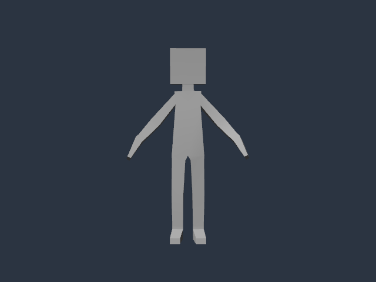

# Import and inspect a weighted character

This playbook imports an unchanged, licensed character and checks its hierarchy,
skin and source-authored motion. It covers asset intake and observation. Follow
the [compiled-game examples](PLAYBOOKS.md) separately for gameplay; this guide
does not supply locomotion clips, retargeting, IK or a character controller.



*Rigged Figure, © 2017 Cesium, [CC BY 4.0](https://creativecommons.org/licenses/by/4.0/).
Rendered in Poima from the unmodified source; PNG conversion of a Windows Vulkan
readback. This is a stylized test character, not a graphics showcase.*

## Prerequisites and source

Use a matching native build, Python 3.9+ and a new output directory. Import and
authoring work without graphics. Runtime pose checks need simulation; the
optional image checks need the Windows Vulkan build and a supported GPU.

The example uses **Rigged Figure**, by Cesium (2017), distributed in the
[Khronos sample collection](https://github.com/KhronosGroup/glTF-Sample-Assets/tree/edc7c9e67c639d230715049ee31f9a96a6babbbe/Models/RiggedFigure)
under [CC BY 4.0](https://creativecommons.org/licenses/by/4.0/).
Read its [license notice](https://github.com/KhronosGroup/glTF-Sample-Assets/blob/edc7c9e67c639d230715049ee31f9a96a6babbbe/Models/RiggedFigure/LICENSE.md)
and retain attribution when sharing the character or derived captures.
The test does not download assets. Obtain the pinned
[original GLB](https://raw.githubusercontent.com/KhronosGroup/glTF-Sample-Assets/edc7c9e67c639d230715049ee31f9a96a6babbbe/Models/RiggedFigure/glTF-Binary/RiggedFigure.glb)
and save it as `build/character-source/RiggedFigure.glb`.

The original is 50,116 bytes, with SHA-256:

```text
d6be85417d3e256861ee733eea6916093a7af7c79c16366181fd8abcaeb38cf5
```

The asset has 22 nodes, 19 skin joints, 370 vertices, 256 triangles and one
1.25-second motion with 57 transform channels. The motion opens the arms while
remaining in place; it is not a walk cycle. A static matrix-authored root converts
the model's authored axes. Poima decomposes that root under its
[matrix transform policy](ASSETS.md#matrix-authored-transforms).

## Run the checks

From the repository root:

```sh
python3 tests/imported_character_contract.py \
  --binary build/runtime-headless/poima \
  --source build/character-source/RiggedFigure.glb \
  --output build/character-check
```

For an authoring-only build, substitute `build/headless/poima`, use a different
output directory, and add `--runtime 0`. That checks import and authored content;
it does not check runtime playback.

For Windows Vulkan observations from WSL, use a Windows native executable and
add `--windows-interop --capture --gpu 0`. Use the GPU index from your build's
device discovery and a new output directory. The images are renderer readbacks,
not editor screenshots or physical input checks.

## What to inspect

1. Discover the installed command schemas and capabilities. Import the original
   file with `asset.import`; inspect the returned asset identity and diagnostics.
2. Page through `asset.inspect` sections `nodes`, `skins` and `animations`.
   Check the converted root, joint ancestry, clip duration and channel targets.
3. Instantiate with one revision-guarded `asset.instantiate` transaction. The
   outer wrapper is editable; the model's skin and mapped nodes retain their
   source frames. Inspect the authored hierarchy and material.
4. Observe several source-authored poses. The verifier compares imported and
   runtime transforms against an independent source-file calculation. Optional
   rendered observations also compare skinning with independently baked geometry.
5. Reopen after removing only the verifier's owned source copy. Verify that the
   cooked content still resolves and the original caller-provided file remains
   unchanged. Retain the evidence report and inspect any generated images.

General command forms are documented in [Assets](ASSETS.md),
[Animation assets](ANIMATION_ASSETS.md) and [Runtime animation](RUNTIME_ANIMATION.md).
For assets intended for distribution, use [provenance records](ASSET_PROVENANCE.md)
and validate the [project export closure](PROJECTS.md).

## Recorded checks

Version 0.0.70 passes the guide on Linux and Windows runtime builds, and on a
simulation-disabled Linux authoring build: 694 RPCs across eight clean owned
process exits. Windows observations run separately on the laptop's NVIDIA and
AMD GPUs, with 24 captures in total. The largest GPU/reference discrepancy is
one pixel with a four-step channel difference; CPU/reference images match
exactly in these observations. Numerical source comparisons cover every node
and all 370 vertices at four clip times. See the
[qualification record](evidence/m2-gltf-matrix-intake.json) for exact scope,
inputs and bounds.

## Recovery and limits

A source hash mismatch means this particular verifier cannot establish the
expected result. Obtain the pinned original, or build a separate reference for
your own asset; changing the expected hash is not a compatibility fix.

Import errors use `-32050`. Check unsupported features and matrix diagnostics
before changing export settings. Import does not edit the authored world or
synthesize colliders. A transaction conflict requires inspecting the current
world and deliberately reconciling your edit; preserve the original receipt
when an interrupted mutation has an unknown outcome.

Separately exported clips require the [exact-skeleton composition contract](FBX_IMPORT.md).
Different rest frames need a defined retargeting workflow. Matching bone names
alone are insufficient, and this example does not establish compatibility with
other character exporters or animation libraries.

This small stylized character establishes a bounded asset path. It is not
evidence of realistic character shading, a locomotion system, game-scale crowds,
physical input, clean-machine deployment or a completed imported-character game.
