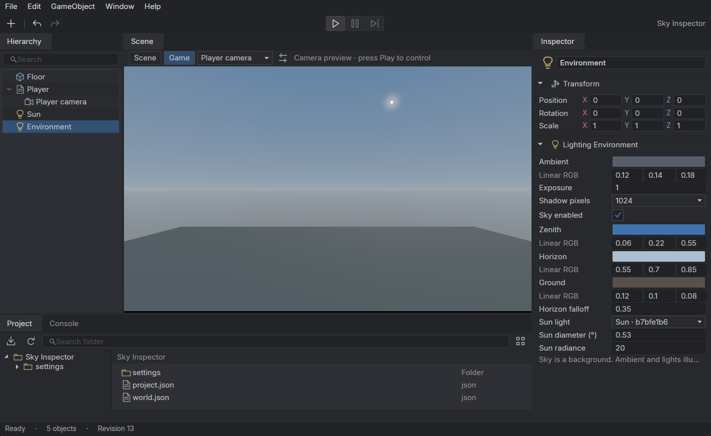
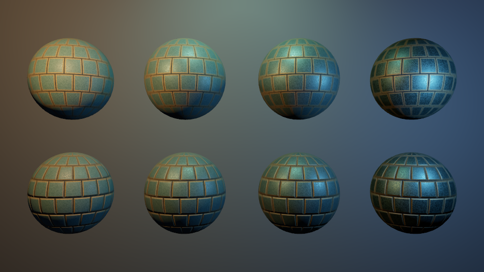

# Authored lighting

Poima 0.0.10 adds directional, point and spot lights, ambient fill and exposure to the native world service, Vulkan capture and player. Agents can author these through the same atomic transactions as meshes and materials, then inspect the resolved poses without a GPU. This is direct lighting; Poima 0.0.11 adds optional [shadow maps](SHADOWS.md). Poima 0.0.30 adds an asset-free procedural sky background. Environment reflections, GI, volumetric lighting and production light culling remain outstanding.

## Components and units

Use `component.set` on an existing entity. `world.describe` schema revision 23 describes the complete requests; `entity.get` and `entity.query` expose the authored components.

```json
{"op":"component.set","id":"00000000000000000000000000000002","type":"Light","value":{"kind":"spot","color":[1,0.65,0.3],"intensity":100,"enabled":true,"range":12,"inner_angle":15,"outer_angle":40}}
```

| Field | Meaning |
| --- | --- |
| `kind` | Required `directional`, `point` or `spot`. |
| `color` | Required linear RGB, each channel in [0,1]. It is not an sRGB color picker value. |
| `intensity` | Required nonnegative value up to 1e9. Directional: lux. Point/spot: candela, measured along the spot's axis. |
| `enabled` | Required Boolean. Disabled lights remain authorable but consume no enabled-light slot. |
| `range` | Point/spot only. Meters, [0,1e9]; absent or zero means unbounded. It is a cutoff distance, not emitter size. |
| `inner_angle` | Spot only, degrees from the axis to the inner cone. Default 0. |
| `outer_angle` | Spot only, degrees from the axis to the outer cone. Default 45. Require `0 <= inner < outer <= 90`. |

A point light uses the entity's world position. Directional/spot emission points along its transformed local −Z axis. Parent transforms affect position and direction; the direction is normalized. Scaling does not multiply intensity, range or cone angles. World units are meters. A directional light's translation has no illumination effect. An optional `shadow` object controls [shadow maps](SHADOWS.md). Area lights remain unimplemented.

One optional `LightingEnvironment` may exist anywhere in a world. Its transform has no effect:

```json
{"op":"component.set","id":"00000000000000000000000000000003","type":"LightingEnvironment","value":{"ambient":[0.015,0.02,0.03],"exposure":1}}
```

Both fields are required. Ambient channels and exposure are finite numbers in [0,1e6]. `ambient` is a constant diffuse fill, not a sky or physical indirect-light solution. `exposure` is a linear multiplier; 2 doubles scene-linear light, 0 makes shaded geometry black. The procedural sky follows exposure. The development [shared HDR composition path](HDR_COMPOSITION.md) also applies exposure to the flat scene background; earlier qualified builds left that background independent. There is no auto-exposure or photometrically calibrated camera.

## Procedural sky

New projects include an Environment with a blue sky, horizon and ground gradient, plus a directional Sun. The Sun illuminates geometry, casts shadows and sets the sky disk's direction and color. Rotate its Transform to move the disk. Existing worlds retain their flat background unless a sky is explicitly enabled.

`LightingEnvironment.sky` is optional. When provided, it must contain all eight fields:

```json
{
  "enabled": true,
  "zenith": [0.06, 0.22, 0.55],
  "horizon": [0.55, 0.70, 0.85],
  "ground": [0.12, 0.10, 0.08],
  "horizon_falloff": 0.35,
  "sun": null,
  "sun_size_degrees": 0.53,
  "sun_intensity": 20
}
```

Colors are linear RGB in [0,1]. `horizon_falloff` is in [0.1,16]; larger values extend the horizon color farther toward the poles. `sun_size_degrees` is the disk's angular **diameter**, in [0.1,20]. `sun_intensity` is its independent background radiance multiplier, in [0,1e6], not the Light's illuminance. `sun` is null or an existing directional Light's 32-character entity ID. A disabled linked Light hides the disk. The reference remains valid even when sky is disabled: deleting or changing that Light requires clearing/changing the reference in the same transaction.

The sky follows camera rotation and FOV, ignores camera translation, and stays behind scene geometry. Its gradient and derivative-smoothed disk use the same exposure, Reinhard mapping and sRGB output as materials, with 1×/4× MSAA support. It is an artistic background; it does not provide atmospheric scattering, reflections, indirect illumination, clouds or a day/night simulation.

`world.describe` exposes the complete sky defaults, disabled by default for compatibility. `world.lighting` and `runtime.lighting` return `sky` plus `sky_sun`: null when absent/disabled, otherwise the linked enabled light's ID, direction **toward** the disk, color and authored Light intensity. Runtime freezes sky settings and the reference while following the Sun's live pose.



## Explicit fallback and inspection

A scene with **no Light or LightingEnvironment components** retains the old preview directional light and ambient fill. Any authored lighting component, including a disabled light, suppresses that fallback. Removing all lighting components restores it. This permits genuinely dark scenes and prevents an agent from disabling a light only to have an invisible replacement appear.

```json
{"jsonrpc":"2.0","id":1,"method":"world.lighting","params":{"revision":3}}
{"jsonrpc":"2.0","id":2,"method":"runtime.lighting","params":{"session_id":"00000000000000000000000000000900","tick":30}}
```

`world.lighting` accepts an optional revision guard. `runtime.lighting` requires a live session ID and accepts an optional tick guard. Both return `preview_fallback`, resolved enabled `lights`, `ambient` and `exposure`. Each light reports entity ID, kind, position, normalized emission direction, color, intensity/unit, range and cone angles. Point-light direction and non-spot cone values are placeholders with no rendering effect. The fallback uses the synthetic observation ID `preview`, which is not an editable entity. The authored response adds `revision`; the runtime response adds `session_id` and `tick`.

Capture and player results also include the resolved lighting. These responses let an agent check the light state alongside the resulting image. Existing revision/tick conflicts use `-32009`; invalid component data or global counts use `-32602`.

Transactions support preview, persisted retry receipts, atomic rejection and component removal. The initial forward path allows **64 enabled lights** and **one environment**; authoring rejects overflow rather than dropping lights silently. Disabled lights count toward the ordinary entity/document limits. These are current implementation bounds, not the planned production scene scale.

## Runtime ownership

`runtime.start` freezes light settings and environment values with the authored revision. Later authoring transactions affect future runtime sessions and authored captures; they do not silently mutate a running simulation. Light poses follow their runtime entity hierarchy, so a lamp attached to a moving rigid body moves in capture and continuous play. Inspection works in the optional headless physics build without Vulkan. Runtime setters/animation of light settings and hot-reload reconciliation are not implemented yet.

## Rendering

Materials use the existing GGX/Smith/Schlick specular and Lambert diffuse terms. Authored lighting also routes built-in boxes without PbrMaterial through that path, using their albedo, metallic 0 and roughness 1. Legacy boxes retain the old preview shading only when fallback lighting is active.

Point/spot intensity follows inverse-square attenuation, with squared distance clamped to 0.0001 m² to bound the singularity within 1 cm. A finite range multiplies it by `clamp(1 - (distance/range)^4, 0, 1)`. Spot falloff is the square of the normalized cosine interval between outer and inner cones. Colors from all lights accumulate in linear space before exposure, Reinhard mapping and sRGB encoding. Ambient fill affects diffuse color and receives material AO; emission receives exposure but no direct-light multiplier. The renderer uses float precision; extremely narrow cones and extreme world scales are not precision-qualified.

Lights with enabled [shadow maps](SHADOWS.md) are occluded by visible opaque geometry; unshadowed lights retain their previous behavior. Metallic surfaces receive direct highlights but lack environment reflections. Work is linear in enabled lights per shaded pixel; there is no clustered light assignment, shadow cache or performance claim for 64 overlapping lights. The player still waits for the GPU each frame. NVRHI error checks are not full Vulkan validation.

## Reproduce and verify

From the repository root, use a fresh world and capture destination:

```sh
build/windows-runtime/poima.exe world build/lighting-grid.world.json < examples/lighting-grid.jsonl
```

The example imports the original normal-mapped sphere fixture and adds warm/cool point lights, a top spotlight and an explicit environment. Asset source paths resolve relative to the world file; capture paths resolve relative to the process working directory. The default capture is `build/lighting-grid.bmp`; remove it or choose another path before repeating capture. The stable transaction request ID permits an identical transaction retry.

```sh
python3 tests/lighting_contract.py build/headless/poima
python3 tests/lighting_contract.py build/runtime-headless/poima
python3 tests/lighting_contract.py build/windows-runtime/poima.exe --windows-interop
python3 tests/lighting_capture.py build/windows-runtime/poima.exe --windows-interop --output build/lighting-capture --gpu 0
python3 tests/player_contract.py build/windows-runtime/poima.exe --windows-interop --authored-lights --output build/lighting-player-authored --gpu 0
```

The headless suite exercises discovery, preview/fallback, retry/persistence, transformed lights, invalid data, global limits and atomic rejection. The optional runtime case checks frozen settings and a light following a falling parent. GPU tests compare numerical references with actual captured pixels for direct lights, distance/range/cone falloff, colored accumulation, ambient/exposure, the last of 64 uniform slots, a moving runtime light, primitive defaults and emission. The authored-light player variant attaches lamps to a falling body and a moving camera, then compares final light poses and pixels after 371 ticks against independent headless stepping. See [recorded evidence](evidence/m2-lighting.json) for the builds, GPU results and current qualification limits.



Sky qualification uses actual hardware captures and independent pixel/projection checks:

```sh
python3 tests/sky_capture.py build/windows-runtime/poima.exe --windows-interop --output build/sky-gpu1 --gpu 1
python3 tests/sky_capture.py build/windows-runtime/poima.exe --windows-interop --output build/sky-gpu0 --gpu 0
```

The [0.0.30 sky record](evidence/m2-procedural-sky.json) includes 44 captures per GPU at 1×/4× MSAA, legacy/disabled and translation equality, exposure, camera orientation/FOV, Sun position/size, geometry occlusion, frozen runtime settings, live Sun pose and exact player/capture parity. Comparisons between authored double-precision and physics float-precision rotations permit one display-byte difference; identical-state comparisons remain exact. The desktop additionally passes 59 semantic actions per GPU, including actual Inspector handlers, draft preservation, invalid edits, undo/redo, environment creation, floating/reset layout and Scene/Game captures. These tests qualify small-scene correctness, not physical-input usability or production frame rates.
