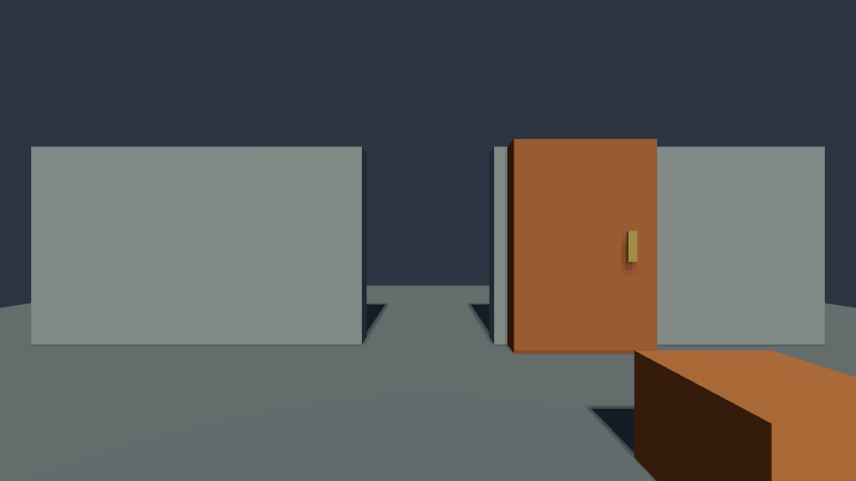

# C# gameplay in the native runtime

Poima can load handwritten C# into its native EnTT/Jolt runtime, inspect and edit typed gameplay fields, and replace game code while retaining compatible state. The example uses the same native collider queries and kinematic motion as the CLI: press **E** while looking at the sliding door to open it. Agents can submit the same `use` action through headless steps or Vulkan replay.

This is the first integrated gameplay SDK subset: one `Game<TState>` module per runtime, with input, entity observation, raycasts, kinematic movement, sound events, animation control, opt-in [character movement](CHARACTER_INPUT.md) and [static NPC navigation](NAVIGATION.md). C++20 remains the engine language. CoreCLR supplies JIT compilation and garbage collection during development. A bounded [Native AOT distribution route](NATIVE_GAMEPLAY.md) compiles the same game source for Linux and Windows. [Custom scalar components](CUSTOM_COMPONENTS.md) provide native-owned per-entity data with generated C# accessors. Production deployment qualification and the complete SDK remain unfinished.

Opt-in [persistent field metadata](GAMEPLAY_PERSISTENCE.md) assigns stable IDs and literal defaults to global state without changing normal initialization or the current exact-save restore rules.

## Build

From the repository root, obtain the optional workspace-local Linux .NET SDK if it is absent:

```sh
python3 scripts/bootstrap_tools.py --only dotnet
.cache/toolchains/dotnet-10.0.401/dotnet build managed/Poima.ManagedBridge/Poima.ManagedBridge.csproj -c Release
.cache/toolchains/dotnet-10.0.401/dotnet build examples/managed/DoorGame/Poima.DoorGame.csproj -c Release
cmake --preset runtime-headless -DPOIMA_ENABLE_MANAGED_GAMEPLAY=ON \
  -DPOIMA_ENABLE_GAME_UI=ON \
  -DPOIMA_DOTNET_HOST_HEADERS="$PWD/.cache/toolchains/dotnet-10.0.401/packs/Microsoft.NETCore.App.Host.linux-x64/10.0.12/runtimes/linux-x64/native"
cmake --build --preset runtime-headless
ctest --preset runtime-headless
```

For the Windows player, configure and build `windows-runtime` with the same `-D` options after completing the [Windows toolchain setup](BUILD.md). The host headers contain conditional Windows/Linux definitions and were used for both tested builds. These paths identify the measured SDK; another SDK requires its matching header path and separate qualification. The CMake presets leave managed gameplay and game UI off by default, and the authoring-only `headless` build needs no .NET installation. Enable the UI option for samples that author native panels or controls, including Collection Room and Patrol Room.

Keep the bridge's output directory together, including `Poima.Gameplay.dll`, its dependency metadata and `Poima.ManagedBridge.runtimeconfig.json`. The game assembly is portable IL; the native executable must load a CoreCLR installation for its own operating system. Tested installations:

| Native engine | Explicit hostfxr path |
| --- | --- |
| Linux x64 | `.cache/toolchains/dotnet-10.0.401/host/fxr/10.0.12/libhostfxr.so` |
| Windows x64 | `C:/Program Files/dotnet/host/fxr/10.0.12/hostfxr.dll` |

No runtime is installed or redistributed by the engine build. Hostfxr and the stable bridge remain loaded for the process lifetime. Changing their selected paths requires restarting the engine process; only game assemblies are replaced during gameplay reload.

## Use the editor

The [C# Gameplay window](EDITOR_GAMEPLAY.md) configures a compiled development assembly for Play, exposes typed live values, and reloads compatible builds while paused. The desktop package includes its development runtime and stable bridge. Source compilation remains an external IDE or `dotnet build` step.

## Write gameplay

The [complete sliding-door sample](../examples/managed/DoorGame/DoorGame.cs) references only `Poima.Gameplay` and ordinary .NET types. It does not require C++, unsafe code, renderer internals or JSON inside its update. Its structure is:

```csharp
using Poima;

public struct CounterState
{
    public EntityId Player;
    public int Uses;
}

[GameModule("my-game.counter")]
public sealed class CounterGame : Game<CounterState>
{
    public override void Initialize(ref CounterState state)
    {
        state.Player = new EntityId(0, 100);
    }

    public override void Tick(ref CounterState state, GameContext context)
    {
        if (context.Pressed(state.Player, GameAction.Use)) ++state.Uses;
    }
}
```

`TState` has sequential unmanaged layout and 1–128 public mutable fields, totaling at most 65,536 bytes. Supported fields are `int`, `long`, `float`, `double` and `EntityId`. Floating values must remain finite. The protocol represents `long` as a decimal string to preserve all 64 bits and `EntityId` as 32 hexadecimal digits. Booleans, strings, arbitrary nested structs and collections are not yet supported state fields; the door uses an integer for its open/closed state. Game classes cannot have instance fields. Put authoritative mutable data in `TState` so the runtime can migrate, inspect and roll it back.

`GameContext` is borrowed for the current call. It exposes:

| API | Behavior |
| --- | --- |
| `Tick`, `DeltaTime` | Current tick before its physics update, and a fixed 1/60 second interval. |
| `Inputs`, `Pressed(entity, action)` | Current controller inputs; `Jump` and `Use` are press edges. |
| `Get(entity)` | Live world transform, velocity, body motion kind and remaining motion ticks. |
| `Raycast(origin, direction, distance, ignore)` | Closest collider hit, or null; see the [native ray contract](PHYSICS_INTERACTIONS.md). |
| `PlaySound(emitter, gain)` / `StopSound(voice)` | Create/stop a native voice in the gameplay transaction; [event/recording contract](AUDIO_EVENTS.md). |
| `MoveKinematic(entity, position, rotation, ticks)` | Queue a validated native kinematic target for this tick. |
| `GetAnimation(entity)` | Copy native playback and active transition state; null for an existing non-rig entity. |
| `SetAnimation(entity, clip, time, speed, loop, playing, blendTicks)` | Queue complete native playback state and an optional fixed-tick crossfade for this tick. |
| `SetAnimation(entity, clip, transitionMode, time, speed, loop, playing, blendTicks)` | Opt-in versioned command selecting `Crossfade` or `Inertial`; requires `IInertialAnimationGame`. |
| `GetAnimationExtended(entity)` | Opt-in copied playback state with nullable active mode/progress; requires `IInertialAnimationGame`. |
| `GetAnimationLayer(entity, slot)` | Copy one configured slot, including playback, immutable mode/mask count and weight ramp; requires `IMaskedAnimationGame`. |
| `SetAnimationLayer(entity, slot, clip, weight, ...)` | Queue complete playback and target weight for a configured slot; requires `IMaskedAnimationGame`. |
| `FindNavigationPath(agent, goal, corners, extents, maxPolygons, maxNodes)` | Copy a bounded route from the live character foot position; Tick-only and requires `INavigationGame`. |

Controller look is applied before C# runs, so a use action in the same tick sees the new camera direction. Gameplay then runs before physics advances. Queued motions are validated together before application, with at most 128 per tick. Duplicate targets, invalid bodies and exceeding native speed/duration limits fail the batch. Explicit caller motion and gameplay may not target the same body on the first tick of a batch. Movement is held for a step/replay segment; look, jump and use apply only on its first tick. Read-only entity queries during gameplay see the current state, not the eventual result of queued motion.

This is trusted local project code. Do not retain borrowed pointers, start background gameplay work or store authoritative state in statics/external objects. Native-state rollback cannot undo file writes, subscriptions, static variables or other external side effects. Managed exceptions become structured engine errors; this is not a sandbox for arbitrary assemblies.

## Control animation from C#

Version 0.0.34 exposes the same native playback and crossfade contract used by agents and the Inspector. `GetAnimation(entity)` returns copied playback state with an optional active transition. An existing entity without an animation rig returns null; an unknown entity is an error. `SetAnimation` takes the rig wrapper identity, a nullable clip index, time in seconds, speed, loop/playing flags and `blendTicks`. Null selects the authored rest pose; zero blend duration switches immediately. Defaults are time 0, speed 1, looping and playing enabled, and no fade. An explicit negative clip index is invalid; use null for rest. Time, speed and duration use the same bounds as native commands.

```csharp
// Issue on a state change or input edge, rather than restarting every tick.
if (context.Pressed(state.Player, GameAction.Use))
    context.SetAnimation(state.Rig, clip: 1, blendTicks: 12);
```

The [animation sample](../examples/managed/AnimationGame/AnimationGame.cs) shows this inside a complete module. Durations use the engine's 60 Hz simulation clock: 12 ticks is 0.2 seconds. Clip speed changes playback time, not blend duration. Crossfade interruption freezes the current blended local pose as the new source. This preserves pose continuity without guaranteeing continuous velocity or foot contact; see [native animation](RUNTIME_ANIMATION.md) for the complete limits.

Version 0.0.56 adds an opt-in overload for native inertial transitions. Declare `IInertialAnimationGame` on the game class, then pass `AnimationTransitionMode` as the third argument. The original seven-parameter overload remains unchanged: numeric-time calls, including third-argument `0` and `default`, continue to select the legacy crossfade command. The enum overload requires the marker even when selecting `Crossfade`.

```csharp
using Poima;

public struct MyState { public EntityId Player, Rig; }

[GameModule("my-game.inertial-animation")]
public sealed class MyGame : Game<MyState>, IInertialAnimationGame
{
    public override void Initialize(ref MyState state)
    {
        state.Player = new EntityId(0, 100);
        state.Rig = new EntityId(0, 1000);
    }

    public override void Tick(ref MyState state, GameContext context)
    {
        if (context.Pressed(state.Player, GameAction.Use))
            context.SetAnimation(state.Rig, 1,
                AnimationTransitionMode.Inertial, blendTicks: 18);
    }
}
```

Replace the example IDs with a controller and rig wrapper in your world, and select a valid clip index before running. Inertial transitions estimate outgoing motion from distinct committed samples and decay one finite-time correction toward the destination; they do not guarantee foot locking, matched phases or zero overshoot.

`GetAnimationExtended(entity)` returns nullable `AnimationStateExtended`. Its `State` is the same legacy playback/transition projection returned by `GetAnimation`; `Mode` and `Progress` are null when no transition is active. For an active transition, `Progress` is elapsed ticks divided by duration, rather than a clip's contribution to the pose. An existing non-rig entity returns null; an unknown entity is an error. These reads retain the committed-state timing described below.

Calls made during `Tick` queue commands. Repeated queries in that callback observe the current native state, not queued writes. Commands apply after the callback and before the physics update, then animation advances with the simulation tick. Explicit caller commands from `runtime.step` have already applied before gameplay runs. If caller and gameplay target the same base clock or the same configured layer on that first tick, the entire batch fails instead of choosing a winner. Duplicate gameplay targets also fail. Base and distinct layer slots on the same rig can coexist. Caller and gameplay together may submit at most 64 animation commands on the first tick; subsequent ticks allow at most 64 gameplay commands each.

Invalid commands, failed curve samples and managed exceptions restore animation clocks, interrupted-pose buffers, inertial corrections/output history, local poses, physics, sounds and native-owned gameplay fields to the start of the batch. This covers a failure several ticks into one step request. It cannot undo external side effects made by managed code. Compatible CoreCLR code reload leaves the native animation clocks, history and in-progress transitions intact.

The native service compatibility baseline remains epoch 7 (176 bytes), including the [gameplay save](GAMEPLAY_SAVES.md), [component](CUSTOM_COMPONENTS.md), [lifecycle](GAMEPLAY_LIFECYCLE.md) and [UI control](GAME_UI.md) extensions. Inertial-only marked games additionally require `animation_inertial_v1` and a 192-byte service prefix with separate versioned animation callbacks. Masked games require both animation features and the 208-byte prefix described below. Unmarked games retain the exact 176-byte view; existing callback structures and signatures do not grow. The bridge and SDK remain a matched pair.

With a matched SDK/bridge, load-time negotiation checks the marker before game construction and `Initialize`. An unavailable extension rejects the marked game; arbitrary assembly/module initialization and native-library loader side effects remain outside that guarantee. Callback entry revalidates the required prefix before reading the extension. Requirements stay outside the game-state schema and save fingerprint. Supported required profiles are 176 baseline, 192 named inertial, 208 named masked layers plus inertial, 216 named character input, and 224 named navigation; combined games declare every required feature. A later compatible host may advertise additional available services while preserving these prefixes. See the [artifact contract](NATIVE_GAMEPLAY.md#artifact-contents) and historical [0.0.56 qualification](evidence/m2-managed-inertial.json). Graph APIs, IK, retargeting and root motion remain unfinished.

## Control masked layers from C#

Version 0.0.58 adds `IMaskedAnimationGame`, which inherits `IInertialAnimationGame`. The marker requests `animation_layers_v1` together with `animation_inertial_v1` and a 208-byte services prefix before construction. Inertial-only games retain 192 bytes; unmarked games retain 176. The original getters and both `SetAnimation` overloads continue to select the base clock.

```csharp
using Poima;

public struct CharacterState { public EntityId Player, Rig; }

[GameModule("my-game.masked-animation")]
public sealed class CharacterGame : Game<CharacterState>, IMaskedAnimationGame
{
    public override void Initialize(ref CharacterState state)
    {
        state.Player = new EntityId(0, 100);
        state.Rig = new EntityId(0, 1000);
    }

    public override void Tick(ref CharacterState state, GameContext context)
    {
        AnimationLayerState? layer = context.GetAnimationLayer(state.Rig, 1);
        if (layer.HasValue && context.Pressed(state.Player, GameAction.Use))
            context.SetAnimationLayer(state.Rig, 1, clip: 2, weight: 0.8,
                transitionMode: AnimationTransitionMode.Inertial,
                blendTicks: 12, weightBlendTicks: 18);
    }
}
```

Replace the IDs with your controller and rig wrapper, author `AnimationRig.layers` slot 1, and select a valid clip index. Slots are 1–4. A valid slot missing from an existing entity, including an existing non-rig entity, returns null. Dead/unknown entities and invalid slots fail; setters also reject an unconfigured slot.

`AnimationLayerState` exposes `Slot`, immutable `Mode` and `MaskNodes`, `Playback.State`, nullable active clip `Playback.Mode`/`Progress`, effective `Weight` and `TargetWeight`, and optional `WeightTransition` with `StartTick`, `DurationTicks`, `ElapsedTicks`, `Source` and `Target`. The getter validates the known native reply before exposing these values. It does not return full masks, references or pose history.

`SetAnimationLayer(entity, slot, clip, weight, transitionMode, time, speed, loop, playing, blendTicks, weightBlendTicks)` stages a complete playback and target-weight replacement during Tick. Defaults are crossfade mode, time 0, speed 1, loop/playing true and both durations zero. Null clip selects rest. Weight is finite 0–1; both durations are 0–3,600 ticks. Frozen masks, layer mode and additive references remain authored data. Writes share the committed-read timing, 64-command budget, target conflicts and whole-batch rollback described above. A weight ramp preserves its effective value on interruption, without guaranteeing continuous weight velocity.

Compatible CoreCLR reload retains native layer clocks, unweighted history and weight ramps; a failed reload retains the previous usable module. Requirements do not alter the state fingerprint, and durable restores still bind the actual saved gameplay artifact and authored content. Native AOT libraries remain process-pinned. Arbitrary mixed old bridge/new SDK cohorts are unsupported: an old bridge recognizing only the inherited inertial marker does not establish a layer pre-construction guard.

The [0.0.58 compiled-layer record](evidence/m2-managed-animation-layers.json) separates actual CoreCLR and Native AOT runtime checks from independent mock ABI transfer/guard checks. Each runtime route passes eight groups on Windows and Linux, including fresh complete-payload restore and immediate compiled re-interruption. These fixtures add no GUI, GPU, physical-input, production-deployment or animation-throughput qualification.

`tests/runtime_gameplay_layers.py` reproduces the compiled-layer fixture with `--binary`, `--dotnet`, `--hostfxr`, `--bridge` and a new `--output`. It also requires a separately preserved pre-layer `--legacy-binary` and matched `--legacy-bridge` closure for rejection checks. Use `--windows-interop` when launching the Windows engine from WSL. The runner builds its fixture modules; retain historical artifacts before rebuilding the SDK/bridge.

## Plan NPC routes from C#

Version 0.0.64 adds the independent `INavigationGame` marker and `navigation_query_v1` with a 224-byte services prefix. It does not inherit movement or animation markers. Declare `ICharacterInputGame` separately when the NPC also calls `SetCharacterInput`. Named requirements authorize callbacks; merely receiving a larger allocation does not grant intervening features. Earlier 176/192/208/216-byte views and signatures remain unchanged.

`FindNavigationPath(EntityId agent, Vector3d goal, Span<NavigationPoint> corners, Vector3d? extents = null, uint maxPolygons = 256, uint maxNodes = 4096)` reads the live native capsule foot position during Tick. It sees committed prephysics state, checks baked capsule clearance, and returns copied float corners with asset/status/projection metadata. Only `Complete` grants a complete route. Capacity is 2–256; compiled polygon/node limits are 1–256 and 32–4,096. Eight native attempts, including native failures, are allowed per Tick. Errors preserve the destination span. Typed Initialize and Control APIs expose no navigation query.

Use an explicitly [bound static mesh](NAVIGATION.md#bind-a-world). Binding/freeze freshly verifies package identity and source topology; runtime queries perform no baking or package I/O. The matched loader rejects a missing backend/binding before game construction, excluding arbitrary assembly/module initialization. The [compiled follower fixture](../tests/managed_navigation_gameplay/NavigationGame.cs) implements both markers, persists ten XYZ corners and a cursor in a generated 512-byte component, and steers through normal native input. Its [replay harness](../tests/navigation_runtime_contract.py) checks saved/fresh continuation, immediate replan, rollback and compatible CoreCLR reload without route patches or teleports.

The [0.0.64 runtime-navigation record](evidence/m2-runtime-navigation.json) reports separate CoreCLR and actual Native AOT runs: each passes ten checks over 1,009 RPCs and five clean owners on Linux, and nine checks over 998 RPCs and four clean owners on Windows. The extra Linux check uses a navigation-disabled simulation build. Earlier [static navigation evidence](evidence/m2-navigation.json) is a different scope. The callback adds no save format, navigation editor, crowd avoidance, dynamic obstacles or general AI graph.

## Load, inspect and edit

Discover the current operations and schema revision through `world.describe`. `managed_gameplay` and `gameplay_reload` indicate this optional integration; broad `hot_reload` remains false because content/shader/general component reload is incomplete.

First author [interaction-room.jsonl](../examples/interaction-room.jsonl) into a fresh world using the [world service](WORLD_SERVICE.md). Continue sending these requests to that same engine process. This Windows example uses absolute paths; relative paths resolve against the world document's parent directory, not the shell working directory:

```jsonl
{"jsonrpc":"2.0","id":2,"method":"runtime.start","params":{"session_id":"00000000000000000000000000000384","revision":1}}
{"jsonrpc":"2.0","id":3,"method":"runtime.gameplay.load","params":{"session_id":"00000000000000000000000000000384","request_id":"000000000000000000000000000007d0","expected_tick":0,"expected_revision":0,"hostfxr":"C:/Program Files/dotnet/host/fxr/10.0.12/hostfxr.dll","bridge":"D:/poimaengine/managed/Poima.ManagedBridge/bin/Release/net10.0/Poima.ManagedBridge.dll","assembly":"D:/poimaengine/examples/managed/DoorGame/bin/Release/net10.0/Poima.DoorGame.dll","type":"Poima.Examples.DoorGame","values":{"UseDistance":10}}}
{"jsonrpc":"2.0","id":4,"method":"runtime.step","params":{"session_id":"00000000000000000000000000000384","request_id":"000000000000000000000000000007d1","expected_tick":0,"ticks":120}}
{"jsonrpc":"2.0","id":5,"method":"runtime.step","params":{"session_id":"00000000000000000000000000000384","request_id":"000000000000000000000000000007d2","expected_tick":120,"ticks":120,"inputs":[{"entity":"00000000000000000000000000000064","use":true}]}}
{"jsonrpc":"2.0","id":6,"method":"runtime.gameplay.inspect","params":{"session_id":"00000000000000000000000000000384","tick":240,"fields":["Open","Activations"]}}
```

The final inspection reports `Open: 1`, `Activations: 1` and gameplay revision 1. The fixture's longer interaction distance lets the stationary player reach the door. For normal play, the sample default is three meters; approach the door first. `runtime.play` uses the loaded game automatically, supports `use: true` in replay segments and binds interactive use to E. Physical keyboard/mouse interaction still needs a foreground human qualification session.

| Operation | Contract |
| --- | --- |
| `runtime.gameplay.inspect` | Requires `session_id`; optional `tick` guard. Returns session, tick, gameplay revision, structure revision and module, or null before load. Compact default includes identity, loaded assembly SHA-256 and values. `include_schema: true` includes field types/layout, assembly/type and migration report. Optional unique `fields` selects at most 128 values. |
| `runtime.gameplay.load` | Requires session, request ID, expected tick, expected gameplay revision, hostfxr, bridge, assembly and fully qualified type. Optional `values` applies a field patch after initialization/migration. Returns complete metadata and increments gameplay revision. |
| `runtime.gameplay.edit` | Same session/request/tick/revision guards, with a required `values` object. Atomically updates validated fields and increments gameplay revision. |
| `runtime.gameplay.collect` | Requires the current session and an initialized bridge. Explicit diagnostic GC reports `active_modules` and `retired_alive`; use outside frame-time measurements. |

Gameplay revision is separate from authored-world revision and tick. It changes on successful load/edit, not each game update. Load/edit share the runtime's 32 retry receipts with step/play: an identical request ID and payload returns its previous result without rerunning the operation; a different payload conflicts. Guards reject stale ticks/revisions. After any runtime structural edit, load/edit also require `expected_structure_revision` from the gameplay observation; retain it with the edit or reload draft. The field is optional before the first structural edit, but a supplied value is always checked. An identical retained retry recovers its original result before comparing current revisions. Unknown fields, unsupported types and invalid values are errors, with no partial field edits. Important error codes are `-32003` for an unavailable build feature, `-32009` for a guard conflict, `-32010` for reused request identity, `-32060` for gameplay load/edit/collection failure and `-32040` for a failed headless simulation batch.

## Replace game code

Global `EntityId` fields must be unset (all zero) or refer to an existing runtime entity. The engine checks them before activating a module, after paused field edits, after each gameplay callback against the candidate component state, and during save restoration. Invalid references reject activation/edit/restore or roll back the entire explicit simulation batch. This applies to both CoreCLR and Native AOT gameplay.

Build the game project again while retaining the engine process, then call `runtime.gameplay.load` with a new request ID and current tick/gameplay revision. The engine loads assembly bytes into a new collectible context and computes their actual SHA-256. The main assembly has no persistent file lock. Rebuild/load happens explicitly; file watching is not implemented.

Initialization runs into fresh native-owned staging state. Matching field names and exact field kinds are copied from the old state; added fields keep initialization defaults and removed fields are listed in the migration report. A retained field changing type, a changed module identity, missing/broken assembly or failed initializer rejects replacement. Successful publication retires the old context. A failed compile never replaces the running assembly; a failed load/migration/edit leaves its state and physics intact. This is compatible-field migration, not arbitrary user-defined migration or hot replacement of the engine itself.

Each `runtime.step` checkpoints game state together with physics, controller angles and active kinematic targets. If any tick fails, that entire batch rolls back. Continuous play/replay advances using individual ticks, so a later failure retains earlier completed ticks under its existing partial-progress contract. Authoring documents are never modified by gameplay updates. Runtime state currently disappears on ordinary stop/restart. The experimental [C++ runtime snapshot API](RUNTIME.md#portable-runtime-snapshot-foundation) can stage complete typed gameplay state against the exact same module and content, skipping `Initialize` during restore. The [save-slot service](RUNTIME.md#durable-save-slots) persists these snapshots and restores them through guarded world-service operations. [Typed gameplay save/load requests](GAMEPLAY_SAVES.md) run after successful batches; authored gameplay components remain future work.

Collectible assembly unload is cooperative. External event handlers, threads or retained objects can keep a retired context alive. Normal test reloads collect completely; a deliberately retained event handler is detected as `retired_alive: 1`. The engine reports this condition rather than claiming it can force arbitrary code to unload. There are guards of 32 simultaneously active modules in the bridge, 1,024 recorded retired contexts before collection, and a 64 MiB main-assembly file limit. Only one module is attached to a runtime.

## Verification and limits

Run the actual compiler/reload/rollback fixture on Linux:

```sh
python3 scripts/verify_gameplay.py \
  --binary build/runtime-headless/poima \
  --dotnet .cache/toolchains/dotnet-10.0.401/dotnet \
  --hostfxr .cache/toolchains/dotnet-10.0.401/host/fxr/10.0.12/libhostfxr.so \
  --bridge managed/Poima.ManagedBridge/bin/Release/net10.0/Poima.ManagedBridge.dll \
  --output build/gameplay-contract-linux --reloads 100
```

For Windows, select `build/windows-runtime/poima.exe`, the installed Windows `dotnet.exe` and `hostfxr.dll`, a separate output directory and `--windows-interop`. `tests/gameplay_capture.py` additionally accepts `--game examples/managed/DoorGame/bin/Release/net10.0/Poima.DoorGame.dll`, `--gpu 0` or `1`, and `--output build/gameplay-capture` to check a continuous 480-tick Vulkan replay against independent headless simulation and captures.

The [initial gameplay evidence](evidence/m2-managed-gameplay.json) includes 100 successful reloads on each OS, real compile/load/initialization failures, compatible-field migration, finite numeric/lossless integer edits, retry/guard behavior, same-tick look/use ordering, complete batch rollback and an intentional retained-context probe. Both laptop GPUs pass scripted door interaction, native-state/C#-field equality and exact final-image parity against an independent headless run. The build also passes 12 authoring-only and 15 runtime CTest suites and the applicable Windows CLI/native tests.

For the animation extension, run `scripts/verify_gameplay_animation.py` with the same binary, dotnet, hostfxr, bridge and output options. It compiles real C# modules and checks native/managed state agreement, staged commands, conflict and bound rejection, interrupted fades, compatible reload and whole-batch rollback. The standalone `tests/managed_service_abi` executable checks service-table compatibility through the actual managed bridge. The [0.0.34 evidence](evidence/m2-managed-animation.json) records 12 integration groups and 13 ABI checks per OS, along with the existing 100-reload gameplay and Vulkan replay regressions. These checks are separate from production character, GC and frame-time qualification.

| C#-triggered closed door | C#-triggered open door |
| --- | --- |
|  |  |

These are small integration fixtures. They do not qualify full-game frame times, large SDK builds, allocation-free gameplay, arbitrary cross-platform deterministic C#, production AOT/console deployment or the whole engine. Generated scalar component bindings and template-based root-prop spawning/removal are implemented. Arbitrary component membership changes, general events/jobs, removal of originally authored entities, animation graphs, complete audio/environmental controls, VFX, UI, automatic source watching and concurrent authoring while a player window owns the connection remain unfinished. The [independent AOT lab](MANAGED_SHIPPING_LAB.md) does not make this CoreCLR integration shipping-ready.

Sound callbacks are retained in the service-table prefix. Animation, save, component, lifecycle and UI control callbacks extend the table to ABI version 7 (176 bytes); the outer call remains version 1 (80 bytes). Changing the service compatibility epoch requires coordinated artifacts; compatible tail additions do not change existing callback layouts or meanings. Native voices survive compatible game reloads; failed tick batches roll back their handles and state.

## Native compiled game distribution

The same bounded `Game<TState>` source can be compiled into a native shared library through the [Native AOT artifact route](NATIVE_GAMEPLAY.md). That route statically binds its game/state types, uses the same native services and rollback state, and packages through project/game manifest v2. Native library replacement requires restarting the player process; compatible collectible reload remains a CoreCLR development feature. Native AOT still includes runtime services such as garbage collection.

## Create and remove runtime props

The [C# lifecycle API](GAMEPLAY_LIFECYCLE.md) adds typed template handles, immediate ID reservation, same-Tick component initialization, frozen default inspection and spawned-prop removal. It uses the services-7 baseline (176 bytes); moving from earlier epochs requires a coordinated rebuild. Reads retain committed membership; all births, writes, removals and save intentions participate in outer-batch rollback.
