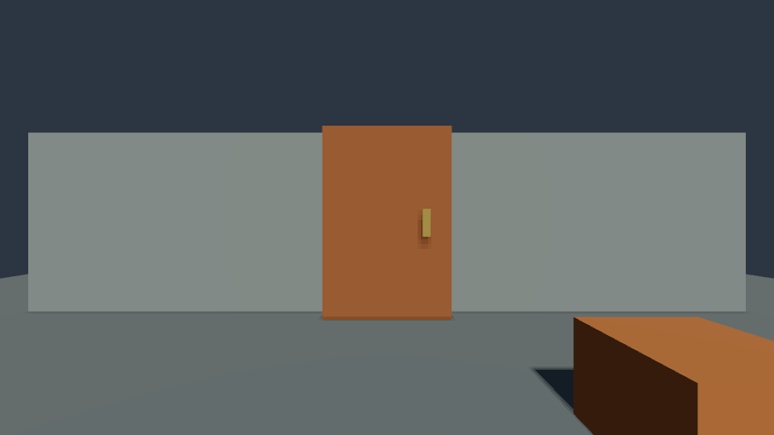

# Physics queries and controlled motion

Poima 0.0.13 adds native collider raycasts and timed kinematic targets to the existing 60 Hz runtime. Agents can identify a solid object, command a door to move, inspect its progress, and verify that collision and rendering follow the same live state. These operations are also C++ runtime methods. Poima 0.0.14 now exposes them through the [C# gameplay module](MANAGED_GAMEPLAY.md), with a use-button binding and scripted door sample. UI prompts and sound events remain unfinished.

## Query a collider

`world.describe` schema revision 13 exposes `runtime.raycast`:

```json
{"jsonrpc":"2.0","id":1,"method":"runtime.raycast","params":{"session_id":"00000000000000000000000000000384","tick":120,"origin":[0,1.5,2],"direction":[0,0,-1],"distance":10,"ignore":["00000000000000000000000000000064"]}}
```

The required `tick` must match live simulation. `origin` and `direction` use world coordinates; the runtime normalizes the direction. `distance` is the segment length in meters, from 0.001 to 10,000. Origin and endpoint must lie within ±1,000,000 meters per coordinate. Direction components must be finite, bounded by ±1,000,000, with squared length at least 1e−24. These are numeric guards, not large-world accuracy qualification.

Optional `ignore` contains at most 128 unique, existing entity IDs. It excludes their bodies, not their descendants. Ignoring an entity without a body has no effect. Include the controlled character when querying from inside its capsule.

The response returns `session_id`, `tick`, and `hit`. A miss is `hit: null`; a hit contains:

| Field | Meaning |
| --- | --- |
| `entity` | Stable entity ID of the closest collider. |
| `fraction` | Fraction along the ray segment, within [0,1]. The endpoint is included. |
| `distance` | Fraction multiplied by the requested distance. |
| `position` | World-space hit position. |
| `normal` | World-space surface normal; null for a solid primitive origin-inside hit. Mesh hits retain triangle winding normals from either side. |
| `triangle` | Original model primitive index-triple ordinal for a MeshCollider hit; null for other shapes. |

The query uses current Jolt collision shapes, including collision-only and visually hidden objects. It does not pick triangles from an imported render mesh without a collider. Boxes, capsule characters and explicit [static MeshCollider geometry](MESH_COLLISION.md) are supported. Mesh rays hit both sides; physics contacts use front faces. Exactly equal hit fractions select the lexicographically smallest entity ID, then the smallest source triangle ordinal within a mesh. The collector retains one hit and does not prune equal-distance candidates by traversal order; broader query performance qualification remains open. Near-equal hits are not artificially merged.

Queries do not advance time, wake bodies or mutate authored state. Stale ticks report `-32009`; malformed vectors/ranges/ignore lists and unknown ignored entities report `-32602`. Existing runtime-session errors apply.

## Author a kinematic body

Set `BoxCollider.motion` to `"kinematic"`; the other existing required collider fields remain unchanged. Static, dynamic and kinematic bodies share the existing collision layer rules. Kinematic bodies must be hierarchy roots; scale is frozen at runtime start. Render meshes, lights and non-collider child transforms can follow the root. Static colliders below any moving body/controller are rejected at runtime creation: give each moving solid its own kinematic root.

A kinematic body follows a prescribed pose rather than responding to gravity or contact forces. It can push dynamic bodies and block the character. Static obstacles do not stop its commanded trajectory. Thin/fast interactions and character riding on moving platforms need further qualification; this delivery does not add platform-relative locomotion or a door obstruction/crushing policy.

## Move, inspect and replay

Add optional `motions` to `runtime.step`:

```json
{"jsonrpc":"2.0","id":2,"method":"runtime.step","params":{"session_id":"00000000000000000000000000000384","request_id":"00000000000000000000000000002649","expected_tick":120,"ticks":60,"motions":[{"entity":"00000000000000000000000000000002","position":[2.2,1.5,-3],"rotation":[0,0,0,1],"duration_ticks":120}]}}
```

Each target requires an entity, world-space position, normalized XYZW quaternion and `duration_ticks` (1–36,000). Up to 128 distinct targets may begin in one batch. Position components are bounded to ±1,000,000 meters. Average translation and shortest-arc rotation must not exceed 100 m/s and 20 rad/s. These limits are checked from the current pose when the target begins.

Targets begin on the batch's first tick. Their duration is independent of the number of ticks in that request: this example advances halfway, leaving 60 ticks of motion. Later ordinary steps continue the motion without resending it. Resending a target with a fresh request ID replaces the prior motion from the current pose; repeating an identical existing receipt returns the previous result without restarting motion.

The runtime interpolates position linearly and rotation along the shortest quaternion arc from the frozen start pose. Each tick uses Jolt's `MoveKinematic` velocity integration to approach that tick's pose. Completion clears linear/angular velocity and removes the target. The final pose has physics floating-point precision; it is not a serialized exact copy of arbitrary authored decimal coordinates.

`runtime.entity` adds:

- `motion`: `none`, `static`, `dynamic`, `kinematic` or `character`.
- `kinematic_target`: the active target object, or null.
- `motion_remaining_ticks`: remaining ticks, or zero.

Its existing world matrix and velocity remain authoritative observations. All child render/light poses derive from the updated hierarchy. Motion never writes back to the authored Transform.

`runtime.play` replay segments accept the same `motions` array. Targets start only on the first tick of their segment and can continue into following segments or later player/step calls. Human play also advances any previously started targets. The connection still blocks while a player window runs; concurrent editing and live gameplay callbacks remain future work.

JSON shape/duplicate/range failures report `-32602`; native target-reference, body-kind, speed and physics-update failures during `runtime.step` report `-32040`. All step targets are validated before advancing. Physics-update failure restores Jolt state, controller state, targets, elapsed motion and tick. A replay's state-dependent target failure can occur in a later segment: the player returns its existing partial-progress error receipt, retaining earlier successful ticks. It does not roll back an entire player session.

## Sliding-door example

Use fresh output/world paths. From Windows PowerShell at `D:\poimaengine`:

```powershell
Get-Content examples/interaction-room.jsonl | .\build\windows-runtime\poima.exe world build/interaction.world.json
Get-Content examples/play-interaction.jsonl | .\build\windows-runtime\poima.exe world build/interaction.world.json
```

The 480-tick replay lands the character, walks into the closed door, slides it aside and walks through. It captures the final state and returns character/door observations. The example has a moving child handle, side walls, a crate and a shadowed directional light. This original example commands opening through explicit motion data. The [C# sample](MANAGED_GAMEPLAY.md) instead queries proximity and handles a use-button action in game code.

The fixture's closed and open views, from the same camera:




## Verification and limits

```sh
cmake --build --preset runtime-headless
ctest --preset runtime-headless
cmake --build --preset windows-runtime --target poima-interaction-test
./build/windows-runtime/poima-interaction-test.exe
python3 tests/interaction_capture.py build/windows-runtime/poima.exe --windows-interop --output build/interaction-capture --gpu 0
python3 tests/player_contract.py build/windows-runtime/poima.exe --windows-interop --kinematic --authored-lights --shadows --profile --output build/interaction-player --gpu 0
```

Native tests cover ray faces, inside/ignored/tied/endpoint hits, closed/open door blocking, target progress and stopping, rotation/sign-equivalent quaternions, retargeting, child poses, pushing a dynamic crate, invalid-command nonmutation and restoration after a real contact-capacity failure. Protocol tests cover discovery, guards, receipts, authored/live separation and persistence of the authored motion kind. Actual Windows captures on NVIDIA and AMD verify changed images, queries and passable collision; a separate 371-tick continuous replay equals independent headless stepping and final pixels. [Recorded evidence](evidence/m2-physics-interactions.json).

These fixtures do not qualify arbitrary collision content, full physics determinism across all platforms, continuous collision for kinematic sweep volumes, complex hinges/joints, asynchronous physics, durable runtime saves, the C# SDK or a packaged game.
