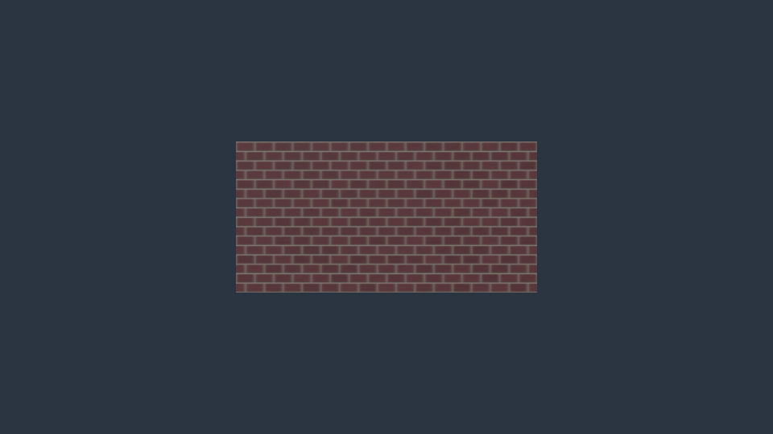

# Native procedural PBR materials

Poima's compiled CPU baker creates tileable brick and plaster materials from small, versioned JSON recipes. One correlated surface controls color variation, mortar/bevel height, grain and roughness. The outputs are ordinary cooked image assets used by `PbrTextures`; games load the baked images and do not interpret the recipe.



*NVIDIA Vulkan readback of the example brick recipe, repeated twice in each UV direction. A basic material fixture, not a game scene or authoring video.*

This feature is an authoring tool, with native Windows/Linux checks and AMD/NVIDIA Vulkan fixtures recorded in the [qualification evidence](evidence/m2-procedural-materials.json). It does not provide a material graph, displacement, geometry damage, dynamic wetness, physically computed AO or automatic UV transforms.

## Generate, inspect and apply

Send a recipe through the native world API:

```json
{"method":"asset.material.generate","params":{"recipe":{"format":"poima.material.recipe.v1","kind":"brick","seed":7401,"width":256,"height":256,"color":"#703e45","joint_color":"#b0a697"}}}
```

The result has `id`, `recipe_id`, `state`, `result` and `diagnostic`. `id` and `recipe_id` are the same 64-digit canonical recipe identity. Initial `state` is `baking`; `result` is null. Poll `asset.material.job` with `{"id":"<recipe-id>"}` until `state` becomes `succeeded`, `cancelled` or `failed`. A successful `result` contains:

- `recipe_id`, reusable canonical `recipe`, `evaluator`, and actual compiler/OS/architecture `numerical_profile` provenance.
- `maps` with each cooked asset hash, color space, dimensions, mip count and encoded byte count.
- Suggested `PbrMaterial` and `PbrTextures` component values.
- `facts` describing channel conventions, UV scale, numerical limits and bundle policy.
- `manifest_sha256`, the hash of the persisted descriptor bytes.

Generate does not change authored revisions, entities, history or active runtime state. Apply both returned component values with an ordinary guarded transaction:

```python
# material is the successful job's result object; client is a WorldClient.
client.call("world.transact", {
    "base_revision": 12,
    "request_id": "00000000000000000000000000000001",
    "ops": [
        {"op": "component.set", "id": "00000000000000000000000000000002",
         "type": component, "value": material[component]}
        for component in ("PbrMaterial", "PbrTextures")
    ],
})
```

Use `preview:true`, explicit retries, history and undo through the existing transaction API. `entity.material` reports the effective resolved texture IDs. `world.asset.references` reports the authored bindings. An active runtime retains its frozen images until replaced.

`asset.material.inspect` with `{"recipe":"<recipe-id>"}` reloads the persisted recipe and material after reopening the project. It verifies image hashes, color spaces, dimensions, canonical facts, metadata and suggested bindings rather than trusting filenames alone. Inspection does not rerun the recipe or authenticate the derivation of an externally edited descriptor. The returned canonical `recipe` can be edited and resubmitted.

## Recipe fields

`format:"poima.material.recipe.v1"` and `kind:"brick"|"plaster"` are required. Unknown keys, fractional/Boolean counts, nonfinite numbers and unsupported combinations are rejected with `-32602`. Defaults are expanded before recipe hashing.

| Field | Admission | Default |
| --- | --- | --- |
| `seed` | unsigned 32-bit integer |1 |
| `width`, `height` | integers 64–512, including odd dimensions |256 |
| `tile_width_m`, `tile_height_m` | finite 0.1–100 meters |2,1 |
| `color` | lowercase `#rrggbb`, encoded sRGB | brick `#9b4835`; plaster `#b8b09e` |
| `roughness` |0.045–1 | brick 0.8; plaster 0.9 |
| `roughness_variation` |0–0.5 |0.1 |
| `color_variation` |0–0.5 |0.12 |
| `grain_m` |0–0.01 meters | brick 0.00025; plaster 0.0001 |
| `rows` | brick only, even integer 2–64 |8 |
| `columns` | brick only, integer 1–64 |8 |
| `joint_width_m` | brick only,0–0.2 meters |0.008 |
| `joint_depth_m` | brick only,0–0.05 meters |0.004 |
| `bevel_m` | brick only,0.000001–0.2 meters |0.006 |
| `joint_color` | brick only, lowercase `#rrggbb` | `#8b8270` |

For brick, `joint_width_m + 2*bevel_m` must be smaller than both physical cell dimensions. Alternating half-cell rows require an even row count so the pattern repeats vertically. Plaster rejects all six brick-only fields. Set `grain_m`, `color_variation` and `roughness_variation` to zero for a smooth uniform plaster control.

The two example recipes in [examples/materials](../examples/materials/README.md) are original data and require no downloaded art or generative service.

## Surface and PBR conventions

Pixel centers sample a periodic, seeded 32-cell noise lattice and the same brick/mortar surface. Mortar boundaries fade cell-specific roughness so the row seam remains continuous. First and last texel centers need not have identical values: they lie on opposite sides of a repeat boundary. Repeating the material requires ordinary repeat sampling.

Color inputs are sRGB. The baker converts them to linear light for blending and variation, then encodes opaque RGBA8 base color. The normal and packed metallic/roughness maps are linear data. Packed channels are R=0, G=perceptual roughness, B=0 metallic, A=255. Neutral material factors are white base color, metallic factor 1 and roughness factor 1; the zero metallic map makes the final surface nonmetallic. Emissive and occlusion overrides are explicitly cleared, preserving no unrelated imported maps.

Normals come from periodic central height differences measured in physical meters and point along `normalize(-dh/dU, -dh/dV, 1)` in the mesh's UV tangent frame. Increasing-V follows the mesh bitangent; there is no automatic green-channel inversion. This agrees with the existing renderer's glTF-style [linear tangent-space normal convention](https://github.com/KhronosGroup/glTF/blob/main/specification/2.0/Specification.adoc#materialnormaltextureinfo).

UV0..1 must span the authored tile's physical width and height. The recipe does not alter imported UVs, infer texel density or apply texture-coordinate transforms. Normal maps require usable UV0 and tangent frames on imported meshes. Existing color-correct image mip cooking is reused; normal mip filtering averages encoded components, with shader normalization. This is not variance-aware specular filtering.

Recipe identity hashes canonical parameters plus evaluator `poima.cpu.pbr.v1`; cooked image identities hash actual package bytes. Recipe IDs can differ while identical image outputs deduplicate. Determinism is scoped to the same recipe/evaluator and qualified numerical build profile. Floating-point normalization and sRGB filtering prevent an unqualified claim of universal bit equality across compilers or operating systems. Compiler/target provenance is recorded in the completed manifest. If an identical recipe already has a valid manifest from the same numerical profile, rebuild compares its maps and suggested bindings against newly generated output and rejects a mismatch. A valid descriptor from another numerical profile can be reused without claiming current-profile reproduction; the stored profile identifies its original producer. Profile metadata is not an authenticity signature.

## Jobs, storage and bounds

One native worker may bake at a time. At most 8 session job records and their encoded outputs are retained; forget completed records to make room. The recipe's 64-digit identity is the job key. Repeating generate for a retained recipe returns that same job. Forgetting or restarting loses job status; regenerating the same recipe safely rebuilds/deduplicates image packages and reuses a verified manifest. There is no cumulative request limit, unbounded retired-ID set or once-only submission receipt promise.

- `asset.material.jobs {}` lists retained jobs without polling or publishing them.
- `asset.material.job {"id":...}` polls nonblocking CPU completion and publishes a completed bake on the owner thread.
- `asset.material.cancel {"id":...}` requests cancellation. Cancellation wins until successful owner publication, including when CPU work already finished but has not been published. Cancelled work never returns a successful material.
- `asset.material.forget {"id":...}` removes a terminal record; baking records reject with `-32080`.
- Unknown/forgotten job IDs reject with `-32004`; invalid shapes reject with `-32602`. Capacity/busy admission rejects with `-32080`; storage failures use `-32050` or a failed job diagnostic.

The worker evaluates rows, generates existing mip chains, encodes and validates packages without touching world state or files. Cancellation checks occur between rows and image stages. World destruction requests cancellation and joins its worker before releasing state. Owner publication performs bounded filesystem work; it is not an asynchronous storage subsystem or a frame-time guarantee.

Three RGBA8 maps with complete mips, dimensions at most 512×512, 8 retained jobs, 1024-byte UTF-8 failure diagnostics (malformed bytes replaced) and 32 KiB descriptors bound working data. A conservative performance or peak-memory claim still needs actual measurement. No arbitrary shader source, expression, executable or output path is accepted.

The asset directory stores immutable `<image-hash>.pimage` outputs and `<recipe-id>.pmaterial` descriptors. All images are verified before the descriptor is published last. Atomic file replacement does not create a multi-file filesystem transaction or guarantee power-loss directory durability. A failed publication can leave unreferenced immutable images; it cannot attach a partially generated material to the world or return a successful incomplete descriptor. Corrupt existing packages/descriptors are rejected rather than overwritten.

Recipe manifests are authoring-only project data: retain the project asset directory in backups/source sharing when editable recipes are required. Runtime bundle closure follows ordinary `PbrTextures` image references and intentionally omits `.pmaterial` manifests. Shipping images does not imply recipe-source export. Read-only packaged worlds hide and reject generate/job/jobs/cancel/forget. Verified recipe inspection remains available when an authoring descriptor was explicitly retained beside the world; a normal shipped bundle will not contain it.

## Qualification tools

`poima-material-recipe-test` provides independent flat-channel and slope oracles, periodic surface checks, codec/mip checks, guarded admission, cancellation, manifest verification and native read-only/shared-scope coverage. `tests/procedural_material_contract.py <engine> --output <local-report.json>` exercises actual authoring transactions, job retention, reopen, shared clients and runtime dependency closure. Add `--windows-interop` when launching a native Windows binary from WSL.

`tests/procedural_material_capture.py <engine> --output <new-directory> --gpu <index>` is an explicit Vulkan fixture. It captures a 2×2 repeated material, independent flat-geometry normal control, enabled normal products, repeated identical pixels, two viewing distances, a plaster recipe and a curved imported tangent fixture. It is not automatically run by CTest. These are authored-material fixtures, not a game-performance, artist-replacement or broad visual-quality benchmark. Qualification results must distinguish an executed pass from the presence of these test tools.
