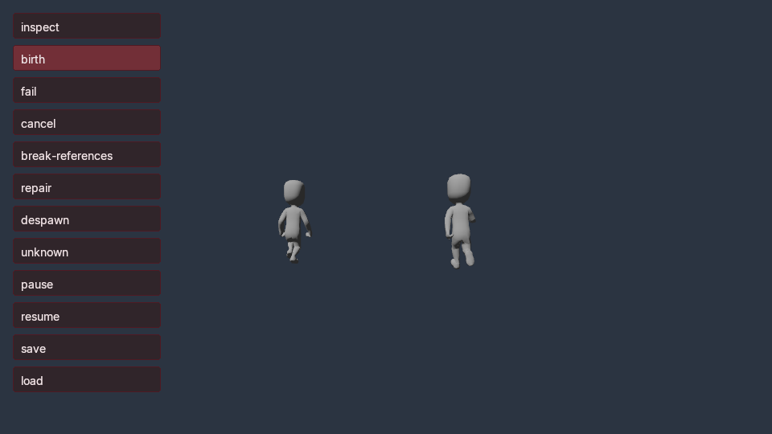

# Runtime hierarchy instances

A template is a frozen recipe. An instance is a live copy of its complete entity
hierarchy, with its own entity IDs, component values, physics and animation
playback. This guide covers the native authoring service and compiled C# API.
The hierarchy extension is introduced in **0.0.78**. Use the executable's focused schemas and [implementation status](IMPLEMENTATION_STATUS.md)
to check the build and platform you are using.



*Two gameplay-spawned characters at tick 90 in a relocated Windows Native AOT
player. Original Kenney Protagonists 1.1 content (CC0); plain fixture scene,
not a production lighting or character-rendering showcase.*

## Identities and references

Three identities have different meanings:

| Identity | Meaning | C# type |
| --- | --- | --- |
| Template ID | Selects a recipe in the frozen catalog | `TemplateId` |
| Template-local node ID | Selects one member within that recipe | `TemplateNodeId` |
| Instance root or member ID | Refers to a reserved or committed entity in one runtime | `EntityId` |

Template and local IDs are nonzero, canonical 32-character lowercase hexadecimal
strings. They do not become live handles simply because their bytes resemble an
entity ID. `TemplateId` and `TemplateNodeId` have no implicit conversion to
`EntityId`; neither is a supported persisted gameplay-state field kind. Store
resolved live handles in `EntityId` fields instead.

The root receives the complete spawn transform override, when supplied. Child
transforms remain local to their parents. Every spawn assigns a fresh live ID to
each member; a second copy shares immutable assets but does not share member IDs
or playback state.

Native references inside a hierarchical recipe must select local members. This
includes parents, controller cameras, rig bindings, skin bindings and the sky's
sun. Registered custom-component entity fields and bounded entity arrays have a
slightly different rule: handles matching a local member ID are remapped to that
instance; other nonzero handles remain external references and must resolve in
the final live world. Zero remains an empty handle. Legacy standalone prop
recipes keep their literal custom-component world references.

## Author a recipe

`world.transact` accepts two `template.set` forms. The legacy form supplies root
`components`. The hierarchical form supplies `root` and an `entities` object,
keyed by local node ID. Each member has `name`, `parent` and `components`, including
`Transform`. Use one unparented root and a connected, acyclic hierarchy. Do not
combine the two forms in one recipe.

Existing component constraints still apply. A CharacterController must be an
unscaled root; its required `camera` field can be `null`, or select a local Camera
directly beneath it. Native definitions represent the absent camera as an empty
string.
Moving box bodies must be roots. Static colliders cannot inherit a moving body
or controller. Imported animation needs its complete AnimationRig/RigNode/SkinnedMesh
membership, including nodes not selected for rendering. A skin cannot become a
standalone weighted mesh by copying only its draw component.

For an imported actor, first complete [asset intake](FBX_IMPORT.md) and
[character instantiation](IMPORTED_CHARACTER.md), then use the complete selected
graph as the recipe's local definitions. Preserve asset bindings, the rig's node
coverage and source-derived transforms. No import or skeleton retargeting occurs
when an instance spawns.

This minimal Python recipe contains only transforms, so it needs simulation but
no GPU, .NET or model files. Install the [Python client](PYTHON_CLIENT.md), use a
new world path and a simulation-enabled native executable:

```python
from pathlib import Path
from poima_client import WorldClient, new_id

binary = Path("build/runtime-headless/poima").resolve()
world = Path("build/instance-example.world.json").resolve()
world.parent.mkdir(parents=True, exist_ok=True)
if world.exists():
    raise FileExistsError(world)

template = "eeeeeeeeeeeeeeeeeeeeeeeeeeee7801"
root = "eeeeeeeeeeeeeeeeeeeeeeeeeeee7802"
child = "eeeeeeeeeeeeeeeeeeeeeeeeeeee7803"
identity = {"position": [0, 0, 0], "rotation": [0, 0, 0, 1], "scale": [1, 1, 1]}

with WorldClient.open(binary, world) as engine:
    engine.discover("method", "runtime.structure.transact")
    revision = engine.inspect()["revision"]
    authored = engine.transact([{
        "op": "template.set", "id": template, "name": "Two-node example",
        "root": root, "entities": {
            root: {"name": "Root", "parent": None,
                   "components": {"Transform": identity}},
            child: {"name": "Child", "parent": root,
                    "components": {"Transform": {
                        "position": [0, 1, 0], "rotation": [0, 0, 0, 1],
                        "scale": [1, 1, 1]}}}
        }
    }], revision, request_id=new_id())
    session = new_id()
    engine.call("runtime.start", {"session_id": session, "revision": authored["revision"]})
    request = {"session_id": session, "request_id": new_id(), "expected_tick": 0,
               "expected_structure_revision": 0,
               "spawns": [{"template_id": template}], "despawns": []}
    born = engine.call("runtime.structure.transact", request)
    live_root = born["spawned"][0]
    instance = engine.call("runtime.instance", {
        "session_id": session, "id": live_root, "tick": 0,
        "expected_structure_revision": born["structure_revision"]})
    assert instance["nodes"][root] == live_root
    assert instance["nodes"][child] != live_root
    assert engine.call("runtime.structure.transact", request)["replayed"]
    engine.call("runtime.structure.transact", {
        "session_id": session, "request_id": new_id(), "expected_tick": 0,
        "expected_structure_revision": born["structure_revision"],
        "spawns": [], "despawns": [live_root]})
    engine.call("runtime.stop", {"session_id": session})
```

The transaction creates and removes live membership at unchanged simulation time;
it does not instantiate authored scene entities or write runtime changes back into
the world. Templates are frozen at `runtime.start`. Stop and start with a fresh
session to adopt later authored recipe edits.

## Inspect and mutate live membership

| Method | Important parameters and result |
| --- | --- |
| `template.get` / `template.query` | Inspect authored recipes at a pinned authoring revision. Follow query pagination. |
| `runtime.template.get` / `runtime.template.query` | Inspect the runtime's frozen catalog using `session_id` and exact `tick`; `revision` pins its authored source revision. |
| `runtime.structure.transact` | Supply `session_id`, fresh `request_id`, `expected_tick`, `expected_structure_revision`, and `spawns`/`despawns`. Returns root IDs in `spawned`, structure/component revisions and `replayed`. |
| `runtime.instance` | Supply `session_id`, committed root `id`, exact `tick`, and optionally `expected_structure_revision`. Returns template ID, initial transform and the complete `nodes` local-to-live map. |

Keep the original structural request when its outcome is unknown. An identical
retained receipt returns the original result without spawning twice. Reusing its
request ID with changed parameters rejects. An expired retry must still satisfy
its original guards; do not replace those guards as an automatic recovery step.
[Recovery rules](PYTHON_CLIENT.md#failure-and-deliberate-recovery).

After the first structural edit, runtime mutations with `expected_tick` also
require `expected_structure_revision`. Read pins use the field declared by the
specific method: `runtime.instance` uses `expected_structure_revision`, while
entity/component reads use `structure_revision`. A stale tick or structure guard
rejects without applying the mutation. Unknown committed roots reject instance
inspection; authored entities and child IDs are not instance roots.

Common structural failures are explicit:

| Failure | Service behavior | Recovery |
| --- | --- | --- |
| Stale tick or structure revision | `-32009`, no mutation | Inspect current state and deliberately reconcile the intended operation. |
| Changed parameters under a retained request ID | `-32010` | Recover with the original request; a different operation needs a fresh ID. |
| Unknown instance root or child passed as root | `runtime.instance` returns `-32004` | Recover the root ID from a retained spawn receipt or registered gameplay state, then inspect that root's member map. There is no general instance-list operation. |
| Invalid graph, transform, budget or final reference candidate | Structural mutation returns `-32602` | Correct the offending recipe/request/reference; failed publication has not committed a receipt. |

C# resolver failures throw rather than returning a fabricated or zero handle.
An undeclared marker fails before reading the extension table. Native callback
errors and malformed zero-success results likewise reject the SDK call.

The recipe catalog is bounded to 256 templates, 1,024 members per hierarchy and
4,096 members across all templates. A structural transaction is bounded to 4,096
combined commands and expanded birth/removal nodes. Expanded membership also
obeys live/retained entity, physics, animation, audio and component budgets. A
small recipe can therefore fail admission when its copies exceed an aggregate
budget.

## Resolve nodes from compiled gameplay

Declare `IHierarchicalInstancesGame` before calling `ResolveNode`. The named
`hierarchical_instances_v1` feature reads a 232-byte prefix of services epoch 7;
call ABI remains 1/80. This opt-in is independent of character input, navigation,
inertialization and animation layers. A larger table alone grants none of those
helpers. Existing 176/192/208/216/224-byte artifacts retain their negotiated views.
New games need a matching SDK/bridge or newly published Native AOT artifact.

The following code requires a different frozen recipe containing a complete
imported AnimationRig/RigNode/SkinnedMesh graph, with the AnimationRig at local
node `7803` and clip 0 already present. It cannot run against the two-transform
recipe above:

```csharp
using System;
using System.Runtime.InteropServices;
using Poima;

[StructLayout(LayoutKind.Sequential)]
public struct ActorState { public EntityId Root, Rig; public int Born; }

[GameModule("example.hierarchical-actor")]
public sealed class ActorGame : Game<ActorState>, IHierarchicalInstancesGame
{
    static readonly TemplateId Actor = TemplateId.Parse("eeeeeeeeeeeeeeeeeeeeeeeeeeee7801");
    static readonly TemplateNodeId Visual = TemplateNodeId.Parse("eeeeeeeeeeeeeeeeeeeeeeeeeeee7803");
    public override void Initialize(ref ActorState state) => state = default;
    public override void Tick(ref ActorState state, GameContext context)
    {
        if (state.Born != 0) return;
        state.Root = context.Spawn(Actor);
        state.Rig = context.ResolveNode(state.Root, Visual);
        context.SetAnimation(state.Rig, 0, speed: 1, loop: true, playing: true);
        state.Born = 1;
    }
    public override void Control(ref ActorState state, ControlContext context)
    {
        if (context.Action == "actor.inspect" && state.Born != 0 &&
            context.ResolveNode(state.Root, Visual) != state.Rig)
            throw new InvalidOperationException("Instance mapping changed.");
    }
}
```

`Spawn` reserves all member IDs during Tick. `ResolveNode` can resolve that
noncanceled reservation immediately, but `Get`, `IsAlive`, component queries,
component reads, animation reads and raycasts still observe committed membership.
Do not read a new rig's playback before publication. Initial component writes,
animation commands and declared character input can target valid reserved
members; final validation and application occur after the callback. Character
input also requires `ICharacterInputGame`.

`GetTemplate<T>` reads frozen recipe values, including template-local custom
references. A complete initializer overwrites the entire component payload, so
resolve every local scalar/array handle before sending those values to `Set<T>`.
Leaving the recipe payload untouched allows native instantiation to remap it.
Instance edits never alter recipe defaults.

A UI `Control` callback does not advance simulation. It may resolve committed
members and use its existing UI, pause/resume and save services. It cannot spawn
or despawn directly: schedule the operation in registered game state and perform
it in the next Tick. A paused game must resume or receive a deliberate guarded
step before that Tick occurs. [Control ordering](GAME_UI.md) and
[live player](LIVE_PLAYER.md).

## Cancellation, deletion and failure

`Despawn(root)` removes an entire spawned instance. Removing one child or an
arbitrary authored entity through this API is not supported. Repair or clear all
incoming references in surviving component scalars/arrays and registered gameplay
state in the same Tick. Clear saved child handles as well as the root handle.
Unrepaired references reject the whole candidate. Already queued writes or
movement/animation/input commands targeting a committed member being removed
also reject; previously committed motion does not prevent removal.

Despawn of a same-Tick reservation cancels the entire birth before native object
creation. Its initializers and staged motion, animation and character commands
are discarded. Other objects must still clear references to the canceled IDs.
Resolution after cancellation rejects. A successful canceled birth consumes its
reserved public IDs and advances the structural lineage; an outer batch failure
restores the allocator instead.

A failed explicit multi-tick batch restores the original membership, component
and gameplay values, native physics, animation playback/history, sound state,
ID allocators and queued save operations. A returned reserved ID is tentative
until that outer batch commits. External C# file/network/static side effects do
not participate in rollback. Continuous playback normally commits separate ticks,
so a later failure preserves earlier successful ticks.

Audio emission reads committed membership; birth-Tick audio playback on a
reserved emitter is not supported. Committed instance removal retires its sound
records and presentation voices instead of borrowing propagation paths from an
absent emitter. Surviving emitters keep their own state.

## Save and reload boundaries

Hierarchy-bearing structural snapshots use runtime snapshot version 6. They
retain the frozen recipe identity, initial root transform, complete local-to-live
map and public-ID frontier. Restore checks exact membership, non-alias live IDs,
component references, rig state and saved transforms against trusted frozen
content. It uses saved component payloads before constructing the candidate, so
repaired external references do not revert to old recipe defaults. Old supported
root-prop snapshot formats retain their separate reconstruction paths.

This is exact-content/module restoration. The existing explicit schema-upgrade
pipeline does not yet support hierarchy recipes or version-6 snapshots; do not
use it to migrate these saves. Changing a recipe, component schema or module
identity needs a separately supported migration path. Save operations need the
current tick and applicable structure, component, gameplay, UI and control
guards; consult [gameplay saves](GAMEPLAY_SAVES.md).
Compatible CoreCLR reload preserves registered instance handles and state when
its existing compatibility checks pass. It does not adopt edits to the frozen
recipe catalog. Native AOT replacement is a separate trusted artifact boundary.

## Checks and current human workflow

The source oracles are [native instance membership](../tests/runtime_instances_native.cpp),
[world-service hierarchy contract](../tests/world_instances_contract.py),
[compiled instance consumer](../tests/managed_instance_gameplay/ManagedInstanceGame.cs),
[managed ABI guards](../tests/managed_service_abi/InstanceExtension.cs) and
[publication requirements](../tests/native_gameplay_publish_requirements.py), and
[spawned player camera](../tests/instance_player_contract.py).
The [compiled fixture instructions](../tests/managed_instance_gameplay/README.md)
cover original-source intake, both gameplay backends and Windows export.
Version 0.0.78 qualification covers Windows/Linux headless compiled gameplay and
Windows Vulkan observations on both laptop GPUs. The minimal Python recipe above
was executed on the simulation-enabled Linux build. See [implementation status](IMPLEMENTATION_STATUS.md)
and [recorded evidence](evidence/m2-runtime-instances.json) for exact scope and limits.

Humans can inspect and author these recipes through the CLI or Python client,
then inspect member IDs, playback and rendered results through the native
service. This mechanism does not supply a desktop prefab editor, variants,
nested prefab overrides or in-place visual recipe editing. Use the actual exposed
editor controls and native operations rather than inferring those workflows from
hierarchical spawning.
