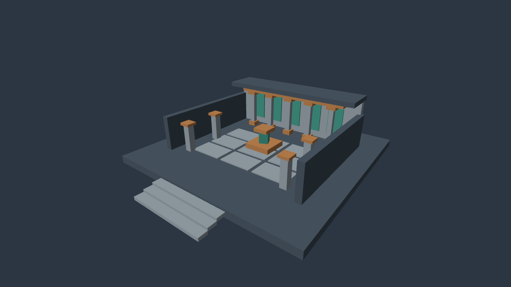

# Author, edit and observe a 3D scene

The persistent world service connects to a native Vulkan/NVRHI forward preview. Agents can create a hierarchy, assign box geometry and a camera, edit it, and capture the resulting image without a GUI editor. Rendering consumes an immutable native snapshot of the current authored revision. It does not modify the world document or its transaction revision.



The reference courtyard contains 49 box renderers and one camera. This is blockout geometry under fixed lighting. Optional [authored lights and shadow maps](SHADOWS.md) are available; advanced indirect/atmospheric lighting remains unfinished. Imported textured geometry and a continuous player are now available through the paths linked below; this courtyard remains a blockout fixture. M0, M1 and M2 remain incomplete.

## Try the example

Build the Windows render preset as described in [BUILD.md](BUILD.md). From the project root in Windows PowerShell, create a new world using the checked-in operation batch:

```powershell
Get-Content examples/courtyard.jsonl | .\build\windows-render\poima.exe world build/courtyard.world.json
'{"jsonrpc":"2.0","id":2,"method":"world.capture","params":{"revision":1,"camera":"000000000000000000000000000003e8","path":"build/courtyard.bmp","width":1280,"height":720}}' | .\build\windows-render\poima.exe world build/courtyard.world.json
```

The first command persists the scene. The second opens a native window for two frames, saves a BMP and returns the observation metadata. `path` must identify a new file in an existing directory; capture refuses to overwrite an existing file or use a world-owned sidecar. Use a fresh artifact name for each new observation. Relative paths resolve against the process working directory; successful responses return the resolved absolute path. The sample's transaction expects a new revision-0 world. Its fixed request ID also makes an identical retry safe.

On Linux/WSL the same JSONL can author a document with the headless executable:

```sh
./build/headless/poima world build/courtyard.world.json < examples/courtyard.jsonl
```

That build explicitly returns `-32003` for a valid capture request because it has no renderer. The tested graphics route is the native Windows executable, launched directly or through WSL interoperability. Native Linux GPU rendering is not qualified. A display and Vulkan 1.3 hardware are currently required for capture; it is independent of an editor but not an offscreen/no-display renderer.

## Discoverable components

Use `world.describe` to discover the installed build's schema revision and available operations. The following components provide the basic box-and-camera path; [assets](ASSETS.md), [lighting](LIGHTING.md) and [runtime](RUNTIME.md) document the additional paths. Entity creation supplies a Transform; add or replace optional components using `component.set` and remove them using `component.remove`. The mandatory Transform cannot be removed. Component queries and inspection expose the same data used by the renderer.

| Component | Data and meaning |
| --- | --- |
| `Transform` | Local position, normalized XYZW quaternion and positive scale. Hierarchy composition is parent × local. |
| `Camera` | `vertical_fov` in degrees, `near` and `far` in meters. Field of view is 5–150; 0.001 ≤ near < far ≤ 10,000,000. Looks along local −Z with local +Y up. |
| `MeshRenderer` | `primitive: "box"`, `albedo: [r,g,b]` in linear [0,1], and `visible` boolean. The box has unit side lengths and is centered at the entity origin. |

Camera capture requires an orthonormal world basis: a scaled or sheared camera hierarchy is rejected. Mesh geometry supports nonuniform scaling and hierarchical shear; normals use the inverse-transpose matrix. Matrix composition uses doubles on the CPU and float constants on the GPU. Extremely large/deep transforms may exceed numeric range and produce an explicit diagnostic; this is not a large-world precision solution.

`entity.world_transform` accepts an entity ID and optional revision guard, returning a column-major 4×4 world matrix. It preserves shear rather than forcing a lossy decomposition into rotation and scale. `entity.get` can retrieve any built-in component. `entity.query` accepts a component-type filter alongside its existing parent, revision and pagination options.

This basic scene uses document format version 1. [Custom component schemas](CUSTOM_COMPONENTS.md) upgrade a document to version 2. Documents with only Transform still load. Older binaries reject documents containing component types they do not understand; use the [authoring compatibility contract](AUTHORING_API_COMPATIBILITY.md) when choosing matching tools.

## Capture contract

`world.capture` requires `revision`, `camera` and `path`. It accepts `width`/`height` from 128 to 4096 (default 960×540), optional Vulkan device index `gpu`, and `samples` of 1 or 4 (default 4). The requested sample count must be supported; the renderer does not silently substitute another value. `poima capabilities` reports `scene_capture` separately from the still-unqualified production `renderer` capability.

The response records world identity/revision, camera identity and world matrix, lens settings, object count, absolute image path, dimensions, actual samples, GPU name, hardware flag, frame count, NVRHI error count and engine version. Scene state is static during this synchronous operation; authored observations report a null tick. The optional [runtime](RUNTIME.md) adds fixed-step simulation and live captures with a session/tick. Images are artifacts outside the JSON response. Capture results also report resolved [lighting](LIGHTING.md), including whether the preview fallback is active.

The preview shares unit-box geometry, uploads per-object transform/material constants and per-frame camera/light data, depth-tests against D32, and resolves 4× MSAA before readback. It prefers an sRGB attachment so lighting and resolve use linear light; the UNORM fallback encodes in the shader and does not qualify gamma-correct edge resolve. The original box courtyard retains fixed directional Lambert preview shading because it has no authored lights or PBR materials. Current scenes can instead use the [textured PBR path](ASSETS.md) and [authored lights, ambient fill and exposure](LIGHTING.md). [Optional shadow maps](SHADOWS.md) add direct-light visibility.

Stale revisions fail with `-32009`; a missing camera/component with `-32004`; invalid settings, camera transforms or reserved/existing output paths with `-32602`; an unbuilt renderer with `-32003`; and renderer failure with `-32020`. Rendering failure does not mutate the world. A filesystem error during BMP writing can leave an incomplete output file; discard artifacts from failed requests. Existing-file protection is a preflight check, not a lock against unrelated concurrent writers.

Each capture creates and destroys its own graphics context, serializes GPU work and presents two frames. This proves the authoring-to-image path, not player frame times or viewport iteration latency. Full device-loss recovery, Khronos validation, persistent GPU caches, asynchronous captures and a production render graph remain unfinished. The [desktop editor](DESKTOP_EDITOR.md) separately provides persistent Scene/Game panels, camera controls and CPU geometry picking.

Poima 0.0.12 adds independent camera/shadow frustum rejection and a `render_diagnostics` result. Optional Boolean `culling` (default true) and `profile` (default false) enable comparison and CPU/GPU intervals. See [the diagnostics contract](RENDER_DIAGNOSTICS.md) for counter definitions and timing boundaries.

## Verification

Headless CTest includes independent affine inverse/projection math checks and world-contract cases. Those cover a rotated/scaled parent hierarchy, component schema validation, component removal and persistence, filtering, capture preconditions and the explicit unbuilt-renderer error, alongside existing transaction/recovery cases.

The explicit GPU test opens windows and checks actual captured pixels:

```sh
python3 tests/scene_capture.py build/windows-render/poima.exe --windows-interop --gpu 0 --output build/scene-evidence
python3 tests/scene_capture.py build/windows-render/poima.exe --windows-interop --gpu 1 --output build/scene-evidence
```

Both laptop GPUs pass depth occlusion despite far geometry being submitted later, behind-camera clipping, visibility changes, parent motion, camera motion, MSAA edge differences, revision metadata, failed-capture recovery and identical rendered pixels after reopening the saved scene in a new process. The fixture checks pixels and saves each request/response, rather than treating a successful exit as proof of rendering. [Evidence and source hashes](evidence/m2-scene-capture.json). These are two GPUs in one laptop, not broad hardware qualification.

Poima 0.0.9 renders indexed static glTF geometry with metallic/roughness material factors and PNG/JPEG maps, including tangent-space normal maps. The original box material remains available. See [ASSETS.md](ASSETS.md) for the supported profile and current texture/lighting exclusions.
