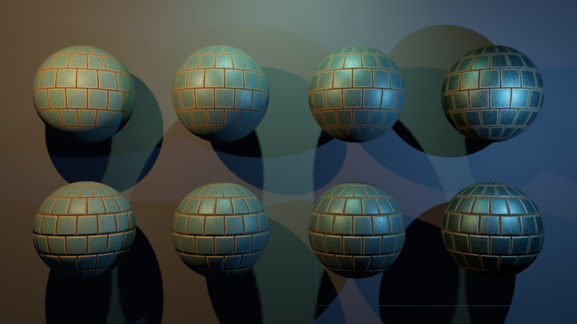

# Shadow maps

Poima 0.0.11 adds optional Vulkan shadow maps for all three authored light kinds. Settings are available through the native world service, freeze with a runtime session, and apply to both captures and continuous play. This establishes raster visibility for the compatibility graphics tier. It does not complete the production renderer or implement ray-traced shadows, ReSTIR or virtual shadow maps.

## Authoring

Add a `shadow` object to a Light component. Absence preserves the previous unshadowed behavior:

```json
{"op":"component.set","id":"00000000000000000000000000000002","type":"Light","value":{"kind":"spot","color":[1,0.65,0.3],"intensity":100,"enabled":true,"range":30,"outer_angle":40,"shadow":{"enabled":true,"near":0.05,"distance":25,"bias":0.0001,"normal_bias":0.005}}}
```

| Shadow field | Contract |
| --- | --- |
| `enabled` | Required Boolean when `shadow` is supplied. Default without the object: false. |
| `near` | Local-light shadow near plane in meters, [0.001,100]; default 0.05. Directional cascades use the camera near plane instead. |
| `distance` | Shadow coverage distance in meters, greater than `near` and at most 100000; default 80. Directional: camera-view depth. Local: distance from the source. |
| `bias` | Depth comparison offset in normalized shadow depth, [0,0.1]; default 0.0005. This is not a world-space distance; excessive values detach shadows. |
| `normal_bias` | Receiver offset along the geometric surface normal in meters, [0,1]; default 0.01. Scaled by `1 - N·L` to reduce grazing-angle acne. |

Shadowed spotlights require `outer_angle <= 89.5°` because the depth view uses a finite perspective projection. A finite local-light range must exceed the shadow near plane. Its effective shadow far plane is the lesser of range and shadow distance. Illumination can continue outside shadow coverage; the final tenth of coverage fades visibility toward unshadowed lighting. The near exclusion is a real limitation: place it close enough to include gameplay-relevant blockers.

Set the shared map resolution through the optional LightingEnvironment field:

```json
{"op":"component.set","id":"00000000000000000000000000000003","type":"LightingEnvironment","value":{"ambient":[0.015,0.02,0.03],"exposure":1,"shadow_resolution":1024}}
```

Allowed resolutions are 256, 512, 1024 and 2048 texels per view. Default: 1024. This field does not change the viewport resolution or MSAA count.

| Enabled shadowed light | Depth views | Storage at 1024² D32 |
| --- | ---: | ---: |
| Directional | 4 cascades | 16 MiB |
| Point | 6 faces | 24 MiB |
| Spot | 1 view | 4 MiB |

The initial renderer permits **16 views** and **128 MiB of depth texels**. Both constraints apply. For example, two point lights plus one directional light fit at 1024; three point lights exceed the view limit. Nine views at 2048 exceed the memory limit. Changing resolution participates in the same whole-world validation as adding lights. Failed edits are atomic and do not replace the prior valid scene. Disabled lights/shadows consume no shadow views. Texture allocation/driver overhead is additional to the texel count; these are not total-renderer memory caps.

`world.describe` schema revision 13 includes these fields and limits. `world.lighting`, `runtime.lighting`, captures and player results expose effective per-light shadow settings plus `shadow_resolution`, `shadow_views` and `shadow_bytes`. The view count represents the allocation for enabled shadowed lights. A directional camera whose near plane is already beyond the configured distance has no active cascades, although its reserved views still count toward allocation. Authoring inspection requires no GPU.

All currently visible opaque MeshRenderer/StaticMesh geometry casts and receives shadows. Hidden geometry does neither. Collision-only objects do not cast. There are no per-object cast/receive masks, alpha-cutout casters or transparent transmission yet. Shadow rasterization is two-sided, including thin imported planes; color-pass sidedness is unchanged. Material AO/ambient/emission are not multiplied by direct-light shadow visibility.

## Projection and filtering

Directional lights partition the camera depth interval into four practical splits: 60% logarithmic and 40% linear. Coverage ends at the smaller of camera far and shadow distance. Each partition uses a bounding sphere, rounded extent, a small filter margin and a light-space center snapped to texels. The last tenth of each cascade overlaps and blends with the next; the last cascade fades out. Light rotation, resolution changes and moving casters can still change the map. Texel snapping reduces camera-translation shimmer; it is not temporal antialiasing.

Directional depth bounds extend toward the light by the configured shadow distance beyond the receiver sphere, allowing relevant offscreen casters. Casters outside these bounds cannot contribute; there is no scene-wide caster-bound analysis yet.

Local lights use a perspective depth map: one cone for a spot, or +X/−X/+Y/−Y/+Z/−Z views for a point. Point selection uses the receiver's dominant direction axis. A 3×3 percentage-closer filter averages depth comparisons. Each tap uses an analytic receiver-plane depth adjustment, so a sloping unoccluded surface does not shadow itself merely because adjacent texels store different depths. The triangle plane is derived from world-position derivatives before divergent light/cascade branches; smoothed vertex normals and normal maps affect shading, not this depth plane. A normal map does not change caster geometry.

Point-face filter taps clamp to the current face at its edges. Cross-face filtering is not seamless, and complex silhouettes crossing cube edges can show discontinuities. The tests cover six orientations and one seam-spanning blocker, not every seam configuration. The filter is fixed-width; it does not simulate area-light penumbrae or contact hardening. Bias can trade acne for detached shadows, especially with large near/far ratios or fine geometry. Floating-point precision at extreme scales remains unqualified.

## Runtime and costs

The runtime owns the frozen settings. Light and caster transforms follow current simulation state; shadow maps are cleared and redrawn each presented frame, so moving or hidden occluders do not retain old shadows. Viewport resize recomputes the directional fit. Runtime setting edits/hot-reload reconciliation remain outstanding.

Depth maps use an array of single-sample D32 layers independently of viewport MSAA. The implementation requires D32 depth-attachment and sampled-image support and validates device dimensions. An unshadowed scene binds a one-texel dummy depth layer to keep material layouts consistent; this small allocation is excluded from the requested shadow-budget report.

Poima 0.0.12 adds independent [frustum culling and render diagnostics](RENDER_DIAGNOSTICS.md) for each shadow view. An object rejected by the camera can still cast a visible shadow. There is no shadow caching, occlusion culling, per-light scheduling or virtual page allocation. The renderer still serializes frames with a GPU wait. The tests establish correctness on the named hardware; they are not evidence of a shipped-game frame-rate target or scalable many-light performance. These limitations motivate the subsequent render scheduling and broader performance qualification.

## Verification and example

Use a fresh world/capture destination from the repository root:

```sh
build/windows-runtime/poima.exe world build/shadow-grid.world.json < examples/shadow-grid.jsonl
python3 tests/lighting_contract.py build/headless/poima
python3 tests/shadow_capture.py build/windows-runtime/poima.exe --windows-interop --output build/shadow-capture --gpu 0
python3 tests/player_contract.py build/windows-runtime/poima.exe --windows-interop --authored-lights --shadows --output build/shadow-player --gpu 0
```

The example extends the original procedural-texture sphere grid with two shadowed point lights and a shadowed spotlight. Asset source paths resolve relative to the world file; capture paths resolve relative to the working directory. It writes `build/shadow-grid.bmp`, refusing an existing destination.

Native math tests cover six point projections, rotated spot projection, all cascade frustum corners, stable sub-texel camera translation and resource bounds. Authoring tests exercise defaults, invalid parameters, transaction rollback, resolution/count limits and persistence. GPU tests compare blocked and unblocked receivers for all three light kinds, every cascade and blend boundary, moving/hidden/indexed casters, all six point faces, a cube seam, the final array layer, all four resolutions, smoothed normals on a flat receiver, shadow-distance limits and a physics-driven occluder. The player variant compares 371 ticks of shadowed continuous replay with independent headless stepping and final capture. See [recorded evidence](evidence/m2-shadows.json).


