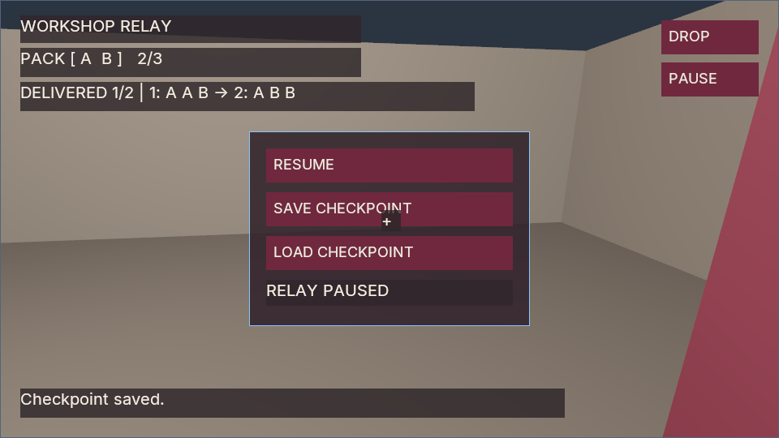

# Agent-authored Workshop Relay fixture

Workshop Relay is a small first-person pickup and delivery game authored in one
external Codex session using **`gpt-6.1-sol`**. The measured session lasted
**7 minutes 21 seconds**. The agent authored a native scene, registered
components, spawn templates, typed UI layout/style and compiled C# gameplay,
then exercised the game through Poima's headless service. This is one bounded
exercise, not a development-time or general agent success-rate benchmark.

The retained [C# source](game/Relay.cs) and [project](game/WorkshopRelay.csproj)
preserve the original generated bytes. [manifest.json](manifest.json) names the
game type, entities, component fields, controls and recipes using portable paths.
[world.json](world.json) retains authored revision **5** with transaction receipts
removed. The implementation is original exercise evidence rather than a polished
recommended SDK example.

[Recorded exercise and replay results](../../m2-agent-workshop.json) distinguish
the authoring session, independent original-binary verification, rendered
observations and rebuilt public-fixture replay. Public evidence contains bounded
summaries and hashes; provider/account data and machine-specific execution logs
are not part of this fixture.

The game spawns three A and three B parts. Camera-ray Use collects a closest
pickup within three meters into a native capacity-three int32 inventory buffer.
Station one consumes A A B; station two then consumes A B B. Wrong recipes,
premature station use and full inventory preserve resources. Drop queues a
compiled control intent, then the next Tick removes the last item and spawns a
matching pickup. The HUD and menu use authored wine/neutral styling; Pause,
Resume, Save and Load invoke compiled controls.

Independent verification passed **2,550 native requests** against the original
**Windows 0.0.52 CoreCLR** engine. It checked ordered inventory, native spawned
pickups, camera misses/range, capacity/recipe/order rejection, open-space drop and
recollection, resource conservation, both deliveries and terminal stability.
Compiled Save/Load and fresh-process restoration preserve reflected state,
inventory, native identities/poses and logical UI before continuation. A separate
NVIDIA Vulkan readback shows the styled wine UI over primitive scene geometry;
it is not an OS editor screenshot or a game-performance measurement.

Drop uses a fixed forward position without wall/overlap validation; only the
recorded open-space placement is verified. The Save control displays
“Checkpoint saved.” when its request is accepted, before storage completion;
actual durable writes and restore were checked independently. General interaction
occlusion, physical controls, game-scale GPU performance, Linux execution,
Native AOT execution of this game and consoles remain unqualified. Pause is an
owner intent: manually calling `runtime.step` still advances physics. An
interactive owner must honor the pause request.

## Rendered checkpoints

| Paused checkpoint | Completed relay |
| --- | --- |
|  |  |

These are lossless PNG encodings of two original 0.0.52 native Vulkan readbacks,
not desktop screenshots, edited mockups or frames from the rebuilt public replay.

## Reproduce the retained game

Use a compatible engine with simulation, managed gameplay and the native UI
backend enabled, the matching SDK/analyzer/managed bridge, and an installed .NET
10 SDK. Run Python on
the engine's operating system; replay uses the repository's standard-library
client and needs no provider account or AI invocation. Native/managed build
instructions are in the [gameplay guide](../../../MANAGED_GAMEPLAY.md).

Build in a disposable directory so generated files stay outside the evidence
source. From the repository root, this Windows PowerShell example uses matching
already-built SDK and analyzer assemblies:

```powershell
$fixture = "docs/evidence/fixtures/agent-workshop"
$work = "build/agent-workshop-fixture"
if (Test-Path $work) { throw "Choose a new work directory." }
New-Item -ItemType Directory -Path "$work/game", "$work/reference" | Out-Null
Copy-Item "$fixture/game/*" "$work/game/"
Copy-Item "managed/Poima.Gameplay/bin/Release/net10.0/Poima.Gameplay.dll" "$work/reference/Poima.Gameplay.dll"
Copy-Item "managed/Poima.Components.Generator/bin/Release/net10.0/Poima.Components.Generator.dll" "$work/reference/Poima.Components.Generator.dll"
dotnet build "$work/game/WorkshopRelay.csproj" -c Release --disable-build-servers
```

The retained project references `../reference/Poima.Gameplay.dll`, loads
`../reference/Poima.Components.Generator.dll` as its analyzer and writes
`../compiled/WorkshopRelay.dll`. It has no package references. Build the matching
metadata extractor, then extract the actual component manifest from that compiled
assembly:

```powershell
dotnet build managed/Poima.NativeGame.Generator/Poima.NativeGame.Generator.csproj -c Release --disable-build-servers
dotnet managed/Poima.NativeGame.Generator/bin/Release/net10.0/Poima.NativeGame.Generator.dll `
  --components "$work/compiled/WorkshopRelay.dll" "$work/compiled-components.json"
```

Compare the extracted schemas with the retained world's registered schemas.
`manifest.json` is the game's portable replay map; it is separate from this
generated component manifest. Rebuilt assemblies can have different hashes from
the original session, so replay must create new module-bound checkpoints.

Run the [independent public replay](../../../../tests/agent_workshop_replay.py),
replacing hostfxr with the installed matching runtime path:

```powershell
python tests/agent_workshop_replay.py `
  --engine build/windows-runtime/poima.exe `
  --world docs/evidence/fixtures/agent-workshop/world.json `
  --manifest docs/evidence/fixtures/agent-workshop/manifest.json `
  --assembly build/agent-workshop-fixture/compiled/WorkshopRelay.dll `
  --hostfxr "C:/Program Files/dotnet/host/fxr/10.0.12/hostfxr.dll" `
  --bridge managed/Poima.ManagedBridge/bin/Release/net10.0/Poima.ManagedBridge.dll `
  --source docs/evidence/fixtures/agent-workshop/game/Relay.cs `
  --source docs/evidence/fixtures/agent-workshop/game/WorkshopRelay.csproj `
  --output build/agent-workshop-fixture/replay-1
```

Choose a new replay output directory. The runner uses the supplied portable map
and actual compiled module in two disposable standalone native processes. It
checks generated inventory/pickup schema membership, ordered native values,
camera/controller inputs, compiled controls, complete checkpoint restoration and
continued victory. It does not patch gameplay fields or teleport transforms to
manufacture success. The local report retains detailed RPCs and paths separately
from its allowlisted public summary; success requires clean process exits.

The rebuilt public fixture passes **2,549 native requests** on the **0.0.53
Windows CoreCLR** host. The original source and project build with zero warnings
or errors, and extracted component schemas match the authored world. The replay
records a paused `[A,B]` checkpoint at tick 410; all three continuations deliver
the final recipe at tick 477 and preserve victory through the terminal checks at
tick 505. Full reflected state, native identities/poses and logical UI restore
before a resumed callback. Both owned native processes exit with code 0. Engine,
assembly, SDK and source hashes are in the separate public evidence record.

The [sanitized assignment](TASK.md) records the exercise requirements without
provider prompts, execution receipts or account information. Comprehensive water,
general AI/navigation, advanced rendering and the engine's broader roadmap are
outside this task.
