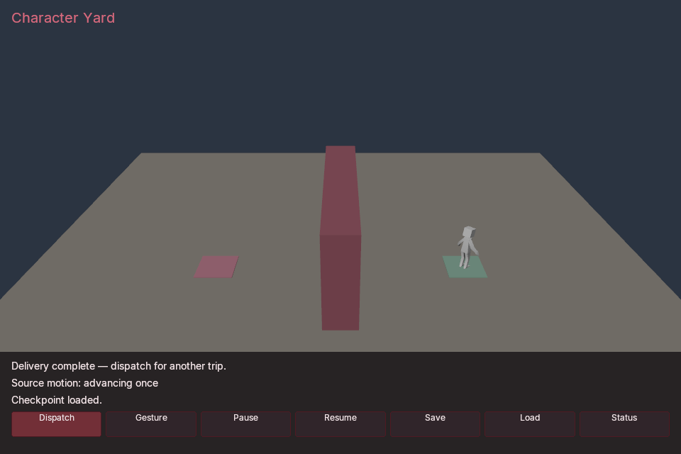

# Character Yard

An imported character follows a compiled delivery route around solid cover.
Its native capsule controls movement; the attached source skeleton plays an
arm-opening motion. The sample includes redispatch, pause/resume and durable
checkpoints. **The imported motion is not a walk cycle.**



*Reviewed Windows Vulkan readback. Rigged Figure, © 2017 Cesium,
[CC BY 4.0](https://creativecommons.org/licenses/by/4.0/), from the
[pinned original source](https://github.com/KhronosGroup/glTF-Sample-Assets/tree/edc7c9e67c639d230715049ee31f9a96a6babbbe/Models/RiggedFigure).
Poima imports the source and attaches its retained rig to a native controller.*

## Prerequisites and content

Use the matching **0.0.71** engine, SDK and sample checkout, Python 3.9+, and
a .NET 10 SDK for compilation. Follow the
[managed build instructions](../../docs/MANAGED_GAMEPLAY.md#build) to build the
engine and CoreCLR bridge; building this game project alone does not enable
CoreCLR in the engine. Enable simulation and `POIMA_ENABLE_NAVIGATION=ON`.
Interactive Windows play also needs the Vulkan renderer and
`POIMA_ENABLE_GAME_UI=ON`. Native AOT needs `POIMA_ENABLE_NATIVE_GAMEPLAY=ON`;
that artifact route does not require hostfxr or the managed bridge.
Linux headless verification is a separate route from Windows graphical play.

These reproduction commands describe the historical 0.0.71 checkpoint. Create
a separate checkout before running them, then run all build, publication and
export commands from that checkout:

```sh
git worktree add --detach ../poima-character-yard-0.0.71 86549b9
cd ../poima-character-yard-0.0.71
```

The sibling destination must be new. Building current `main` produces its
current engine version; changing a publication's version label does not make
that build compatible with a 0.0.71 export. For a newer engine, rebuild and
publish against its matching SDK and version, then verify that complete bundle
separately.

The module requires services epoch **7**, a **224-byte** prefix, and the named
features `baseline_v7`, `component_collections_v1`, `animation_inertial_v1`,
`character_input_v1` and `navigation_query_v1`. Discover the actual build's
capabilities before launching.

Supply the pinned, unmodified **Rigged Figure**, copyright 2017 Cesium,
licensed [CC BY 4.0](https://creativecommons.org/licenses/by/4.0/). Obtain the
[original GLB](https://raw.githubusercontent.com/KhronosGroup/glTF-Sample-Assets/edc7c9e67c639d230715049ee31f9a96a6babbbe/Models/RiggedFigure/glTF-Binary/RiggedFigure.glb)
as `build/character-source/RiggedFigure.glb`. It is **50,116 bytes**, SHA-256:

```text
d6be85417d3e256861ee733eea6916093a7af7c79c16366181fd8abcaeb38cf5
```

The [imported-character guide](../../docs/IMPORTED_CHARACTER.md) gives the
source license notice, inspection workflow and transform limits. The launcher
does not download or alter the source. It creates an asset provenance record
for attribution when exporting; retain the license and credit when sharing
the character or derived images.

## Compile and extract the component schemas

Run from the repository root:

```text
dotnet build examples/character-yard/Poima.CharacterYardGame.csproj -c Release -m:1 --artifacts-path build/character-yard/dotnet-artifacts -o build/character-yard/managed
dotnet run --project managed/Poima.NativeGame.Generator -c Release -- --components build/character-yard/managed/Poima.CharacterYardGame.dll build/character-yard/game.poima-components.json
```

The second command extracts generated metadata without executing game code.
See [custom components](../../docs/CUSTOM_COMPONENTS.md#import-and-author)
for the schema contract. `ActorVisualConfig` supplies the visual entity, inspected
hold/motion clip indices, transition duration, stations and `LoopMotion` flag.
`YardRoute` persists up to ten XYZ corners and its cursor. The launcher imports
these schemas and authors their values; do not invent clip indices or replace
the manifest with a hand-written approximation.

## Launch on Windows

With Windows-native Python and a matching CoreCLR installation, use PowerShell:

```powershell
python examples/character-yard/run.py `
  --binary build/windows-runtime/poima.exe `
  --source build/character-source/RiggedFigure.glb `
  --manifest build/character-yard/game.poima-components.json `
  --assembly build/character-yard/managed/Poima.CharacterYardGame.dll `
  --hostfxr "C:/Program Files/dotnet/host/fxr/10.0.12/hostfxr.dll" `
  --bridge managed/Poima.ManagedBridge/bin/Release/net10.0/Poima.ManagedBridge.dll `
  --output build/character-yard/play-01
```

Replace the hostfxr path with your matching Windows runtime. The bridge output
must retain its SDK assembly and runtime configuration. `--output` must be a
new directory: the launcher creates the world, cooked assets and external save
store there. It preserves commands in `commands.json`.

From WSL, add `--windows-interop` when using a Windows executable; supply paths
accessible from WSL, such as `/mnt/c/Program Files/dotnet/host/fxr/10.0.12/hostfxr.dll`,
and the launcher translates filesystem arguments. Optional
`--gpu 0` selects a discovered device; indices depend on your machine.

WASD and mouse control the separate first-person observer. Tab releases the
pointer for the UI; click outside the panel to return to gameplay.

| Control | Result |
| --- | --- |
| Dispatch | Query a new complete route to the opposite station; no teleport. |
| Gesture | Replay the original arm-opening take once from its beginning. |
| Pause / Resume | Pause or resume native playback and compiled decisions. |
| Save / Load | Request the durable `character-yard` checkpoint. |
| Status | Read the actual save/load result, including while paused. |

Request acceptance is not storage completion. The HUD reconciles the native
receipt on a later Tick or UI action; paused playback needs an explicit Status
refresh. After loading, use Resume. Keep the exact authored content and compiled
artifact for checkpoint continuation; compatible CoreCLR reload is distinct
from changing a saved artifact or schema.

## Observe and verify

The movement root is actor **300**; visual wrapper **400** is its child, rotated
180 degrees around Y to align the imported figure with native -Z forward. The
source's matrix-authored Z-up axis-conversion node and joint hierarchy remain inside
that wrapper. Player **100** and camera **101** are separate; the NPC never
receives fabricated player inputs. Static yard collision supplies navigation.

Compiled gameplay measures displacement between committed positions, then holds
or advances the inspected motion. `HoldClip` and `MotionClip` both select the
single source take. `LoopMotion=0` prevents a discontinuous endpoint wrap:
holding preserves the current clock, and the completed 1.25-second take stays
stopped. Gesture is the explicit restart action. This is animation playback
attached to physical routing, not root motion or foot-matched locomotion.

Run the independent headless contract with a matching Linux CoreCLR build:

```sh
python3 tests/character_yard_contract.py \
  --binary build/runtime-headless/poima \
  --source build/character-source/RiggedFigure.glb \
  --manifest build/character-yard/game.poima-components.json \
  --assembly build/character-yard/managed/Poima.CharacterYardGame.dll \
  --hostfxr .cache/toolchains/dotnet-10.0.401/host/fxr/10.0.12/libhostfxr.so \
  --bridge managed/Poima.ManagedBridge/bin/Release/net10.0/Poima.ManagedBridge.dll \
  --output build/character-yard/check-01
```

Use a new output directory. Windows execution uses the corresponding binary
and hostfxr paths; add `--windows-interop` from WSL. Optional
`--capture --gpu 0` retains Windows Vulkan readbacks. `--timeout 600` bounds the
complete contract. The verifier records hashes and actual requests in
`evidence.json`; success requires `passed: true` and clean owned-process exits.
Inspect its checks and limitations rather than treating presence of the script
as execution evidence.

The verifier observes physical routing around cover, the controller/rig
attachment and source-derived joint poses after transitions settle. It checks
compatible CoreCLR reload or deliberate Native AOT replacement rejection,
same-owner and fresh-owner checkpoint continuation, compiled UI receipts,
delivery, nonloop completion and explicit gesture replay. It does not patch
game state, route corners or character transforms to manufacture completion.

## Native gameplay and export

Follow the [Native AOT prerequisites](../../docs/NATIVE_GAMEPLAY.md#publish)
on the matching target OS. For Windows, use Windows-native Python and a .NET 10
SDK with the required C++ linker toolchain, then publish:

```powershell
python scripts/publish_native_gameplay.py `
  --project examples/character-yard/Poima.CharacterYardGame.csproj `
  --type Poima.Examples.CharacterYardGame `
  --rid win-x64 --engine-version 0.0.71 `
  --output build/character-yard/native-win `
  --work build/character-yard/native-win-work
```

Both destinations must be new. Replace `--assembly`, `--hostfxr` and `--bridge`
in the launcher or verifier with
`--descriptor build/character-yard/native-win/native-gameplay.json`; retain
`--manifest`, using the publication's `game.poima-components.json`.
Native AOT artifacts stay process-loaded and do not support compatible replacement.

Install a matching Windows runtime, following the
[Windows build setup](../../docs/BUILD.md#native-windows-executable-from-linux--wsl).
From WSL, this native-only profile enables simulation through the preset,
navigation, graphical UI and Vulkan rendering:

```sh
cmake --preset windows-runtime \
  -DPOIMA_ENABLE_NATIVE_GAMEPLAY=ON -DPOIMA_ENABLE_MANAGED_GAMEPLAY=OFF \
  -DPOIMA_ENABLE_NAVIGATION=ON -DPOIMA_ENABLE_GAME_UI=ON
cmake --build --preset windows-runtime
cmake --install build/windows-runtime --prefix build/character-yard/runtime-windows
```

Build all configured install targets before installing, including the native
desktop companion if enabled in your build. Use a new install prefix. The exporting executable, installed runtime and
published artifact must all report engine version 0.0.71; the runtime must
advertise the required service features listed above.

The launcher's development directory is not an exported game bundle. Follow
[project/runtime export](../../docs/PROJECTS.md#install-a-runtime-and-export)
with a version-2 project manifest referencing the native descriptor and authored
world. Export requires the exact matching installed Windows runtime, cooked
model/navigation closure and attribution records. Launch a bundle with an
explicit external `--save-root` to enable checkpoints; keep mutable storage
outside its immutable payload.

The dedicated bundle verifier authors a project, exports and relocates it,
removes its owned source project, and runs the source-independent player first.
It then reconstructs a separate headless world with the preserved caller GLB
to check the exact bundled runtime/artifact. Run with **Windows-native Python**,
Windows paths and assertions enabled:

```powershell
python tests/character_yard_bundle.py `
  --binary build/windows-runtime/poima.exe `
  --runtime build/character-yard/runtime-windows `
  --artifact build/character-yard/native-win/native-gameplay.json `
  --source build/character-source/RiggedFigure.glb `
  --output build/character-yard/bundle-check-01 `
  --ticks 1400 --capture --gpu 1 --timeout 900
```

Use a new output directory and your discovered GPU index. This verifier has
no `--windows-interop` option and performs no compilation or downloads. Its
`evidence.json` preserves command outcomes, inventory hashes and separate player
and headless results. It does not remove caller assets or runtime/artifact inputs.

## Recorded scope

The [0.0.71 evidence](../../docs/evidence/m2-character-game.json) records five
Windows/Linux CoreCLR and Native AOT cohorts totaling **7,772 RPCs**, including
source-derived poses and same-owner/fresh-owner saves. The exported Windows
player separately completes **1,400 ticks** after source-project removal and
relocation. A further **1,552-RPC** contract exercises that exact bundled runtime
and artifact in newly reconstructed worlds for pose and checkpoint checks.
Those reconstructed worlds intentionally use the preserved caller source;
they are separate from source-independent exported playback.

These records cover their frozen inputs and recorded executions, rather than
establishing that every setup command above ran as one continuous walkthrough.
The Windows host had developer tooling installed; this is not clean-machine
deployment qualification.

The sample covers a small flat yard and one stylized imported source. General
retargeting, root motion, IK, dynamic navigation and save migration are separate
capabilities; it makes no AAA-character, game-scale or physical-device claim.
