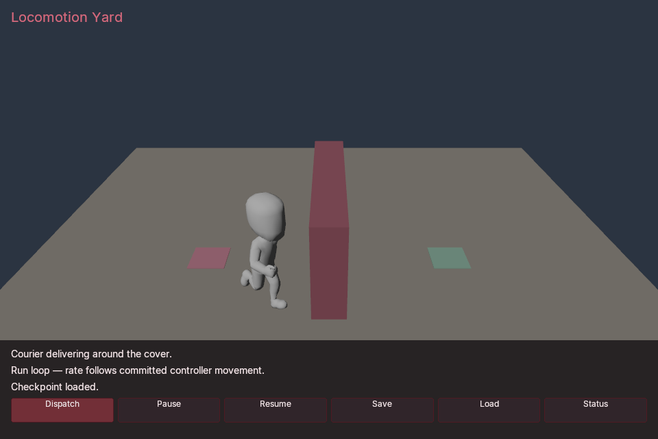

# Locomotion Yard

A compiled C# courier follows a native navigation route around solid cover.
Its capsule owns movement; an attached imported character plays separate
original Idle and Run animations. The sample includes redispatch, pause/resume,
durable checkpoints and a separate first-person observer.

This sample uses the explicit [rotation retargeting policy](../../docs/ANIMATION_RETARGETING.md).
It keeps the original target geometry, hierarchy, skin weights and inverse binds.
The historical [Character Yard](../character-yard/README.md) remains a separate
sample with its original arm-opening motion.



*Actual Windows Vulkan readback of the compiled game. Original Kenney body and
Run take, CC0-1.0; Poima-authored primitive cover and HUD. Lossless BMP-to-PNG
conversion, not an editor screenshot.*

## Prerequisites and original content

Use a matching **0.0.75** engine, SDK and sample checkout, Python 3.9+, and a
.NET 10 SDK for compilation. Enable simulation, navigation and game UI.
Windows interactive play also requires Vulkan rendering. CoreCLR development
requires `POIMA_ENABLE_MANAGED_GAMEPLAY=ON`, matching host headers and a built
managed bridge; follow [managed setup](../../docs/MANAGED_GAMEPLAY.md#build).
Native AOT requires `POIMA_ENABLE_NATIVE_GAMEPLAY=ON` and does not use hostfxr or
the bridge at play time. Linux headless verification is separate from Windows
graphical play.

The module uses services epoch **7**, a **224-byte** prefix, and the features
`baseline_v7`, `component_collections_v1`, `animation_inertial_v1`,
`character_input_v1` and `navigation_query_v1`. Discover the actual build's
capabilities before loading it.

Obtain Kenney's original [Animated Characters Protagonists 1.1](https://kenney.nl/assets/animated-characters-protagonists),
licensed [CC0-1.0](https://creativecommons.org/publicdomain/zero/1.0/).
Extract it yourself into, for example, `build/locomotion-source`. Pass the folder
containing `Model`, `Animations` and `License.txt` as `--source-directory`.
The launcher performs no downloads and requires these unchanged files:

| Relative path | SHA-256 |
| --- | --- |
| `Model/characterMedium.fbx` | `18835fef534eede635b081ee7fe647d01a885550a591d2e6bf071010906167d8` |
| `Animations/run.fbx` | `e635461fc8dace85ec67a7f7941e949a7c3f108b51ae4d2da1557e6e01749df8` |
| `Animations/idle.fbx` | `c8a24e0294376ee5a195c56752a13310e1c0b5f8588a4db50e094120e3e4cc74` |
| `License.txt` | `68280323c6dca1f532c71fb248a6f344abed39a574278a2edfa27801aea3d0cd` |

The sample rejects a different source profile. Other characters require their
own inspected references, clip selection and controller dimensions. These raw
file pins differ from the normalized parsed-model fingerprints used by
`asset.source.inspect` and the import policy.

The launcher inspects each original donor, samples its `Root|0.Targeting Pose`
at time zero, and selects the original Run or Idle take by name. It explicitly
retains local position deltas for `HipsCtrl` and `Hips`; other positions and
all scales use the target reference. It creates exportable CC0 provenance.
See [asset provenance](../../docs/ASSET_PROVENANCE.md) and
[source inspection](../../docs/ANIMATION_RETARGETING.md#inspect-the-original-sources).

## Compile and extract schemas

Run from the repository root after building the matching SDK and bridge:

```text
dotnet build examples/locomotion-yard/Poima.LocomotionYardGame.csproj -c Release -m:1 --artifacts-path build/locomotion-yard/dotnet-artifacts -o build/locomotion-yard/managed
dotnet run --project managed/Poima.NativeGame.Generator -c Release -- --components build/locomotion-yard/managed/Poima.LocomotionYardGame.dll build/locomotion-yard/game.poima-components.json
```

Schema extraction reads generated assembly metadata without executing gameplay.
`LocomotionVisualConfig` supplies the visual, inspected clip indices, transition
and idle timing, stations, nominal run speed and slowdown distance.
`LocomotionRoute` stores ten XYZ corners and a cursor in a 512-byte native
component. The launcher imports these generated schemas and authors their
values. [Custom component reference](../../docs/CUSTOM_COMPONENTS.md#import-and-author).

## Launch on Windows

With Windows-native Python and a matching Windows CoreCLR installation:

```powershell
python examples/locomotion-yard/run.py `
  --binary build/windows-runtime/poima.exe `
  --source-directory build/locomotion-source `
  --manifest build/locomotion-yard/game.poima-components.json `
  --assembly build/locomotion-yard/managed/Poima.LocomotionYardGame.dll `
  --hostfxr "C:/Program Files/dotnet/host/fxr/10.0.12/hostfxr.dll" `
  --bridge managed/Poima.ManagedBridge/bin/Release/net10.0/Poima.ManagedBridge.dll `
  --output build/locomotion-yard/play-01
```

Replace hostfxr with your installed, matching Windows runtime. Retain the whole
bridge output directory, including its SDK assembly and runtime configuration.
`--output` must be new; it receives the authored world, cooked assets, external
save store and `commands.json`.

From WSL, add `--windows-interop` and supply WSL-accessible paths, including the
Windows hostfxr under `/mnt/c/Program Files/dotnet/...`. Filesystem arguments are
translated for the Windows executable. Optional `--gpu 0` selects a discovered
device; indices depend on your machine. The launcher opens a Windows player,
not a Linux graphical window.

WASD and mouse control observer player **100** and camera **101**. Tab releases
the pointer for the UI. Courier actor **300** owns its own capsule and has no
player camera; imported visual **400** is its child. An elevated camera **102**
is available to the verification tool for route readbacks.

| Control | Result |
| --- | --- |
| Dispatch | Query a complete route to the opposite station. |
| Pause / Resume | Pause or resume native playback and compiled decisions. |
| Save / Load | Request the durable `locomotion-yard` checkpoint. |
| Status | Reconcile the actual save/load receipt, including while paused. |

The HUD distinguishes request acceptance from completion. While paused, use
Status to refresh a pending receipt. Checkpoints preserve route progress,
committed position history, playback rates, animation clocks and active fades.
Compatible CoreCLR reload retains this state; Native AOT replacement requires
restarting the process. General schema migration is outside this sample.

## Movement and playback policy

The native controller travels from `(-4,0)` to `(4,0)` around the cover. Its
maximum speed is **4 m/s**; the authored forward input of **0.75** gives
**3 m/s** on unobstructed straight segments. Input slows within **0.8 m** of a
route corner or destination, and stops while turning. Physics owns the resulting
movement. The imported source scale is retained: measured standing height is
approximately **3.7647** world units, with capsule radius **0.42**. The visual is
offset from original standing bounds and rotated **180°** around Y so its source
forward direction matches the controller.

Idle advances and loops while stationary; its initial lead time is **90 ticks**.
Run also loops. C# measures the previous committed horizontal displacement over
the fixed `1/60 s` tick and divides that speed by the explicitly authored
**3 m/s** nominal reference, clamping playback rate to `[0,8]`. Tick gaps invalidate
the measurement. This nominal reference is a gameplay choice, not a stride
calibration inferred from an in-place animation.

Clip or binding changes use a **12-tick** inertial transition. Rate-only changes
of at least `0.01` wait until an active transition ends, then update with no new
fade and retain the observed clock. The saved counters distinguish transitions,
accepted rate corrections and deferred corrections. The original Run has pose
continuity at wrap (C0), but differing slopes (not C1). No loop repair, IK, foot
locking, root-motion extraction or ground-contact fitting occurs here.

## Verify headlessly

Use a matching Linux simulation build with navigation, game UI and CoreCLR
enabled. The authoring-only `headless` preset cannot execute this game.
Run with a new output directory:

```sh
python3 tests/locomotion_yard_contract.py \
  --binary build/runtime-headless/poima \
  --source-directory build/locomotion-source \
  --manifest build/locomotion-yard/game.poima-components.json \
  --assembly build/locomotion-yard/managed/Poima.LocomotionYardGame.dll \
  --hostfxr .cache/toolchains/dotnet-10.0.401/host/fxr/10.0.12/libhostfxr.so \
  --bridge managed/Poima.ManagedBridge/bin/Release/net10.0/Poima.ManagedBridge.dll \
  --output build/locomotion-yard/contract-linux-01 --timeout 1200
```

Use the corresponding installed hostfxr if your SDK differs. For Windows,
replace the binary and hostfxr with Windows paths; add `--windows-interop` from
WSL. Optional `--capture --gpu 0` requests Windows Vulkan readbacks.

The contract binds binary, compiled artifact, sample and original-source hashes.
It checks real capsule travel and cover clearance, original-source joint and
weighted-vertex expectations after fades, advancing Idle/Run clocks, deferred
rate corrections, compatible reload or rejected AOT replacement, UI receipts,
and exact same-owner/fresh-owner save continuation. It removes only its own
exact source copies before fresh restoration. Caller originals remain read-only
for the source-pose oracle. The oracle uses native normalization of original
FBX, with separate quaternion-chain/FK/skin math; it is not a second FBX parser.

## Publish Native AOT and export

Follow [Native AOT prerequisites](../../docs/NATIVE_GAMEPLAY.md#publish) on the
matching operating system. Windows requires Windows-native Python, a .NET 10
SDK and its supported C++ linker toolchain:

```powershell
python scripts/publish_native_gameplay.py `
  --project examples/locomotion-yard/Poima.LocomotionYardGame.csproj `
  --type Poima.Examples.LocomotionYardGame `
  --rid win-x64 --engine-version 0.0.75 `
  --output build/locomotion-yard/native-win `
  --work build/locomotion-yard/native-win-work
```

Output and work destinations must be new. On Linux use `python3` and
`--rid linux-x64` with separate destinations; cross-OS AOT publication is not
supported. To run or verify an artifact, replace `--assembly`, `--bridge` and
`--hostfxr` with `--descriptor .../native-gameplay.json`, retaining `--manifest`
with the publication's `game.poima-components.json`.

For native-only Windows export, complete [Windows build setup](../../docs/BUILD.md#native-windows-executable-from-linux--wsl)
and install the matching runtime. From WSL:

```sh
cmake --preset windows-runtime \
  -DPOIMA_ENABLE_NATIVE_GAMEPLAY=ON -DPOIMA_ENABLE_MANAGED_GAMEPLAY=OFF \
  -DPOIMA_ENABLE_NAVIGATION=ON -DPOIMA_ENABLE_GAME_UI=ON
cmake --build --preset windows-runtime
cmake --install build/windows-runtime --prefix build/locomotion-yard/runtime-windows
```

Build all configured install targets before installing and use a new prefix.
The exporter, installed runtime and published artifact must agree on their
engine version and required service features; relabeling an artifact cannot
make an older runtime compatible.

The launcher's development directory is not an exported game. Follow
[project export](../../docs/PROJECTS.md#install-a-runtime-and-export) with a
version-2 project manifest referencing the native descriptor, authored world
and cooked closure. Keep mutable saves outside the immutable bundle with an
explicit `--save-root`.

The dedicated verifier exports and relocates a bundle, removes its owned source
project, and runs the source-independent player before reconstructing a
separate headless world for pose and checkpoint checks. Use Windows-native
Python, Windows paths, assertions enabled and a new output directory:

```powershell
python tests/locomotion_yard_bundle.py `
  --binary build/windows-runtime/poima.exe `
  --runtime build/locomotion-yard/runtime-windows `
  --artifact build/locomotion-yard/native-win/native-gameplay.json `
  --source-directory build/locomotion-source `
  --output build/locomotion-yard/bundle-check-01 `
  --ticks 1400 --capture --gpu 1 --timeout 1800
```

This verifier has no `--windows-interop` option and performs no downloads or
compilation. Its separate headless reconstruction intentionally uses the
preserved caller originals. Scripted playback/readbacks do not qualify physical
input, editor usability, clean-machine deployment, crowds or frame-rate
performance.

## Recorded profile

[0.0.75 qualification](../../docs/evidence/m2-locomotion-game.json) records
Windows/Linux CoreCLR and Native AOT, with an additional Windows GPU cohort:
25,338 RPCs, ten clean owned processes and nine Vulkan readbacks. The relocated
Windows player completes 1,400 ticks after removal of its owned source project;
a separate bundled-runtime contract checks another 5,064 RPCs.

The independent oracle compares all 61 node worlds and 1,029 weighted vertices
after transitions. Vertex deformation is calculated from actual runtime joints,
not read directly from GPU buffers. The first exported player report exposes
courier observations through compiled state and renderer counts; direct native
courier clocks and poses are checked in the separately reconstructed contract.
The original source files and compiled inputs remain unchanged. Retained failed
verifier attempts and their corrections are included in the evidence summary.
