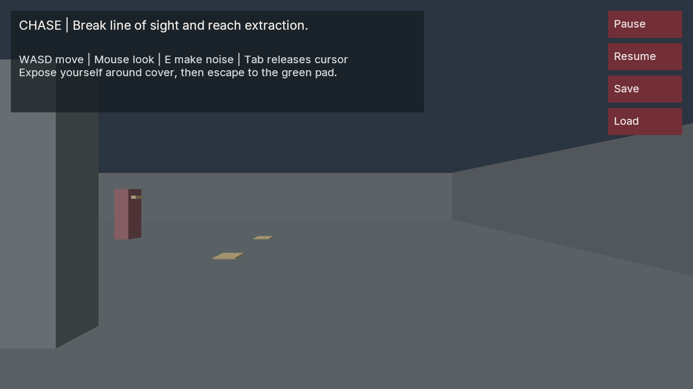

# Patrol room



*Vulkan readback from the native-input verifier. Primitive training geometry; not an authoring video or OS screenshot.*

A small first-person stealth encounter driven by compiled C# decisions and native character physics. A guard patrols four yellow markers. Its 150-degree vision cone and range test use an actual physics ray: the central wall blocks sight. Expose yourself around the wall to trigger a chase, break sight, then reach the green extraction pad. Approaching an exposed guard gets you caught. Press E to make noise and lure an investigation; noise alone does not earn extraction.

The guard is a camera-free CharacterController. Its movement uses `ICharacterInputGame` and `SetCharacterInput`; it never changes transforms or feeds fabricated NPC player inputs. Remembered position, decision mode, timers, waypoint, alerts and outcome live in registered `PatrolState`, so compatible reloads and native saves retain decisions. Same-tick entity reads observe prepared pre-physics state, rather than the staged movement command.

First follow the [managed runtime and bridge setup](../../../docs/MANAGED_GAMEPLAY.md#build), including the `POIMA_ENABLE_MANAGED_GAMEPLAY` and `POIMA_ENABLE_GAME_UI` options. Keep the matching bridge output together. Build the sample from the repository root with the pinned .NET 10 SDK:

```sh
.cache/toolchains/dotnet-10.0.401/dotnet build examples/managed/PatrolGame/Poima.PatrolGame.csproj -c Release --disable-build-servers
```

Supply your built native engine, CoreCLR host library, matching managed bridge and sample assembly. The launcher creates a new output directory, world and save store. Use a different output directory to retry a new match.

From WSL, using the Windows Vulkan runtime and its Windows CoreCLR installation:

```sh
python3 examples/managed/PatrolGame/run.py \
  --binary build/windows-runtime/poima.exe \
  --hostfxr '/mnt/c/Program Files/dotnet/host/fxr/10.0.12/hostfxr.dll' \
  --bridge managed/Poima.ManagedBridge/bin/Release/net10.0/Poima.ManagedBridge.dll \
  --assembly examples/managed/PatrolGame/bin/Release/net10.0/Poima.PatrolGame.dll \
  --windows-interop \
  --output build/patrol-play
```

WASD moves, the mouse looks, E makes noise, and Tab releases the cursor. The on-screen buttons pause/resume and request native checkpoints. Save/load completion is reported by the native operation result; request acceptance is not proof that storage completed. After loading a paused checkpoint, click Resume. Terminal outcomes stop the guard's decisions; player movement can still continue.

The same launcher works with Windows-native Python and Windows paths. From WSL with a Windows engine, add `--windows-interop` to translate filesystem arguments. Vulkan is required for interactive play.

For headless independent qualification:

```sh
python3 tests/patrol_game_contract.py \
  --binary build/runtime-headless/poima \
  --hostfxr /path/to/libhostfxr.so \
  --bridge /path/to/Poima.ManagedBridge.dll \
  --assembly examples/managed/PatrolGame/bin/Release/net10.0/Poima.PatrolGame.dll \
  --output build/patrol-contract
```

The verifier follows player routes through native input, checks real wall occlusion, patrol/chase/investigation/escape/caught outcomes, compatible reload and exact fresh-process checkpoint continuation. `--capture --gpu 0` additionally retains renderer readbacks at reachable states. Qualification results are not implied merely by the presence of this verifier.

Recorded Windows and Linux cohorts each pass four groups over 1,483 RPCs and two clean owned exits. Both laptop GPUs pass four reachable rendered checkpoints with zero reported NVRHI errors. See the [qualification record](../../../docs/evidence/m2-patrol-game.json).

This is an authored training room, not a navigation system. Patrol segments are deliberately clear. Investigations and chases steer directly toward their target; a guard can stop against an obstacle, and this example does not find arbitrary paths around walls. There is no imported character art, skeletal animation, game-scale AI benchmark, physical-device qualification or console/browser deployment claim.
