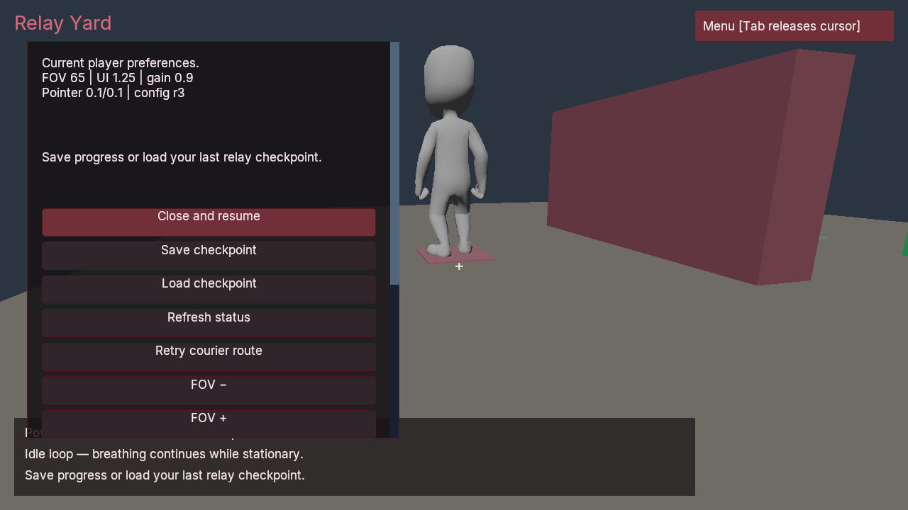

# Relay Yard

A small first-person game assembled through Poima's native authoring API. Recover
three power cells, follow the animated courier around the cover, then activate
the relay terminal. Pickups and completion require an in-range camera ray and
the Use action; menu buttons cannot complete the objective.

The scene uses authored primitive geometry and the original licensed Kenney
Animated Characters Protagonists 1.1 body, Idle and Run FBX files. The
[Locomotion Yard import pipeline](../locomotion-yard/README.md) supplies source
inspection, explicit retargeting, the controller/visual attachment and CC0
provenance. No source asset is rewritten by this launcher.



Native renderer readback from the exported game, with its compiled settings
menu open. Character source: Kenney Protagonists 1.1, CC0-1.0.

## Build the gameplay module

Run the publisher with a matching-host .NET 10 SDK and native linker. On Windows,
use a developer shell with the C++ toolchain available. Use new output and work
folders:

```powershell
python scripts/publish_native_gameplay.py `
  --project examples/relay-yard/Poima.RelayYardGame.csproj `
  --type Poima.Examples.RelayYardGame --rid win-x64 `
  --output build/relay-yard-artifact --work build/relay-yard-publish
```

The project compiles the existing locomotion component declarations alongside
this game's module. The publisher selects `Poima.Examples.RelayYardGame` and
emits its Native AOT library, component manifest, descriptor and dependency
notices. The sample needs native navigation, character input, inertial animation
and player-preference services. It does not add a second movement authority or
interpret a gameplay script at runtime.

## Author and play

Supply your original downloaded Kenney Protagonists 1.1 folder. The launcher
checks the exact supported source hashes before importing. The engine executable
must include the renderer, physics, navigation, FBX intake and native gameplay.
Run native Windows Python for the Windows executable:

```powershell
python examples/relay-yard/run.py `
  --binary build/windows-runtime/poima.exe `
  --source-directory C:/Assets/KenneyProtagonists `
  --manifest build/relay-yard-artifact/game.poima-components.json `
  --descriptor build/relay-yard-artifact/native-gameplay.json `
  --output build/relay-yard-play --gpu 1
```

Choose the GPU using actual device discovery. `--author-only` imports and authors
the world without launching the game. CoreCLR development is also available:
replace `--descriptor` with `--hostfxr`, `--bridge` and `--assembly` paths built
from this project and the managed bridge. Original content is supplied by the
caller; the launcher does not download assets or compile code.

## Controls and checkpoints

Begin starts the shift. WASD moves, the mouse looks, and E uses the closest
collider along the camera ray within three metres. Tab releases the cursor and
pauses native playback. Open Menu to save or load a checkpoint, inspect current
preferences, or change FOV, UI scale, pointer sensitivity and master gain. Close
resumes; click the scene to capture mouse look again.

The native owner controls pause. The welcome screen gates the game's logic;
the standalone player's clock and neutral physics can advance before Begin.
The game has no separate saved pause flag. A restored Runtime is paused by the
player; close a restored menu to resume. Welcome also offers Load for continuation
in a fresh process.

Checkpoints retain collected cells, courier route and animation, controller
state, UI and registered game state. Repeated saves resolve the current slot
generation through the native save service. Save/load errors are visible through
status text and the typed result. Current player preferences remain owned by the
current player; loading a checkpoint does not apply an old preference owner or
configuration. The sample's preference changes are session intent, with no
implicit settings-file write.

## Qualification

This is a small integration workload, not evidence of AA/AAA scale or production
performance. [Implementation status](../../docs/IMPLEMENTATION_STATUS.md) records
which checks have run. Physical-device interaction, audible output, representative
performance and clean-machine delivery require separate qualification.

The semantic verifier plays the game through native movement, camera look and
Use inputs. It checks the welcome gate, failed missing-save load, wrong and
out-of-range rays, premature terminal use, real despawning pickups, repeated
compiled saves, exact partial restoration, stale guards, courier travel and
final completion:

```powershell
python tests/relay_yard_contract.py `
  --binary build/windows-runtime/poima.exe `
  --manifest build/relay-yard-artifact/game.poima-components.json `
  --descriptor build/relay-yard-artifact/native-gameplay.json `
  --source-directory C:/Assets/KenneyProtagonists `
  --output build/relay-yard-contract
```

The graphical verifier additionally needs an installed, stripped Windows runtime
and native Windows Python. It exports the game, removes its owned source copy,
relocates the bundle outside the checkout and runs from an unrelated working
directory. The first process collects one cell and saves; a distinct process
loads that checkpoint from Welcome and completes the objective. Both use the
same native service API as agents. Caller-supplied original sources are retained:

```powershell
python tests/relay_yard_bundle.py `
  --binary build/windows-runtime/poima.exe --runtime build/runtime-installed `
  --artifact build/relay-yard-artifact/native-gameplay.json `
  --source-directory C:/Assets/KenneyProtagonists `
  --output build/relay-yard-bundle-check --gpu 1
```

Each run needs a new output folder and retains unsuccessful attempts. The partial
checkpoint occurs before the courier starts travelling. Animation save/load
while moving, the original-source retarget oracle and other subsystem coverage
are separate checks. Native frame readbacks and semantic actions do not prove
physical-device interaction or audible output.
